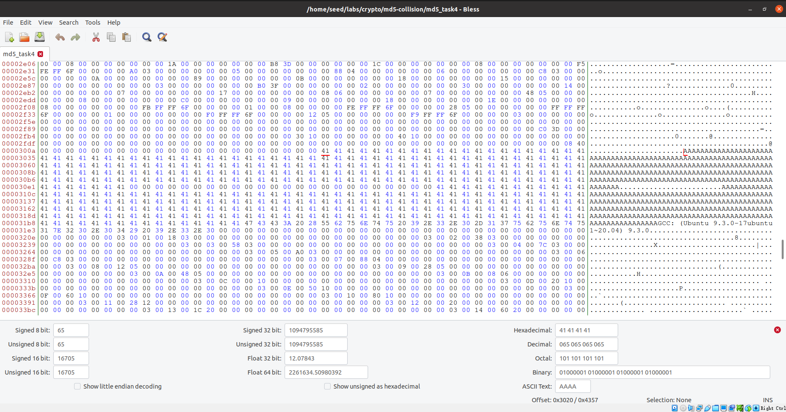

# MD5 Collision

## Task 1: Generating Two Different Files with the Same MD5 Hash

* Question 1. If the length of your prefix file is not multiple of 64, what is going to happen?
* Question 2. Create a prefix file with exactly 64 bytes, and run the collision tool again, and see what
  happens.
* Question 3. Are the data (128 bytes) generated by md5collgen completely different for the two
  output files? Please identify all the bytes that are different.

Answer:

Answer1:

```shell
[02/14/22]seed@VM:~/.../md5-collision$ md5collgen -p prefix.txt -o out1.bin out2.bin
MD5 collision generator v1.5
by Marc Stevens (http://www.win.tue.nl/hashclash/)

Using output filenames: 'out1.bin' and 'out2.bin'
Using prefixfile: 'prefix.txt'
Using initial value: 0b704cb3cb69dd45673e2e2434afa544

Generating first block: ...
Generating second block: S00...........
Running time: 2.74946 s
[02/14/22]seed@VM:~/.../md5-collision$ diff out1.bin out2.bin
2,3c2
< �ZU7>�v��9��P�JT��8
< �p�m�:�C���`����'�k�����,6;����N�1�^N�*�V��=ᰥ?�?�=;���e� ѷ��LZy�zV�_����s�F(��K���'�[LV���
\ No newline at end of file
---
> �ZU7>�v��9��P�JT��8��p�m�:�C���`����'�k����,6;����N�1�^Ώ*�V��=ᰥ?�?�=;���e�� ѷ��LZy�zV�_����srF(��K���'�[L����
\ No newline at end of file
[02/14/22]seed@VM:~/.../md5-collision$ md5sum out1.bin
4a4e60a539c8c0f381c63281d1590976  out1.bin
[02/14/22]seed@VM:~/.../md5-collision$ md5sum out2.bin
4a4e60a539c8c0f381c63281d1590976  out2.bin

```

会补齐到64字节的倍数，然后加128字节数据。

Answer2:

```shell
$ md5collgen -p prefix.txt -o out1.bin out2.bin
$ diff out1.bin out2.bin
$ md5sum out1.bin
$ md5sum out2.bin
```

```shell
[02/14/22]seed@VM:~/.../md5-collision$ nano prefix.txt
[02/14/22]seed@VM:~/.../md5-collision$ md5collgen -p prefix.txt -o out1.bin out2.bin
MD5 collision generator v1.5
by Marc Stevens (http://www.win.tue.nl/hashclash/)

Using output filenames: 'out1.bin' and 'out2.bin'
Using prefixfile: 'prefix.txt'
Using initial value: 9939aeaf3a91f2249dd6c93f5530b466

Generating first block: ...................................
Generating second block: S01....
Running time: 19.3531 s
[02/14/22]seed@VM:~/.../md5-collision$ diff out1.bin out2.bin
Binary files out1.bin and out2.bin differ
[02/14/22]seed@VM:~/.../md5-collision$ md5sum out1.bin
ef085bb9c2b4adc2c148af5618491f55  out1.bin
[02/14/22]seed@VM:~/.../md5-collision$ md5sum out2.bin
ef085bb9c2b4adc2c148af5618491f55  out2.bin

```

直接加128字节的数据。

Answer 3:

```shell
[02/14/22]seed@VM:~/.../md5-collision$ xxd out1.bin 
00000000: 3132 3334 3536 3738 3132 3334 3536 3738  1234567812345678
00000010: 3132 3334 3536 3738 3132 3334 3536 3738  1234567812345678
00000020: 3132 3334 3536 3738 3132 3334 3536 3738  1234567812345678
00000030: 3132 3334 3536 3738 3132 3334 3536 3738  1234567812345678
00000040: 0a00 0000 0000 0000 0000 0000 0000 0000  ................
00000050: 0000 0000 0000 0000 0000 0000 0000 0000  ................
00000060: 0000 0000 0000 0000 0000 0000 0000 0000  ................
00000070: 0000 0000 0000 0000 0000 0000 0000 0000  ................
00000080: c09e 313b c573 9255 46b3 12a7 4411 aa98  ..1;.s.UF...D...
00000090: fbcc 2e90 b161 a253 5ca2 3f66 70c0 c4d8  .....a.S\.?fp...
000000a0: 6bec cac2 fa9f 0540 6b22 d7e3 85df 2565  k......@k"....%e
000000b0: 0816 a0b8 53a4 349c 9048 fa96 5662 18fb  ....S.4..H..Vb..
000000c0: 6f05 78f4 ba50 ebb4 a9ce 5602 ca9c d4e0  o.x..P....V.....
000000d0: 65af 4942 0fbf 8f4a 7e57 8c4b 5b5c c7c1  e.IB...J~W.K[\..
000000e0: 297e c50d f445 8bd7 6794 6bf9 927b 6267  )~...E..g.k..{bg
000000f0: a615 24e3 76bf 802e 6071 63a4 04d6 fc93  ..$.v...`qc.....
[02/14/22]seed@VM:~/.../md5-collision$ xxd out2.bin 
00000000: 3132 3334 3536 3738 3132 3334 3536 3738  1234567812345678
00000010: 3132 3334 3536 3738 3132 3334 3536 3738  1234567812345678
00000020: 3132 3334 3536 3738 3132 3334 3536 3738  1234567812345678
00000030: 3132 3334 3536 3738 3132 3334 3536 3738  1234567812345678
00000040: 0a00 0000 0000 0000 0000 0000 0000 0000  ................
00000050: 0000 0000 0000 0000 0000 0000 0000 0000  ................
00000060: 0000 0000 0000 0000 0000 0000 0000 0000  ................
00000070: 0000 0000 0000 0000 0000 0000 0000 0000  ................
00000080: c09e 313b c573 9255 46b3 12a7 4411 aa98  ..1;.s.UF...D...
00000090: fbcc 2e10 b161 a253 5ca2 3f66 70c0 c4d8  .....a.S\.?fp...
000000a0: 6bec cac2 fa9f 0540 6b22 d7e3 855f 2665  k......@k"..._&e
000000b0: 0816 a0b8 53a4 349c 9048 fa16 5662 18fb  ....S.4..H..Vb..
000000c0: 6f05 78f4 ba50 ebb4 a9ce 5602 ca9c d4e0  o.x..P....V.....
000000d0: 65af 49c2 0fbf 8f4a 7e57 8c4b 5b5c c7c1  e.I....J~W.K[\..
000000e0: 297e c50d f445 8bd7 6794 6bf9 92fb 6167  )~...E..g.k...ag
000000f0: a615 24e3 76bf 802e 6071 6324 04d6 fc93  ..$.v...`qc$....
```

大部分字节都相同，只有少数几个字节不同。

## Task 2: Understanding MD5’s Property

```shell
$ cat out1.bin out2.bin > out3.bin
$ md5sum out1.bin
6d3b5000ccafc138459716e120cc8a23  out1.bin
$ md5sum out3.bin
ac4f66f4da21a3759c5117d45208762e  out3.bin
$ cat out1.bin out3.bin > out13.bin
$ cat out2.bin out3.bin > out23.bin
$ md5sum out13.bin
55ef32c0f08883766acb6f2f5b6e14b4  out13.bin
$ md5sum out23.bin
55ef32c0f08883766acb6f2f5b6e14b4  out23.bin
```

生成的out13.bin的md5和out23.bin的md5的值相同。

## Task 3: Generating Two Executable Files with the Same MD5 Hash

```c
#include <stdio.h>
unsigned char xyz[200] = {
	0x41, 0x41, 0x41, 0x41, 0x41, 0x41, 0x41, 0x41, 0x41, 0x41,
	0x41, 0x41, 0x41, 0x41, 0x41, 0x41, 0x41, 0x41, 0x41, 0x41,
	0x41, 0x41, 0x41, 0x41, 0x41, 0x41, 0x41, 0x41, 0x41, 0x41,
	0x41, 0x41, 0x41, 0x41, 0x41, 0x41, 0x41, 0x41, 0x41, 0x41,
	0x41, 0x41, 0x41, 0x41, 0x41, 0x41, 0x41, 0x41, 0x41, 0x41,
	0x41, 0x41, 0x41, 0x41, 0x41, 0x41, 0x41, 0x41, 0x41, 0x41,
	0x41, 0x41, 0x41, 0x41, 0x41, 0x41, 0x41, 0x41, 0x41, 0x41,
	0x41, 0x41, 0x41, 0x41, 0x41, 0x41, 0x41, 0x41, 0x41, 0x41,
	0x41, 0x41, 0x41, 0x41, 0x41, 0x41, 0x41, 0x41, 0x41, 0x41,
	0x41, 0x41, 0x41, 0x41, 0x41, 0x41, 0x41, 0x41, 0x41, 0x41,
	0x41, 0x41, 0x41, 0x41, 0x41, 0x41, 0x41, 0x41, 0x41, 0x41,
	0x41, 0x41, 0x41, 0x41, 0x41, 0x41, 0x41, 0x41, 0x41, 0x41,
	0x41, 0x41, 0x41, 0x41, 0x41, 0x41, 0x41, 0x41, 0x41, 0x41,
	0x41, 0x41, 0x41, 0x41, 0x41, 0x41, 0x41, 0x41, 0x41, 0x41,
	0x41, 0x41, 0x41, 0x41, 0x41, 0x41, 0x41, 0x41, 0x41, 0x41,
	0x41, 0x41, 0x41, 0x41, 0x41, 0x41, 0x41, 0x41, 0x41, 0x41,
	0x41, 0x41, 0x41, 0x41, 0x41, 0x41, 0x41, 0x41, 0x41, 0x41,
	0x41, 0x41, 0x41, 0x41, 0x41, 0x41, 0x41, 0x41, 0x41, 0x41,
	0x41, 0x41, 0x41, 0x41, 0x41, 0x41, 0x41, 0x41, 0x41, 0x41,
	0x41, 0x41, 0x41, 0x41, 0x41, 0x41, 0x41, 0x41, 0x41, 0x41,
};
int main()
{
	int i;
	for (i = 0; i < 200; i++) {
		printf("%x", xyz[i]);
	}
	printf("\n");
}

```

A的范围是0x3020到0x30e7。


```shell
$ head -c 12320 md5_task3 > prefix
$ tail -c +12448 md5_task3 > suffix
$ md5collgen -p prefix -o out1.bin out2.bin
$ diff out1.bin out2.bin
Binary files out1.bin and out2.bin differ

$ md5sum out1.bin
4f42539d4cbc41c1fef600e366825c1f  out1.bin

$ md5sum out2.bin
4f42539d4cbc41c1fef600e366825c1f  out2.bin

$ cat out1.bin suffix > out1
$ cat out2.bin suffix > out2
$ sudo chmod +x out1
$ sudo chmod +x out2
$ md5sum out1
4b4d8cbb2777ea57b437a6b24a5d3edc  out1
$ md5sum out2
4b4d8cbb2777ea57b437a6b24a5d3edc  out2
$ ./out1
000000000000000000000000000000007dbd56efdde777299c36957acf645f2d9d5093ca242e7bdc67828e16a0981feeb3bbc6b90f8cf49497ba0cdb132870453fd7a18dee7bb2997fe59a92bd92c0b9d01ca7ac4d739524abfb7a267da45ab63626d35a6caecc6fd716e639e564f4d3a84a45575dbc45ae4dcd4ad8c5cb672346dc121d58e040de41414141414141414141414141414141414141414141414141414141414141414141414141414141
$ ./out2
000000000000000000000000000000007dbd56efdde777299c36957acf645f2d9d5013ca242e7bdc67828e16a0981feeb3bbc6b90f8cf49497ba04db232870453fd7a18dee7bb299ffe59a92bd92c0b9d01ca7ac4d739524abfb7a267da4dab63626d35a6caecc6fd716e639e564f4d3a84a45575d3c45ae4dcd4ad8c5cb672346dc129d58e040de41414141414141414141414141414141414141414141414141414141414141414141414141414141


```

## Task 4: Making the Two Programs Behave Differently

`md5_task4.c`:

```c
#include <stdio.h>
#include <string.h>
unsigned char X[200] = {
	0x41, 0x41, 0x41, 0x41, 0x41, 0x41, 0x41, 0x41, 0x41, 0x41,
	0x41, 0x41, 0x41, 0x41, 0x41, 0x41, 0x41, 0x41, 0x41, 0x41,
	0x41, 0x41, 0x41, 0x41, 0x41, 0x41, 0x41, 0x41, 0x41, 0x41,
	0x41, 0x41, 0x41, 0x41, 0x41, 0x41, 0x41, 0x41, 0x41, 0x41,
	0x41, 0x41, 0x41, 0x41, 0x41, 0x41, 0x41, 0x41, 0x41, 0x41,
	0x41, 0x41, 0x41, 0x41, 0x41, 0x41, 0x41, 0x41, 0x41, 0x41,
	0x41, 0x41, 0x41, 0x41, 0x41, 0x41, 0x41, 0x41, 0x41, 0x41,
	0x41, 0x41, 0x41, 0x41, 0x41, 0x41, 0x41, 0x41, 0x41, 0x41,
	0x41, 0x41, 0x41, 0x41, 0x41, 0x41, 0x41, 0x41, 0x41, 0x41,
	0x41, 0x41, 0x41, 0x41, 0x41, 0x41, 0x41, 0x41, 0x41, 0x41,
	0x41, 0x41, 0x41, 0x41, 0x41, 0x41, 0x41, 0x41, 0x41, 0x41,
	0x41, 0x41, 0x41, 0x41, 0x41, 0x41, 0x41, 0x41, 0x41, 0x41,
	0x41, 0x41, 0x41, 0x41, 0x41, 0x41, 0x41, 0x41, 0x41, 0x41,
	0x41, 0x41, 0x41, 0x41, 0x41, 0x41, 0x41, 0x41, 0x41, 0x41,
	0x41, 0x41, 0x41, 0x41, 0x41, 0x41, 0x41, 0x41, 0x41, 0x41,
	0x41, 0x41, 0x41, 0x41, 0x41, 0x41, 0x41, 0x41, 0x41, 0x41,
	0x41, 0x41, 0x41, 0x41, 0x41, 0x41, 0x41, 0x41, 0x41, 0x41,
	0x41, 0x41, 0x41, 0x41, 0x41, 0x41, 0x41, 0x41, 0x41, 0x41,
	0x41, 0x41, 0x41, 0x41, 0x41, 0x41, 0x41, 0x41, 0x41, 0x41,
	0x41, 0x41, 0x41, 0x41, 0x41, 0x41, 0x41, 0x41, 0x41, 0x41,
};
unsigned char Y[200] = {
	0x41, 0x41, 0x41, 0x41, 0x41, 0x41, 0x41, 0x41, 0x41, 0x41,
	0x41, 0x41, 0x41, 0x41, 0x41, 0x41, 0x41, 0x41, 0x41, 0x41,
	0x41, 0x41, 0x41, 0x41, 0x41, 0x41, 0x41, 0x41, 0x41, 0x41,
	0x41, 0x41, 0x41, 0x41, 0x41, 0x41, 0x41, 0x41, 0x41, 0x41,
	0x41, 0x41, 0x41, 0x41, 0x41, 0x41, 0x41, 0x41, 0x41, 0x41,
	0x41, 0x41, 0x41, 0x41, 0x41, 0x41, 0x41, 0x41, 0x41, 0x41,
	0x41, 0x41, 0x41, 0x41, 0x41, 0x41, 0x41, 0x41, 0x41, 0x41,
	0x41, 0x41, 0x41, 0x41, 0x41, 0x41, 0x41, 0x41, 0x41, 0x41,
	0x41, 0x41, 0x41, 0x41, 0x41, 0x41, 0x41, 0x41, 0x41, 0x41,
	0x41, 0x41, 0x41, 0x41, 0x41, 0x41, 0x41, 0x41, 0x41, 0x41,
	0x41, 0x41, 0x41, 0x41, 0x41, 0x41, 0x41, 0x41, 0x41, 0x41,
	0x41, 0x41, 0x41, 0x41, 0x41, 0x41, 0x41, 0x41, 0x41, 0x41,
	0x41, 0x41, 0x41, 0x41, 0x41, 0x41, 0x41, 0x41, 0x41, 0x41,
	0x41, 0x41, 0x41, 0x41, 0x41, 0x41, 0x41, 0x41, 0x41, 0x41,
	0x41, 0x41, 0x41, 0x41, 0x41, 0x41, 0x41, 0x41, 0x41, 0x41,
	0x41, 0x41, 0x41, 0x41, 0x41, 0x41, 0x41, 0x41, 0x41, 0x41,
	0x41, 0x41, 0x41, 0x41, 0x41, 0x41, 0x41, 0x41, 0x41, 0x41,
	0x41, 0x41, 0x41, 0x41, 0x41, 0x41, 0x41, 0x41, 0x41, 0x41,
	0x41, 0x41, 0x41, 0x41, 0x41, 0x41, 0x41, 0x41, 0x41, 0x41,
	0x41, 0x41, 0x41, 0x41, 0x41, 0x41, 0x41, 0x41, 0x41, 0x41,
};
int main()
{
	if (strcmp(X, Y) != 0) {
		printf("I am good.\n");
	}
	else {
		printf("I am bad.\n");
	}
}

```



其中一个数组的范围是0x3020到0x30e7，与上一任务地址相同。

```shell
$ ./md5_task4
I am good.
$ head -c 12352 md5_task4 > prefix
$ tail -c +12448 md5_task4 > suffix
$ md5collgen -p prefix -o out1.bin out2.bin
$ diff out1.bin out2.bin
Binary files out1.bin and out2.bin differ

$ md5sum out1.bin
574bc991fcfbb7253695e80dd43cadca  out1.bin

$ md5sum out2.bin
574bc991fcfbb7253695e80dd43cadca  out1.bin


```

然后使用bless编辑`md5_task4`，将out2.bin的后128字节替换Y数组的前128字节。然后将`md5_task4`拷贝两份，使得两份拷贝中，其中一份的X数组内容和Y一样，重命名为`good`，另一份的X数组前128字节为out1.bin的后128字节，重命名为`bad`。

bad的两个数组内容不同：


```shell

$ diff bad good
Binary files bad and good differ
$ md5sum good
99fe5b295584a76ccca0cd19edf0008d  good
$ md5sum bad
99fe5b295584a76ccca0cd19edf0008d  bad
$ sudo chmod +x bad
$ sudo chmod +x good
$ ./bad
I am bad.
$ ./good
I am good.

```

