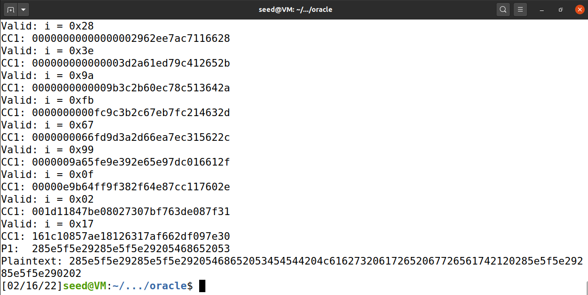

# Padding Oracle Attack

## Task 1: Getting Familiar with Padding

```shell
$ echo -n "12345" > 5P
$ openssl enc -aes-128-cbc -e -in 5P -out 5C
$ openssl enc -aes-128-cbc -d -nopad -in 5C -out 5P_new
$ xxd 5P_new
00000000: 3132 3334 350b 0b0b 0b0b 0b0b 0b0b 0b0b  12345...........
$ echo -n "1234512345" > 10P
$ openssl enc -aes-128-cbc -e -in 10P -out 10C
$ openssl enc -aes-128-cbc -d -nopad -in 10C -out 10P_new
$ xxd 10P_new
00000000: 3132 3334 3531 3233 3435 0606 0606 0606  1234512345......
$ echo -n "1234512345123451" > 16P
$ openssl enc -aes-128-cbc -e -in 16P -out 16C
$ openssl enc -aes-128-cbc -d -nopad -in 16C -out 16P_new
$ xxd 16P_new
00000000: 3132 3334 3531 3233 3435 3132 3334 3531  1234512345123451
00000010: 1010 1010 1010 1010 1010 1010 1010 1010  ................
```

padding = 16 - 长度 % 16

## Task 2: Padding Oracle Attack (Level 1)

```shell
$ nc 10.9.0.80 5000
01020304050607080102030405060708a9b2554b0944118061212098f2f238cd779ea0aae3d9d020f3677bfcb3cda9ce
$ ./manual_attack.py 
C1:  a9b2554b0944118061212098f2f238cd
C2:  779ea0aae3d9d020f3677bfcb3cda9ce
Valid: i = 0xcf
CC1: 000000000000000000000000000000cf
P2:  00000000000000000000000000000000


```

将D2[15]改为0xce（0xcf xor 0x1），CC1[15]改为0xcc（0xcd xor 0x2），K改为2，再次运行：

```shell
$ ./manual_attack.py 
C1:  a9b2554b0944118061212098f2f238cd
C2:  779ea0aae3d9d020f3677bfcb3cda9ce
Valid: i = 0x39
CC1: 000000000000000000000000000039cc
P2:  00000000000000000000000000000003

```

将D2[14]改为0x3b（0x39 xor 0x2），CC1[15]改为0xcd（0xce xor 0x3），CC1[14]改为0x38（0x3b xor 0x3），K改为3，再次运行：

```shell
$ ./manual_attack.py 
C1:  a9b2554b0944118061212098f2f238cd
C2:  779ea0aae3d9d020f3677bfcb3cda9ce
Valid: i = 0xf2
CC1: 00000000000000000000000000f238cd
P2:  00000000000000000000000000000303

```

将D2[13]改为0xf1（0xf2 xor 0x3），CC1[15]改为0xca（0xce xor 0x4），CC1[14]改为0x3f（0x3b xor 0x4），CC1[13]改为0xf5（0xf1 xor 0x4），K改为4，再次运行：

```shell
$ ./manual_attack.py 
C1:  a9b2554b0944118061212098f2f238cd
C2:  779ea0aae3d9d020f3677bfcb3cda9ce
Valid: i = 0x18
CC1: 00000000000000000000000018f53fca
P2:  00000000000000000000000000030303

```

将D2[12]改为0x1c（0x18 xor 0x4），CC1[15]改为0xcb（0xce xor 0x5），CC1[14]改为0x3e（0x3b xor 0x5），CC1[13]改为0xf4（0xf1 xor 0x5），CC1[12]改为0x19（0x1c xor 0x5），K改为5，再次运行：

```shell
$ ./manual_attack.py 
C1:  a9b2554b0944118061212098f2f238cd
C2:  779ea0aae3d9d020f3677bfcb3cda9ce
Valid: i = 0x40
CC1: 00000000000000000000004019f43ecb
P2:  000000000000000000000000ee030303

```

将D2[11]改为0x45（0x40 xor 0x5），CC1[15]改为0xc8（0xce xor 0x6），CC1[14]改为0x3d（0x3b xor 0x6），CC1[13]改为0xf7（0xf1 xor 0x6），CC1[12]改为0x1a（0x1c xor 0x6），CC1[11]改为0x43（0x45 xor 0x6），K改为6，再次运行：

```shell
$ ./manual_attack.py 
C1:  a9b2554b0944118061212098f2f238cd
C2:  779ea0aae3d9d020f3677bfcb3cda9ce
Valid: i = 0xea
CC1: 00000000000000000000ea431af73dc8
P2:  0000000000000000000000ddee030303

```

将D2[10]改为0xec（0xea xor 0x6），CC1[15]改为0xc9（0xce xor 0x7），CC1[14]改为0x3c（0x3b xor 0x7），CC1[13]改为0xf6（0xf1 xor 0x7），CC1[12]改为0x1b（0x1c xor 0x7），CC1[11]改为0x42（0x45 xor 0x7），CC1[10]改为0xeb（0xec xor 0x7），K改为7，再次运行：

```shell
$ ./manual_attack.py 
C1:  a9b2554b0944118061212098f2f238cd
C2:  779ea0aae3d9d020f3677bfcb3cda9ce
Valid: i = 0x9d
CC1: 0000000000000000009deb421bf63cc9
P2:  00000000000000000000ccddee030303
```

至此，成功获得P2的后六字节内容。修改后的`manual_attack.py`：

```python
#!/usr/bin/python3
import socket
from binascii import hexlify, unhexlify

# XOR two bytearrays
def xor(first, second):
   return bytearray(x^y for x,y in zip(first, second))

class PaddingOracle:

    def __init__(self, host, port) -> None:
        self.s = socket.socket(socket.AF_INET, socket.SOCK_STREAM)
        self.s.connect((host, port))

        ciphertext = self.s.recv(4096).decode().strip()
        self.ctext = unhexlify(ciphertext)

    def decrypt(self, ctext: bytes) -> None:
        self._send(hexlify(ctext))
        return self._recv()

    def _recv(self):
        resp = self.s.recv(4096).decode().strip()
        return resp 

    def _send(self, hexstr: bytes):
        self.s.send(hexstr + b'\n')

    def __del__(self):
        self.s.close()


if __name__ == "__main__":
    oracle = PaddingOracle('10.9.0.80', 5000)

    # Get the IV + Ciphertext from the oracle
    iv_and_ctext = bytearray(oracle.ctext)
    IV    = iv_and_ctext[00:16]
    C1    = iv_and_ctext[16:32]  # 1st block of ciphertext
    C2    = iv_and_ctext[32:48]  # 2nd block of ciphertext
    print("C1:  " + C1.hex())
    print("C2:  " + C2.hex())

    ###############################################################
    # Here, we initialize D2 with C1, so when they are XOR-ed,
    # The result is 0. This is not required for the attack.
    # Its sole purpose is to make the printout look neat.
    # In the experiment, we will iteratively replace these values.
    D2 = bytearray(16)

    D2[0]  = C1[0]
    D2[1]  = C1[1]
    D2[2]  = C1[2]
    D2[3]  = C1[3]
    D2[4]  = C1[4]
    D2[5]  = C1[5]
    D2[6]  = C1[6]
    D2[7]  = C1[7]
    D2[8]  = C1[8]
    D2[9]  = C1[9]
    D2[10] = 0xec
    D2[11] = 0x45
    D2[12] = 0x1c
    D2[13] = 0xf1
    D2[14] = 0x3b
    D2[15] = 0xce
    ###############################################################
    # In the experiment, we need to iteratively modify CC1
    # We will send this CC1 to the oracle, and see its response.
    CC1 = bytearray(16)

    CC1[0]  = 0x00
    CC1[1]  = 0x00
    CC1[2]  = 0x00
    CC1[3]  = 0x00
    CC1[4]  = 0x00
    CC1[5]  = 0x00
    CC1[6]  = 0x00
    CC1[7]  = 0x00
    CC1[8]  = 0x00
    CC1[9]  = 0x00
    CC1[10] = 0xeb
    CC1[11] = 0x42
    CC1[12] = 0x1b
    CC1[13] = 0xf6
    CC1[14] = 0x3c
    CC1[15] = 0xc9

    ###############################################################
    # In each iteration, we focus on one byte of CC1.  
    # We will try all 256 possible values, and send the constructed
    # ciphertext CC1 + C2 (plus the IV) to the oracle, and see 
    # which value makes the padding valid. 
    # As long as our construction is correct, there will be 
    # one valid value. This value helps us get one byte of D2. 
    # Repeating the method for 16 times, we get all the 16 bytes of D2.

    K = 7
    for i in range(256):
          CC1[16 - K] = i
          status = oracle.decrypt(IV + CC1 + C2)
          if status == "Valid":
              print("Valid: i = 0x{:02x}".format(i))
              print("CC1: " + CC1.hex())
    ###############################################################

    # Once you get all the 16 bytes of D2, you can easily get P2
    P2 = xor(C1, D2)
    print("P2:  " + P2.hex())

```


## Task 3: Padding Oracle Attack (Level 2)

```python
#!/usr/bin/python3
import socket
from binascii import hexlify, unhexlify

# XOR two bytearrays


def xor(first, second):
    return bytearray(x ^ y for x, y in zip(first, second))


class PaddingOracle:

    def __init__(self, host, port) -> None:
        self.s = socket.socket(socket.AF_INET, socket.SOCK_STREAM)
        self.s.connect((host, port))

        ciphertext = self.s.recv(4096).decode().strip()
        self.ctext = unhexlify(ciphertext)

    def decrypt(self, ctext: bytes) -> None:
        self._send(hexlify(ctext))
        return self._recv()

    def _recv(self):
        resp = self.s.recv(4096).decode().strip()
        return resp

    def _send(self, hexstr: bytes):
        self.s.send(hexstr + b'\n')

    def __del__(self):
        self.s.close()


if __name__ == "__main__":
    oracle = PaddingOracle('10.9.0.80', 6000)

    # Get the IV + Ciphertext from the oracle
    iv_and_ctext = bytearray(oracle.ctext)
    l = len(iv_and_ctext)
    n_blocks = l // 16 - 1
    print(f"n_blocks: {n_blocks}")
    C = [bytearray(16) for _ in range(n_blocks + 1)]
    IV = iv_and_ctext[00:16]
    C[0] = IV
    for _ in range(1, n_blocks + 1):
        C[_] = iv_and_ctext[16*_:16*(_+1)]
        print(f"C{_}: " + C[_].hex())

    plaintext = bytearray()
    for cur_block in range(n_blocks, 0,  -1):
        C1 = C[cur_block-1]  # aliasing

        D2 = bytearray(16)

        D2[0] = C1[0]
        D2[1] = C1[1]
        D2[2] = C1[2]
        D2[3] = C1[3]
        D2[4] = C1[4]
        D2[5] = C1[5]
        D2[6] = C1[6]
        D2[7] = C1[7]
        D2[8] = C1[8]
        D2[9] = C1[9]
        D2[10] = C1[10]
        D2[11] = C1[11]
        D2[12] = C1[12]
        D2[13] = C1[13]
        D2[14] = C1[14]
        D2[15] = C1[15]

        CC1 = bytearray(16)

        CC1[0] = 0x00
        CC1[1] = 0x00
        CC1[2] = 0x00
        CC1[3] = 0x00
        CC1[4] = 0x00
        CC1[5] = 0x00
        CC1[6] = 0x00
        CC1[7] = 0x00
        CC1[8] = 0x00
        CC1[9] = 0x00
        CC1[10] = 0x00
        CC1[11] = 0x00
        CC1[12] = 0x00
        CC1[13] = 0x00
        CC1[14] = 0x00
        CC1[15] = 0x00

        for K in range(1, 16 + 1):
            for i in range(256):
                CC1[16 - K] = i
                # print(CC1.hex())
                barr = bytearray()
                for _ in range(cur_block - 1):
                    barr += C[_]
                barr += CC1
                barr += C[cur_block]
                # print(barr.hex())
                status = oracle.decrypt(barr)
                if status == "Valid":
                    D2[16-K] = i ^ K
                    for j in range(1, K + 1):
                        CC1[16-j] = D2[16-j] ^ (K + 1)
                    print("Valid: i = 0x{:02x}".format(i))
                    print("CC1: " + CC1.hex())
                    break   # break search for i

        # Once you get all the 16 bytes of D2, you can easily get P2
        P = xor(C1, D2)
        print(f"P{cur_block}:  " + P.hex())
        plaintext = P + plaintext
    print(f"Plaintext: " + plaintext.hex())

```




可知，明文为

```
285e5f5e29285e5f5e29205468652053454544204c616273206172652067726561742120285e5f5e29285e5f5e29
```

