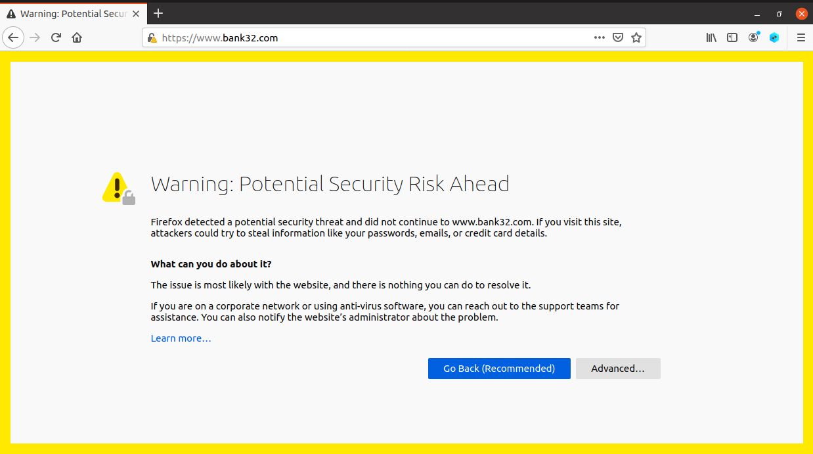
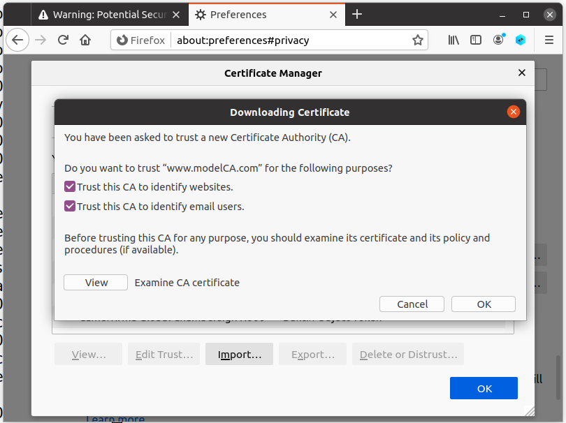
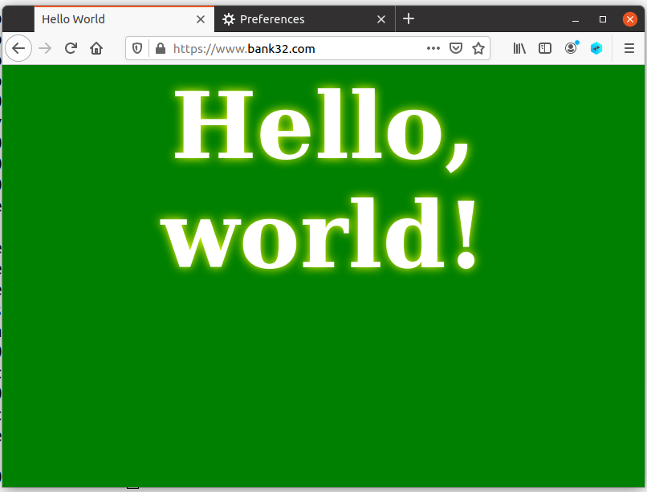
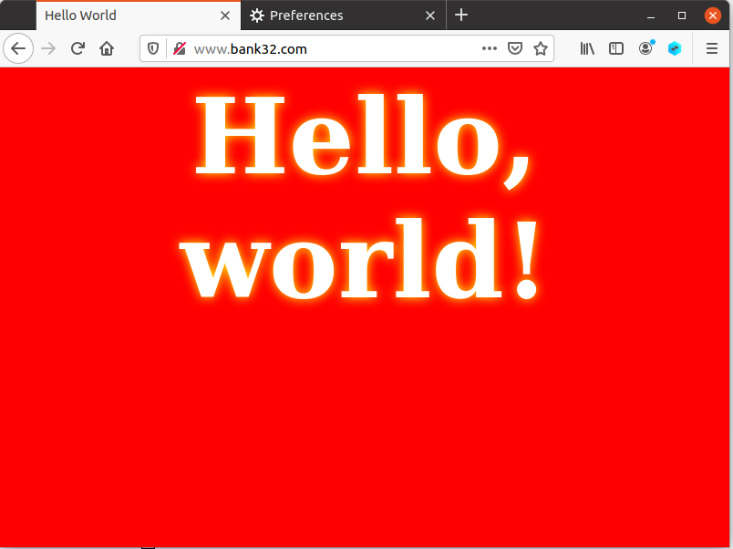
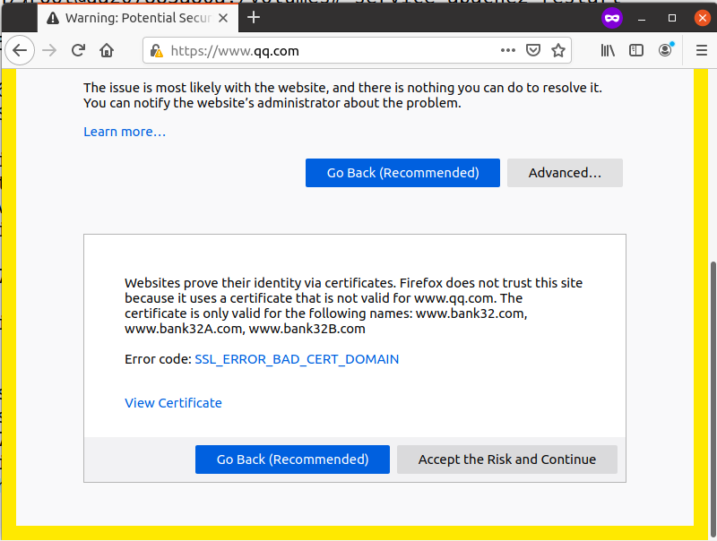
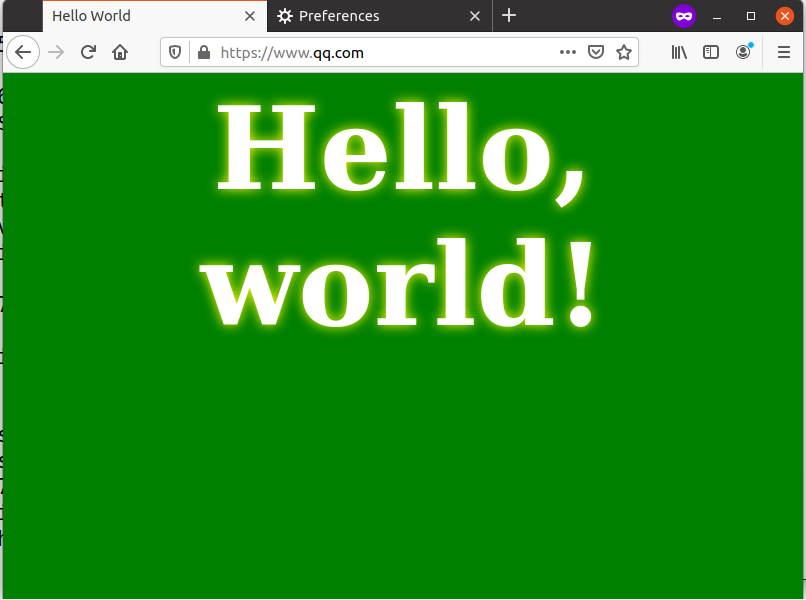

# Public-Key Infrastructure

## Task 1: Becoming a Certificate Authority (CA)

```shell
[02/17/22]seed@VM:~/.../CA$ cp /usr/lib/ssl/openssl.cnf ./my_openssl.cnf
[02/17/22]seed@VM:~/.../CA$ ls
demoCA  my_openssl.cnf
[02/17/22]seed@VM:~/.../CA$ cd demoCA
[02/17/22]seed@VM:~/.../demoCA$ touch index.txt
[02/17/22]seed@VM:~/.../demoCA$ echo -n "1000" > serial
[02/17/22]seed@VM:~/.../demoCA$ mkdir certs
[02/17/22]seed@VM:~/.../demoCA$ mkdir crl
[02/17/22]seed@VM:~/.../demoCA$ mkdir newcerts
[02/17/22]seed@VM:~/.../demoCA$ cd ..
[02/17/22]seed@VM:~/.../CA$ openssl req -x509 -newkey rsa:4096 -sha256 -days 3650 \
		-keyout ca.key -out ca.crt \
		-subj "/CN=www.modelCA.com/O=Model CA LTD./C=US" \
		-passout pass:dees


```

文件ca.key包含CA的私钥，而ca.crt包含公钥证书。

```shell
$ openssl x509 -in ca.crt -text -noout
Certificate:
    Data:
        Version: 3 (0x2)
        Serial Number:
            2d:36:cc:00:b9:41:c5:d0:8c:21:d6:d6:1d:14:ce:25:03:d6:41:ca
        Signature Algorithm: sha256WithRSAEncryption
        Issuer: CN = www.modelCA.com, O = Model CA LTD., C = US
        Validity
            Not Before: Feb 18 04:03:14 2022 GMT
            Not After : Feb 16 04:03:14 2032 GMT
        Subject: CN = www.modelCA.com, O = Model CA LTD., C = US
        Subject Public Key Info:
            Public Key Algorithm: rsaEncryption
                RSA Public-Key: (4096 bit)
                Modulus:
                    00:a5:45:18:00:e2:a7:a3:43:c1:fd:65:98:35:5d:
                    45:a7:37:15:33:59:9f:7d:c7:08:77:94:ba:51:e0:
                    2b:13:e4:b4:13:37:93:b8:12:4a:77:86:01:d6:0e:
                    1b:79:3a:c9:03:f4:c6:d4:fa:9d:27:1a:c0:f8:82:
                    ee:ea:a3:c5:c4:7a:f0:aa:29:d2:19:10:15:ca:4a:
                    99:f4:f8:98:81:de:cb:d9:4b:24:fb:f2:f2:ed:56:
                    d9:69:f9:f4:c9:ab:16:41:47:f6:79:fd:ec:7e:5a:
                    d1:8f:99:5e:d3:c4:14:d3:d2:59:4c:c0:e1:d6:55:
                    ee:50:bf:b3:e2:e4:d1:0c:f8:5b:7e:ef:0c:31:09:
                    09:bf:29:a3:01:d4:40:0c:8d:bd:03:de:ae:25:10:
                    d5:80:76:90:8e:57:e2:62:8c:be:7c:dc:30:e3:5b:
                    5f:6a:1b:c5:f8:c5:5c:5d:1f:c6:14:36:5d:0b:51:
                    d7:dc:32:3f:39:8a:b3:a9:11:80:b5:87:f2:a0:16:
                    b0:82:60:35:c3:42:fb:aa:bb:40:a8:9c:0e:e6:c0:
                    e5:5c:ea:e8:b2:2e:1a:9a:65:c5:2d:f8:be:c3:3f:
                    99:50:36:09:ce:68:2b:c8:06:35:3e:42:13:6a:a8:
                    66:35:04:dc:22:f1:ee:b9:7b:6a:cf:a1:db:95:1f:
                    5d:90:f7:d8:1c:11:24:59:8d:9b:58:e3:8f:49:d4:
                    58:6e:02:c9:a3:b7:bc:06:06:55:7c:88:fb:ef:b4:
                    df:2d:91:6f:8b:fd:6f:b5:80:48:98:e3:34:80:06:
                    fb:0e:d9:f2:72:23:29:59:77:5e:09:20:84:59:40:
                    e2:f4:70:44:82:e8:79:d8:52:37:54:c0:32:e9:04:
                    5b:e3:51:18:5f:84:1e:cd:95:4a:fe:4b:57:ca:fd:
                    57:ae:61:03:73:1b:85:db:11:24:df:a2:57:cc:80:
                    b1:07:cc:a3:e3:0c:36:d0:cc:d4:f5:73:8c:87:b9:
                    28:06:d4:6f:d3:11:03:6f:dc:b2:f1:9b:dc:83:a9:
                    78:11:cf:66:0a:3b:a7:7e:7b:bd:7d:2d:0a:b5:0d:
                    de:41:61:ee:16:15:e7:27:8a:27:74:f3:0e:bc:2c:
                    b2:ad:9a:dc:50:b6:90:81:c1:cb:f7:31:7d:2c:ce:
                    8d:8e:e6:f2:b2:5f:01:42:d5:d0:01:ea:86:9e:9e:
                    f9:a0:05:45:ac:d1:fb:27:1d:5c:1e:43:e3:83:58:
                    2d:67:fb:7f:82:e6:3a:f7:a6:be:7b:ed:b7:91:dc:
                    dc:b4:21:aa:3b:7f:10:00:e0:da:57:d9:77:bc:ee:
                    99:2f:3f:c6:36:37:dd:51:98:7c:5d:73:d5:08:f2:
                    65:1c:4d
                Exponent: 65537 (0x10001)
        X509v3 extensions:
            X509v3 Subject Key Identifier: 
                F7:9E:97:6E:F3:82:A8:05:21:A0:A4:DB:83:37:62:C8:DD:78:07:81
            X509v3 Authority Key Identifier: 
                keyid:F7:9E:97:6E:F3:82:A8:05:21:A0:A4:DB:83:37:62:C8:DD:78:07:81

            X509v3 Basic Constraints: critical
                CA:TRUE
    Signature Algorithm: sha256WithRSAEncryption
         4b:c6:d3:f1:1d:df:ba:f5:29:ed:f0:51:0f:0d:50:b1:69:02:
         0f:e7:43:d5:42:e9:66:1e:1a:09:cb:bd:6c:42:af:ad:4a:96:
         64:23:5d:7a:1c:e1:7f:51:23:a4:d6:a3:5f:7e:91:d9:e8:bf:
         dd:d3:b7:8f:95:e9:a3:ce:63:68:90:aa:02:49:0c:25:dd:bb:
         1e:53:23:ae:87:23:d0:b5:cc:a3:8f:3f:09:90:df:2b:8a:14:
         f2:69:ec:9d:49:a6:7c:a8:a8:c8:39:33:de:fb:e6:4e:8f:cb:
         fa:3c:95:08:ff:04:c2:e5:68:5e:66:f4:f5:83:9d:86:79:0e:
         c4:63:c7:56:0b:54:91:90:a3:97:a5:ad:1c:02:a6:d6:34:29:
         62:e1:04:2c:0e:64:ac:61:ca:40:2e:bb:dd:09:87:1e:fe:db:
         86:a9:e4:d9:56:af:58:fa:02:a1:f9:ad:82:9a:2a:c5:2e:93:
         b2:d0:e9:eb:06:0a:c1:9b:a2:5a:55:73:29:01:3f:35:fe:46:
         e1:03:43:fc:3c:70:ac:ab:78:4d:15:28:41:7b:23:a6:60:3f:
         af:bc:97:92:37:30:2b:38:69:67:c5:6b:16:9b:94:67:78:eb:
         af:25:8a:19:d7:67:80:54:ac:c5:72:96:ab:9d:28:2c:7f:08:
         64:d3:50:37:72:3a:e6:66:c3:db:ee:93:65:1e:9d:9f:a6:9c:
         b6:91:ed:8e:c5:d3:c3:1c:71:dd:09:b5:00:1e:d4:3d:db:df:
         dc:d8:a1:8b:e9:f1:4e:65:c1:72:a4:f0:a0:21:4f:a6:79:38:
         86:66:41:5e:cd:eb:8f:fd:da:0f:5c:11:9b:48:94:e5:c4:4a:
         5a:a9:86:6e:0b:05:6c:90:53:df:c0:3b:af:2b:83:a4:07:83:
         85:ea:6b:5e:8d:b6:70:56:ba:5b:1f:6c:af:40:40:aa:70:51:
         96:22:a1:e8:94:3d:bd:f1:7d:8b:49:a9:57:76:44:fc:46:63:
         1a:17:0f:16:e7:92:99:a0:22:dd:b2:da:15:88:13:24:d4:9d:
         9e:8b:eb:ff:7b:43:d1:5a:38:42:f7:05:42:a1:0f:7c:29:99:
         f6:49:37:dd:9d:ba:31:b7:23:98:f4:d8:c9:20:3f:18:ec:02:
         16:62:3d:1c:42:98:37:57:15:0a:29:4c:c7:40:84:52:ab:87:
         f3:d6:a9:21:27:30:fc:87:0e:15:47:06:09:5a:64:ca:fe:65:
         57:62:8c:86:40:ed:18:52:2e:2d:b3:bb:2a:36:4b:74:5b:4c:
         f1:f9:78:cd:52:89:31:6d:1f:77:4f:17:dc:18:c9:b5:56:d7:
         66:b5:55:1a:06:b7:10:3d

$ openssl rsa -in ca.key -text -noout
Enter pass phrase for ca.key:
RSA Private-Key: (4096 bit, 2 primes)
modulus:
    00:a5:45:18:00:e2:a7:a3:43:c1:fd:65:98:35:5d:
    45:a7:37:15:33:59:9f:7d:c7:08:77:94:ba:51:e0:
    2b:13:e4:b4:13:37:93:b8:12:4a:77:86:01:d6:0e:
    1b:79:3a:c9:03:f4:c6:d4:fa:9d:27:1a:c0:f8:82:
    ee:ea:a3:c5:c4:7a:f0:aa:29:d2:19:10:15:ca:4a:
    99:f4:f8:98:81:de:cb:d9:4b:24:fb:f2:f2:ed:56:
    d9:69:f9:f4:c9:ab:16:41:47:f6:79:fd:ec:7e:5a:
    d1:8f:99:5e:d3:c4:14:d3:d2:59:4c:c0:e1:d6:55:
    ee:50:bf:b3:e2:e4:d1:0c:f8:5b:7e:ef:0c:31:09:
    09:bf:29:a3:01:d4:40:0c:8d:bd:03:de:ae:25:10:
    d5:80:76:90:8e:57:e2:62:8c:be:7c:dc:30:e3:5b:
    5f:6a:1b:c5:f8:c5:5c:5d:1f:c6:14:36:5d:0b:51:
    d7:dc:32:3f:39:8a:b3:a9:11:80:b5:87:f2:a0:16:
    b0:82:60:35:c3:42:fb:aa:bb:40:a8:9c:0e:e6:c0:
    e5:5c:ea:e8:b2:2e:1a:9a:65:c5:2d:f8:be:c3:3f:
    99:50:36:09:ce:68:2b:c8:06:35:3e:42:13:6a:a8:
    66:35:04:dc:22:f1:ee:b9:7b:6a:cf:a1:db:95:1f:
    5d:90:f7:d8:1c:11:24:59:8d:9b:58:e3:8f:49:d4:
    58:6e:02:c9:a3:b7:bc:06:06:55:7c:88:fb:ef:b4:
    df:2d:91:6f:8b:fd:6f:b5:80:48:98:e3:34:80:06:
    fb:0e:d9:f2:72:23:29:59:77:5e:09:20:84:59:40:
    e2:f4:70:44:82:e8:79:d8:52:37:54:c0:32:e9:04:
    5b:e3:51:18:5f:84:1e:cd:95:4a:fe:4b:57:ca:fd:
    57:ae:61:03:73:1b:85:db:11:24:df:a2:57:cc:80:
    b1:07:cc:a3:e3:0c:36:d0:cc:d4:f5:73:8c:87:b9:
    28:06:d4:6f:d3:11:03:6f:dc:b2:f1:9b:dc:83:a9:
    78:11:cf:66:0a:3b:a7:7e:7b:bd:7d:2d:0a:b5:0d:
    de:41:61:ee:16:15:e7:27:8a:27:74:f3:0e:bc:2c:
    b2:ad:9a:dc:50:b6:90:81:c1:cb:f7:31:7d:2c:ce:
    8d:8e:e6:f2:b2:5f:01:42:d5:d0:01:ea:86:9e:9e:
    f9:a0:05:45:ac:d1:fb:27:1d:5c:1e:43:e3:83:58:
    2d:67:fb:7f:82:e6:3a:f7:a6:be:7b:ed:b7:91:dc:
    dc:b4:21:aa:3b:7f:10:00:e0:da:57:d9:77:bc:ee:
    99:2f:3f:c6:36:37:dd:51:98:7c:5d:73:d5:08:f2:
    65:1c:4d
publicExponent: 65537 (0x10001)
privateExponent:
    68:d5:df:58:10:6e:8e:5e:18:dc:08:69:f8:cf:e5:
    b3:20:79:ce:4c:f7:a2:ed:72:2d:88:a6:77:f1:5e:
    e2:0b:9d:3e:e3:6e:4c:c1:2d:83:8b:f9:f6:32:94:
    b2:dd:db:4d:2b:24:45:4d:84:0a:9e:29:f2:79:fb:
    db:d3:6f:4c:27:40:2a:70:c4:d9:29:1e:e9:67:51:
    29:d7:d7:c5:e9:f2:1d:30:51:91:90:97:10:7e:9b:
    03:62:8f:28:ad:e2:3c:1e:cd:f6:ac:60:2b:f6:a8:
    20:13:05:d8:06:f5:bf:38:1b:75:58:94:e9:45:31:
    1a:ff:bf:b8:19:b5:92:28:a8:c1:68:19:af:b1:30:
    01:97:03:d3:d1:33:9f:c2:f9:37:4f:35:e0:45:41:
    69:6f:cc:5a:be:dc:d7:ee:b7:96:b4:86:3e:72:63:
    a0:07:66:19:5b:f8:2f:0a:4c:b7:dd:94:3f:ed:f6:
    a3:b3:2b:ef:f0:4f:ee:db:2f:6d:f7:82:ac:92:37:
    fd:3b:d2:5e:be:4a:ae:0e:82:01:72:9c:f1:3b:43:
    43:21:af:e1:f6:e4:e1:33:d5:54:48:09:9a:08:e9:
    d3:bb:b3:94:be:f7:a6:b6:69:67:c8:ba:50:59:ea:
    1b:8f:ad:a4:6d:1b:25:85:68:47:b5:40:78:e3:a0:
    91:a3:64:a8:75:33:de:18:5f:a4:9b:db:d1:18:8f:
    83:f9:f1:bb:f5:c3:fb:2d:d0:bb:68:c0:a9:c8:25:
    26:0d:d4:49:20:df:50:1a:7b:17:09:ef:e0:08:78:
    a8:e2:2a:06:31:38:26:6c:c0:2b:af:e9:2b:1b:26:
    64:95:a0:55:49:75:5d:41:6b:6e:32:a7:b6:da:18:
    a7:e9:26:ff:09:f5:4d:94:7b:d7:c3:30:57:12:43:
    2b:14:3f:0b:c7:9e:92:4a:86:ee:58:28:32:51:38:
    c3:5a:53:42:5c:b2:10:94:ac:dc:b0:72:07:fb:4a:
    18:49:16:8b:db:29:6b:22:f0:84:64:93:3f:d4:9f:
    8a:cd:1e:d4:c9:9c:97:1a:1b:00:56:13:ec:a6:19:
    e0:1d:fa:c2:41:8d:e3:56:bc:cd:d0:80:4c:df:e1:
    fb:68:31:50:78:59:01:55:eb:27:cd:fe:aa:39:0a:
    23:96:f1:da:ee:d7:42:11:2a:8a:81:1b:44:a6:d4:
    f8:37:20:5c:9a:bb:ae:6a:2a:43:8b:b3:af:cc:26:
    d2:0e:99:ab:c6:dc:b0:d8:b0:c2:72:a7:75:c3:ec:
    c5:6b:80:68:ef:73:63:5e:69:f1:28:0e:e4:a4:dc:
    30:83:a9:27:c1:f0:57:76:f6:77:93:c5:ea:28:4b:
    09:f1
prime1:
    00:db:78:22:ea:4d:2b:4a:ca:87:de:36:41:0a:d1:
    37:4f:44:4a:c0:40:c7:14:bf:f3:ce:3b:8b:6d:d6:
    f3:31:05:5a:39:76:80:97:41:cf:50:b8:fb:91:0d:
    8e:0a:ab:b3:c1:94:42:4f:69:ea:35:da:60:42:a7:
    73:da:01:33:0b:70:5a:41:2d:39:ad:fa:c1:81:74:
    e8:d6:68:82:9d:4e:22:87:58:a3:f2:04:ab:af:0b:
    d0:45:09:24:f8:d6:01:c3:e1:f0:9e:c1:c0:cc:07:
    88:61:b5:8a:00:22:9d:de:78:5c:8a:59:76:93:b6:
    88:74:7c:2e:23:28:62:fa:60:52:df:8e:29:65:41:
    cc:d1:aa:76:bc:08:c4:e2:28:63:a4:25:07:22:08:
    16:84:c9:8b:7f:ff:13:64:1b:50:a6:dd:75:3c:08:
    e1:b4:44:42:a4:4e:e3:95:0a:dd:64:00:19:5f:2a:
    75:1d:73:86:c5:1c:be:b7:69:50:fc:73:b9:73:fb:
    52:0e:1a:32:c5:86:ea:64:90:3e:8b:9f:28:b3:50:
    03:19:ec:4c:87:ec:c8:bc:c3:c0:9b:19:bf:d0:0b:
    f4:38:f3:a8:18:c8:1e:ba:32:67:63:66:5e:20:cd:
    6a:3c:d0:4f:55:77:4c:93:a2:70:23:71:ab:55:a0:
    4b:43
prime2:
    00:c0:c7:73:fa:d8:8a:2f:9d:df:1d:0a:86:c0:b4:
    c7:8d:87:22:49:6e:ad:81:69:23:c7:50:3a:0d:a5:
    70:b8:95:35:4e:2e:42:07:2e:56:43:7e:95:93:e6:
    8c:71:75:bd:40:b5:7b:d2:44:84:4d:23:24:b0:30:
    6b:67:42:6e:91:86:16:be:32:ad:4c:5d:17:cf:43:
    ae:48:0c:e5:8a:a3:e3:de:92:16:f6:3a:cb:ef:6c:
    c4:85:31:42:4b:b5:93:89:8d:90:29:74:55:7e:8d:
    24:8e:55:f2:15:fa:73:60:46:91:63:df:e1:d8:42:
    33:f1:2a:13:38:75:41:c4:46:1c:73:4c:93:9c:46:
    6e:7d:ee:9a:12:90:da:51:b7:d0:d6:d4:c3:db:18:
    8f:c1:db:81:91:7f:1d:cc:ed:98:41:c2:98:e3:b6:
    c1:dc:b6:4c:87:19:ec:e7:bb:85:fa:ac:4b:47:0f:
    f6:c7:45:5f:46:53:d8:d3:51:b4:ec:2a:8e:40:e1:
    96:ec:bf:38:8e:cd:fd:2f:45:9e:81:c2:dd:ee:f1:
    0f:b8:3e:89:a5:51:04:89:db:09:23:82:27:fe:a9:
    3b:50:41:33:a7:ec:48:ce:51:56:01:a8:29:b2:ea:
    d8:be:20:e9:b2:af:8f:df:a5:26:52:be:5e:6f:af:
    59:2f
exponent1:
    00:bb:69:4f:87:7c:f6:67:1b:a4:02:61:9a:11:3e:
    af:58:85:1c:c0:27:90:d9:6b:41:2a:ef:36:15:49:
    e4:ca:0b:a4:0c:45:e1:71:48:c5:5c:4d:5a:a5:77:
    49:c0:5a:f7:59:6a:dd:65:2b:30:d1:63:f5:a7:75:
    8f:3c:ae:a1:84:37:21:1b:5f:1f:4e:2e:3f:67:e9:
    09:9b:6e:0b:7b:80:e9:83:62:72:3d:8d:37:7e:77:
    3c:16:77:c4:96:a9:49:40:98:83:fd:4d:be:f1:7b:
    cd:3e:82:e3:a1:51:ee:35:b7:da:6e:5a:0f:23:fc:
    4f:72:09:48:ec:c4:e4:20:a2:78:a2:66:a7:7a:cc:
    41:b7:19:35:e3:44:29:bc:66:79:10:06:7e:9c:d5:
    03:45:c9:45:d2:bb:63:37:ad:0b:a6:32:9e:95:f1:
    8f:ab:7c:4e:dc:38:71:a7:28:6b:fd:a5:08:05:78:
    20:22:52:30:d7:c9:c0:22:a7:50:7d:03:e5:6d:e1:
    43:24:bf:c2:73:62:ce:6d:a9:af:7f:53:1e:52:61:
    15:04:e2:00:48:62:2e:d8:e2:e0:6a:92:06:76:06:
    7f:3a:d2:f6:cc:92:b7:8a:90:d8:30:cd:8d:bb:bd:
    2d:e7:58:8b:26:94:85:53:dc:f6:9d:8d:c7:9d:8b:
    10:39
exponent2:
    35:ae:14:5c:90:39:82:62:da:82:d2:b0:8d:2e:89:
    b6:9e:1f:6d:05:35:a9:28:66:bf:14:56:e5:ff:e0:
    70:75:93:df:4e:40:32:91:b3:91:9d:c8:f6:e3:26:
    ce:5d:33:b2:b6:16:61:89:94:b1:8a:0c:a8:47:03:
    51:40:8d:5b:56:54:34:e8:15:9b:82:fc:a3:49:3c:
    59:71:c5:e5:22:17:cc:9d:2f:69:a7:1b:ac:72:c4:
    12:36:92:38:54:ba:5d:7e:1e:db:7c:3a:66:3f:d5:
    23:11:49:94:d7:25:93:74:72:fd:b5:94:c4:cc:42:
    7c:6f:f3:e4:2f:ba:7d:75:ec:6c:2a:b1:9b:bd:7c:
    fc:f2:18:d2:fc:a4:de:46:6a:0f:b8:35:45:68:04:
    77:bd:b0:c9:9b:f4:e7:60:6d:9a:3a:1e:aa:a1:f4:
    3f:8a:3f:ab:0b:0c:0d:c7:08:da:b1:69:50:c3:60:
    3b:42:d4:f1:d7:5d:34:12:b7:67:5f:be:36:d0:da:
    5e:d8:2c:5e:8f:7b:65:d3:63:fc:cc:0f:52:7e:ab:
    9a:e9:47:18:d2:83:8a:03:84:fa:ef:3e:45:ca:47:
    ea:e4:0d:07:40:63:51:98:12:73:e9:a8:9a:da:8c:
    39:fd:1e:36:14:6e:e2:9e:b1:1a:2f:4a:4a:9d:30:
    1f
coefficient:
    00:d8:77:0d:16:94:bf:e6:9d:da:2a:33:91:49:1a:
    c0:87:35:0a:27:16:6a:24:1b:f5:e3:dd:1d:f3:37:
    bd:a7:c4:62:04:16:3a:45:c2:38:5b:5c:b6:e4:70:
    f1:dc:1f:fb:81:09:a4:1c:a0:f1:f9:a8:9e:f5:07:
    c9:12:89:fd:92:c1:0d:ec:f4:06:a0:9e:3e:90:bf:
    6b:79:de:b8:73:8e:9b:89:73:b9:dd:87:d7:f5:f1:
    69:7f:72:06:09:a6:f7:ea:5b:70:be:e9:9e:e0:53:
    fc:9f:ff:03:6d:27:8f:ec:8c:48:27:e7:07:52:58:
    a5:e6:93:58:6a:0b:21:c6:a3:5d:a1:26:37:4e:97:
    2e:9a:8d:94:85:ca:03:3f:2d:72:c0:62:ea:1a:6c:
    de:3a:f4:29:81:0b:56:fa:f7:ce:f4:b4:2c:1a:57:
    e6:35:1c:38:cb:49:33:f7:28:f6:7f:dc:99:f5:c5:
    52:23:04:38:40:4e:ee:59:6c:09:9e:2d:55:c4:d1:
    9d:8d:a1:e2:2e:c4:6b:ba:8c:65:3e:55:bd:b3:e6:
    f9:2f:71:a4:1a:c0:78:45:62:4f:20:f8:0c:47:3b:
    0d:ae:a8:f1:e5:ea:9a:80:01:7f:7b:d8:b9:61:d5:
    82:31:5a:93:34:f7:59:7d:c2:57:4a:33:55:82:b2:
    f6:7a

```

* What part of the certificate indicates this is a CA’s certificate?
* What part of the certificate indicates this is a self-signed certificate?
* In the RSA algorithm, we have a public exponent e, a private exponent d, a modulus n, and two secret
  numbers p and q, such that n = pq. Please identify the values for these elements in your certificate
  and key files

Answer:

* 证书文件中，
```
            X509v3 Basic Constraints: critical
                  CA:TRUE
```
	表明是CA证书。

* 证书文件中，Subject和Issuer相同，表明是自签名证书。
* $e = 65537 $, $ n = modulus(00:a5:45:18:...) $, $d = privateExponent(68:d5:df:58:...) $, $ p = prime1(00:db:78:22:...) $, $ q = prime2(00:c0:c7:73:...) $

## Task 2: Generating a Certificate Request for Your Web Server

```shell
$ openssl req -newkey rsa:2048 -sha256 \
-keyout server.key -out server.csr \
-subj "/CN=www.bank32.com/O=Bank32 Inc./C=US" \
-passout pass:dees \
-addext "subjectAltName = DNS:www.bank32.com, \
DNS:www.bank32A.com, \
DNS:www.bank32B.com"
$ openssl req -in server.csr -text -noout
Certificate Request:
    Data:
        Version: 1 (0x0)
        Subject: CN = www.bank32.com, O = Bank32 Inc., C = US
        Subject Public Key Info:
            Public Key Algorithm: rsaEncryption
                RSA Public-Key: (2048 bit)
                Modulus:
                    00:af:6e:61:6d:67:ef:8b:c2:52:7e:a6:58:24:1a:
                    a8:47:34:25:ca:6d:96:b1:0f:5d:e8:9c:fc:11:8d:
                    76:47:a0:b1:14:27:e8:cf:6f:54:df:59:7d:45:97:
                    7c:1c:2b:79:e6:33:b2:c3:c7:c0:5e:b7:45:00:e9:
                    cc:87:b5:a6:f1:ce:1d:4a:ff:37:b0:40:1f:ba:6b:
                    a6:16:45:78:52:7b:e7:10:ee:80:2e:76:85:2c:47:
                    3d:a7:93:a2:da:aa:22:44:ad:41:59:f9:d5:d7:85:
                    8b:ee:bb:6d:06:b5:da:35:07:16:1d:db:7c:3f:14:
                    52:50:e2:9d:c8:67:a2:4a:08:bf:85:77:60:61:ec:
                    31:e4:ba:07:d3:2a:5e:57:4a:37:4f:91:a7:4a:f9:
                    60:ab:97:17:72:04:ec:fb:d5:5f:87:7e:1d:68:8a:
                    9b:9f:33:01:fa:9f:94:79:8a:69:07:8a:6c:2d:62:
                    fc:96:e0:30:64:6f:4e:37:c2:9d:92:16:f4:7d:5b:
                    ab:b7:fc:ea:0d:be:18:13:9c:a3:15:b3:0c:0b:2d:
                    98:e0:06:18:f1:69:df:25:38:8c:c1:7f:ce:49:10:
                    19:57:e5:dc:74:25:aa:a3:2b:f2:10:3e:c2:de:03:
                    83:b0:ee:e6:2b:ab:a0:15:44:41:86:ec:45:ee:66:
                    07:cf
                Exponent: 65537 (0x10001)
        Attributes:
        Requested Extensions:
            X509v3 Subject Alternative Name: 
                DNS:www.bank32.com, DNS:www.bank32A.com, DNS:www.bank32B.com
    Signature Algorithm: sha256WithRSAEncryption
         78:22:38:fc:f1:1c:b4:99:57:42:4a:5e:f4:3b:59:90:f1:fc:
         90:c8:a9:51:a1:c6:f7:35:4f:7b:f1:26:0d:10:5b:ad:14:2b:
         55:93:ab:22:cf:0b:c2:40:4c:d4:3f:09:56:d8:2e:0a:f9:1e:
         c9:c1:da:54:22:56:89:0e:83:d6:5b:90:4c:e6:bf:b6:36:a8:
         04:66:79:ad:8b:70:1f:f3:38:f1:28:7e:67:14:86:c5:fb:f8:
         10:13:aa:14:99:54:e8:94:4f:57:2c:78:e2:47:a1:df:3d:f5:
         84:11:2e:77:e1:03:3c:b7:bd:de:fe:68:0a:c7:ea:65:27:04:
         5e:12:29:c5:74:5e:75:d9:6c:b4:75:69:02:ee:7c:ad:ab:29:
         58:89:34:46:74:d7:20:ec:c3:30:86:59:a9:5f:e1:1b:5f:21:
         d6:2f:59:3c:02:9c:45:de:aa:fd:0d:36:47:19:7a:4c:40:51:
         31:29:ba:66:3e:78:e0:d9:f3:61:ac:78:c9:17:c3:c5:b6:76:
         6b:77:01:10:17:fc:3c:4e:1f:57:1e:5f:fe:7d:27:46:70:24:
         03:91:98:12:3c:24:bf:b1:7a:18:e8:26:12:05:dd:f0:14:c3:
         cd:36:dd:bc:e3:c5:1e:35:14:5a:e7:e6:47:30:d6:f0:5e:86:
         6e:7d:c0:61

$ openssl rsa -in server.key -text -noout
Enter pass phrase for server.key:
RSA Private-Key: (2048 bit, 2 primes)
modulus:
    00:af:6e:61:6d:67:ef:8b:c2:52:7e:a6:58:24:1a:
    a8:47:34:25:ca:6d:96:b1:0f:5d:e8:9c:fc:11:8d:
    76:47:a0:b1:14:27:e8:cf:6f:54:df:59:7d:45:97:
    7c:1c:2b:79:e6:33:b2:c3:c7:c0:5e:b7:45:00:e9:
    cc:87:b5:a6:f1:ce:1d:4a:ff:37:b0:40:1f:ba:6b:
    a6:16:45:78:52:7b:e7:10:ee:80:2e:76:85:2c:47:
    3d:a7:93:a2:da:aa:22:44:ad:41:59:f9:d5:d7:85:
    8b:ee:bb:6d:06:b5:da:35:07:16:1d:db:7c:3f:14:
    52:50:e2:9d:c8:67:a2:4a:08:bf:85:77:60:61:ec:
    31:e4:ba:07:d3:2a:5e:57:4a:37:4f:91:a7:4a:f9:
    60:ab:97:17:72:04:ec:fb:d5:5f:87:7e:1d:68:8a:
    9b:9f:33:01:fa:9f:94:79:8a:69:07:8a:6c:2d:62:
    fc:96:e0:30:64:6f:4e:37:c2:9d:92:16:f4:7d:5b:
    ab:b7:fc:ea:0d:be:18:13:9c:a3:15:b3:0c:0b:2d:
    98:e0:06:18:f1:69:df:25:38:8c:c1:7f:ce:49:10:
    19:57:e5:dc:74:25:aa:a3:2b:f2:10:3e:c2:de:03:
    83:b0:ee:e6:2b:ab:a0:15:44:41:86:ec:45:ee:66:
    07:cf
publicExponent: 65537 (0x10001)
privateExponent:
    07:24:4b:3b:14:fc:1f:88:6d:ab:52:42:4c:55:f9:
    7b:cc:97:ad:42:00:dc:7c:6f:aa:44:99:ce:6d:1f:
    df:92:9f:22:de:ed:0f:64:cc:e3:ba:d4:ea:bc:5c:
    05:19:90:00:db:21:ef:ee:75:da:65:43:9d:e1:e6:
    bd:af:9b:78:44:97:d4:b1:c7:26:99:b5:b0:f5:28:
    f1:c7:2a:3a:d1:68:7a:bb:fa:e3:e9:57:4a:92:2b:
    e4:62:92:42:ac:a2:70:81:4d:23:c8:93:f8:0e:2b:
    c0:30:49:23:f8:cb:45:55:60:85:1e:a6:54:3b:13:
    8e:cf:6a:f4:f9:a3:15:b8:6c:30:46:a6:88:27:8b:
    65:bd:19:76:50:da:40:dd:1e:d8:54:56:a8:5f:4f:
    af:d1:3c:d6:f9:f5:09:39:f5:a9:40:65:00:d3:b6:
    bd:ce:29:b4:89:57:02:bd:87:81:4c:a3:d9:c4:6b:
    ca:24:d7:1f:98:9d:2e:ea:ff:35:ef:84:6c:94:ed:
    56:6b:96:0e:16:cf:f1:a4:7c:ab:72:d4:fb:18:25:
    4e:1c:df:cb:0e:e9:54:10:fa:d4:21:6e:75:dd:ad:
    fe:83:dc:41:fe:15:8d:1d:86:58:12:91:54:26:c1:
    93:9a:4f:89:29:47:b5:ed:ba:1b:a1:b5:c2:5a:ad:
    61
prime1:
    00:da:8a:e1:2a:40:42:2d:82:1e:e0:26:3e:37:73:
    7f:8f:78:83:56:9d:e2:2c:26:9a:9a:4a:68:2c:65:
    43:53:05:60:86:66:64:aa:34:c8:f8:52:49:6f:1b:
    5c:eb:7b:31:2e:6a:35:c7:fe:79:14:2f:11:29:f1:
    fe:7d:e8:c8:00:be:03:93:29:db:62:cd:39:7b:fe:
    4a:bd:20:79:b0:54:f7:c5:ae:34:eb:2f:ad:36:f0:
    6e:26:8e:62:40:ba:d1:94:fa:53:5c:17:f3:e4:a4:
    68:04:af:55:9d:4a:92:50:61:2a:16:45:09:0b:43:
    93:90:9d:c9:f9:52:7d:e9:83
prime2:
    00:cd:7f:e1:2b:1d:a0:77:05:4b:04:09:94:f9:0d:
    4d:8f:e7:a3:54:72:2d:d8:1a:f7:6f:b3:6f:13:f3:
    ee:a7:42:34:c9:2b:87:db:02:50:c0:db:db:c1:2f:
    af:62:cb:47:79:ca:0f:1e:78:de:bc:99:2e:db:c7:
    17:96:ef:aa:d6:f3:cb:d2:61:85:45:d8:09:fa:d7:
    1a:06:34:37:65:e3:c6:7b:78:3a:8b:07:54:9b:a3:
    7d:5c:1d:36:a2:bb:85:26:b2:99:87:17:44:9f:b0:
    f0:e2:7a:89:d3:f2:9e:52:f0:fa:a0:be:41:c7:2c:
    83:c8:31:4e:b0:02:57:72:c5
exponent1:
    00:b8:76:62:e9:bb:c5:60:0e:25:ab:82:fc:1e:e7:
    e1:32:a3:41:10:9a:41:2e:8d:03:0f:da:60:25:a0:
    ef:7b:a2:dd:3f:74:2b:e1:b2:9e:33:63:99:52:2b:
    e1:79:6d:c9:2c:69:3f:ad:e8:70:20:86:3d:d1:8e:
    ce:05:4e:b7:8a:50:d8:49:9e:19:ec:42:57:13:fe:
    a6:ed:0d:fd:48:c5:df:41:3e:f2:b1:d4:d3:3a:bd:
    23:ec:6d:60:27:4c:c8:dc:1b:92:c2:f8:00:c7:eb:
    b1:54:ca:fd:d3:be:fe:d2:d3:c0:a7:7d:6b:cd:d3:
    23:39:fc:c5:5f:29:ae:d7:ab
exponent2:
    16:d7:d1:3a:ce:b7:48:a3:b0:fc:08:e8:a3:6a:a4:
    25:8b:f5:2e:ec:e6:45:b0:71:b2:db:fa:4b:f8:80:
    9d:dd:11:2b:0f:88:b1:82:a7:61:58:cf:2b:c1:56:
    38:a0:2a:18:d2:aa:2d:93:f8:06:74:ec:ad:87:8b:
    0a:bf:27:79:6f:6e:47:bb:89:6a:03:22:d0:dc:5a:
    4b:38:40:b4:35:c6:99:70:fa:e8:fb:6e:9f:42:64:
    2b:fa:1f:59:a5:88:9e:8d:99:dd:57:6b:cc:68:89:
    ce:53:1a:c1:11:a6:21:c8:21:c3:fe:82:27:56:be:
    6b:61:77:c2:be:ef:e3:95
coefficient:
    56:e0:4c:e7:14:57:c8:7e:6a:46:4e:04:ae:ec:31:
    bc:19:0d:b4:0f:9e:8e:1a:0d:7d:d1:6c:d8:d7:e7:
    0d:d4:f2:eb:c7:0d:20:69:d8:8b:80:30:5f:3e:c3:
    8d:d7:be:94:ec:c0:7d:b1:21:7f:6b:d2:fb:af:ee:
    1d:42:00:2d:f1:d5:e5:f3:ea:45:e4:d0:49:9c:c7:
    9b:4f:77:8c:78:e2:c7:2b:38:c6:2a:9a:f9:ff:ab:
    0c:5f:63:ce:56:a2:d1:56:f4:e0:3e:32:08:fb:d3:
    a9:d8:ff:86:e5:c4:f5:9a:55:b9:39:91:ef:6f:0b:
    d4:c5:4a:42:7c:bc:8f:46

```

## Task 3: Generating a Certificate for your server

```shell
$ openssl ca -config my_openssl.cnf -policy policy_anything \
-md sha256 -days 3650 \
-in server.csr -out server.crt -batch \
-cert ca.crt -keyfile ca.key

Using configuration from my_openssl.cnf
Enter pass phrase for ca.key:
Check that the request matches the signature
Signature ok
Certificate Details:
        Serial Number: 4096 (0x1000)
        Validity
            Not Before: Feb 18 04:28:19 2022 GMT
            Not After : Feb 16 04:28:19 2032 GMT
        Subject:
            countryName               = US
            organizationName          = Bank32 Inc.
            commonName                = www.bank32.com
        X509v3 extensions:
            X509v3 Basic Constraints: 
                CA:FALSE
            Netscape Comment: 
                OpenSSL Generated Certificate
            X509v3 Subject Key Identifier: 
                97:34:76:7B:DD:01:E4:2A:3F:D3:30:D9:D3:E2:F9:2D:91:F3:AE:DB
            X509v3 Authority Key Identifier: 
                keyid:F7:9E:97:6E:F3:82:A8:05:21:A0:A4:DB:83:37:62:C8:DD:78:07:81

            X509v3 Subject Alternative Name: 
                DNS:www.bank32.com, DNS:www.bank32A.com, DNS:www.bank32B.com
Certificate is to be certified until Feb 16 04:28:19 2032 GMT (3650 days)

Write out database with 1 new entries
Data Base Updated

$ openssl x509 -in server.crt -text -noout
Certificate:
    Data:
        Version: 3 (0x2)
        Serial Number: 4096 (0x1000)
        Signature Algorithm: sha256WithRSAEncryption
        Issuer: CN = www.modelCA.com, O = Model CA LTD., C = US
        Validity
            Not Before: Feb 18 04:28:19 2022 GMT
            Not After : Feb 16 04:28:19 2032 GMT
        Subject: C = US, O = Bank32 Inc., CN = www.bank32.com
        Subject Public Key Info:
            Public Key Algorithm: rsaEncryption
                RSA Public-Key: (2048 bit)
                Modulus:
                    00:af:6e:61:6d:67:ef:8b:c2:52:7e:a6:58:24:1a:
                    a8:47:34:25:ca:6d:96:b1:0f:5d:e8:9c:fc:11:8d:
                    76:47:a0:b1:14:27:e8:cf:6f:54:df:59:7d:45:97:
                    7c:1c:2b:79:e6:33:b2:c3:c7:c0:5e:b7:45:00:e9:
                    cc:87:b5:a6:f1:ce:1d:4a:ff:37:b0:40:1f:ba:6b:
                    a6:16:45:78:52:7b:e7:10:ee:80:2e:76:85:2c:47:
                    3d:a7:93:a2:da:aa:22:44:ad:41:59:f9:d5:d7:85:
                    8b:ee:bb:6d:06:b5:da:35:07:16:1d:db:7c:3f:14:
                    52:50:e2:9d:c8:67:a2:4a:08:bf:85:77:60:61:ec:
                    31:e4:ba:07:d3:2a:5e:57:4a:37:4f:91:a7:4a:f9:
                    60:ab:97:17:72:04:ec:fb:d5:5f:87:7e:1d:68:8a:
                    9b:9f:33:01:fa:9f:94:79:8a:69:07:8a:6c:2d:62:
                    fc:96:e0:30:64:6f:4e:37:c2:9d:92:16:f4:7d:5b:
                    ab:b7:fc:ea:0d:be:18:13:9c:a3:15:b3:0c:0b:2d:
                    98:e0:06:18:f1:69:df:25:38:8c:c1:7f:ce:49:10:
                    19:57:e5:dc:74:25:aa:a3:2b:f2:10:3e:c2:de:03:
                    83:b0:ee:e6:2b:ab:a0:15:44:41:86:ec:45:ee:66:
                    07:cf
                Exponent: 65537 (0x10001)
        X509v3 extensions:
            X509v3 Basic Constraints: 
                CA:FALSE
            Netscape Comment: 
                OpenSSL Generated Certificate
            X509v3 Subject Key Identifier: 
                97:34:76:7B:DD:01:E4:2A:3F:D3:30:D9:D3:E2:F9:2D:91:F3:AE:DB
            X509v3 Authority Key Identifier: 
                keyid:F7:9E:97:6E:F3:82:A8:05:21:A0:A4:DB:83:37:62:C8:DD:78:07:81

            X509v3 Subject Alternative Name: 
                DNS:www.bank32.com, DNS:www.bank32A.com, DNS:www.bank32B.com
    Signature Algorithm: sha256WithRSAEncryption
         6d:52:29:16:bb:c5:09:78:d3:ec:06:9f:51:e5:9a:6b:8c:a4:
         0d:39:4e:86:af:8e:98:6a:3c:a8:99:e9:b6:ab:bb:d4:18:55:
         40:08:05:7d:d2:12:c0:3b:60:17:e4:a2:d0:6d:02:ff:ae:dc:
         f0:89:17:84:53:3d:08:3b:4d:55:cb:ae:d8:58:89:1e:b0:0e:
         29:ec:aa:b7:8c:99:8a:9c:01:91:e9:56:e7:ab:de:89:f2:3e:
         17:52:c3:d6:19:b7:e8:b3:c9:69:b2:d5:00:95:7a:ff:d6:29:
         61:19:20:13:05:d4:41:01:e5:c2:e9:85:a7:71:51:10:0b:3e:
         aa:52:e0:ba:05:eb:d0:68:47:9c:b5:bd:9b:a9:40:7a:96:0c:
         c5:34:67:8f:8f:0c:bd:0a:09:7c:43:b7:7f:7a:8a:2a:a5:86:
         8a:21:25:96:53:b0:72:4d:4d:e5:52:63:23:42:3d:37:2e:d3:
         ca:f0:c4:46:a7:e4:ed:9e:6a:74:65:56:74:07:3d:d8:cb:36:
         56:32:99:fa:1f:4e:33:1b:d6:09:96:c2:26:17:75:5b:15:31:
         44:10:d8:bc:83:90:5d:83:11:bb:2a:87:a3:f3:da:bb:ba:f6:
         37:d6:e0:16:ff:b9:a2:93:fa:22:f1:a5:49:f1:b9:af:1a:12:
         37:5a:4d:2d:6b:51:02:e4:f8:b8:8f:31:aa:06:38:85:4f:4f:
         fd:1b:72:82:46:b1:e0:e0:52:4e:4e:ba:83:8f:5e:2e:d3:0c:
         2e:60:47:bf:07:24:22:57:73:55:1c:63:05:39:ec:b5:6f:d2:
         7b:d3:f5:c6:d9:0d:b1:6b:90:0e:ff:46:a6:dd:94:55:96:28:
         1a:1c:a9:1b:4f:6e:aa:b1:97:f0:50:7c:54:11:ee:7f:18:b9:
         6f:8e:dd:c7:76:64:e0:07:d9:1e:18:86:ae:68:96:03:75:71:
         d0:52:c2:11:66:36:3c:ec:56:9b:1a:ce:0e:b3:7f:55:b2:6f:
         c4:71:65:50:b7:3e:5d:f8:08:e6:19:d9:d2:e6:32:47:b5:b0:
         ee:1d:5a:6e:3c:d1:b2:44:b4:ff:d7:ad:c4:3f:78:c4:6f:7c:
         37:0b:e5:23:b0:a8:6c:64:1a:1c:c0:20:ff:fd:0e:07:55:d6:
         38:81:07:f0:9d:10:28:58:59:da:f8:33:20:dd:06:0b:d2:cf:
         f6:99:01:69:ae:c2:85:df:78:50:14:90:a5:d7:04:8f:a0:a6:
         d9:66:9a:ce:84:43:d7:b4:28:7b:48:dd:45:c3:6f:13:1a:85:
         57:5c:59:60:ca:68:c8:10:44:1e:a3:1a:1f:8c:e2:f6:f9:1f:
         13:95:d0:b1:d7:c4:a9:a8

```

## Task 4: Deploying Certificate in an Apache-Based HTTPSWebsite

在Docker里：

```shell
root@da207883a80a:/volumes# nano /etc/apache2/sites-available/bank32_apache_ssl.conf
root@da207883a80a:/volumes# a2enmod ssl
Considering dependency setenvif for ssl:
Module setenvif already enabled
Considering dependency mime for ssl:
Module mime already enabled
Considering dependency socache_shmcb for ssl:
Module socache_shmcb already enabled
Module ssl already enabled
root@da207883a80a:/volumes# a2ensite bank32_apache_ssl
Site bank32_apache_ssl already enabled
root@da207883a80a:/volumes# service apache2 start
 * Starting Apache httpd web server apache2                                                   Enter passphrase for SSL/TLS keys for www.bank32.com:443 (RSA):
 * 

```



这是因为Firefox没有导入我们的CA证书。

在`about:preferences#privacy`里，选择Authorities - Import...，导入ca.crt



即可打开我们的HTTPS网页：




如果URL前缀为HTTP，显示的网页如下：




## Task 5: Launching a Man-In-The-Middle Attack

### Step 1: Setting up the malicious website

以`qq.com`为例，在Docker的`/etc/apache2/sites-available/default-ssl.conf`中添加如下内容：

```
<VirtualHost *:443>
    DocumentRoot /var/www/bank32
    ServerName www.qq.com
    DirectoryIndex index.html
    SSLEngine On
    SSLCertificateFile /certs/server.crt
    SSLCertificateKeyFile /certs/server.key
</VirtualHost>

```

### Step 2: Becoming the man in the middle

在VM（模拟受害者）的hosts中添加

```
10.9.0.80	www.qq.com
```


### Step 3: Browse the target website

访问`https://www.qq.com`



提示证书对`www.qq.com`无效。

## Task 6: Launching a Man-In-The-Middle Attack with a Compromised CA

重复Task2，不过这次，在SAN字段加入`www.qq.com`

```shell
$ openssl req -newkey rsa:2048 -sha256 \
-keyout server.key -out server.csr \
-subj "/CN=www.bank32.com/O=Bank32 Inc./C=US" \
-passout pass:dees \
-addext "subjectAltName = DNS:www.bank32.com, \
DNS:www.bank32A.com, \
DNS:www.bank32B.com, \
DNS:www.qq.com"
$ openssl ca -config my_openssl.cnf -policy policy_anything \
-md sha256 -days 3650 \
-in server.csr -out server.crt -batch \
-cert ca.crt -keyfile ca.key

```

然后在Docker里重启Apache服务器。

Firefox访问`https://www.qq.com`，可见MITM攻击成功。


