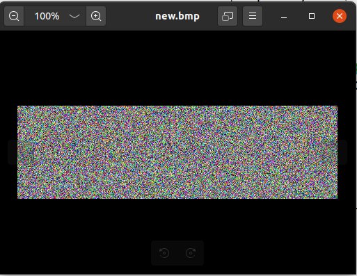
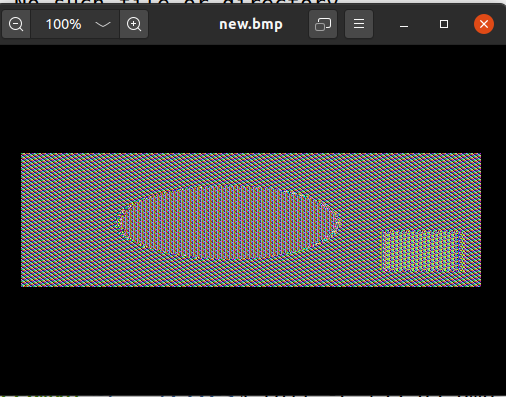
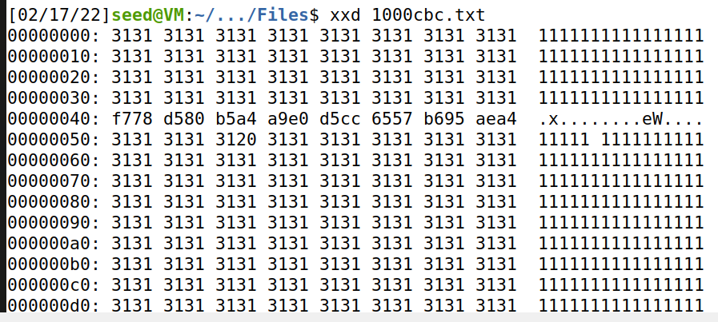
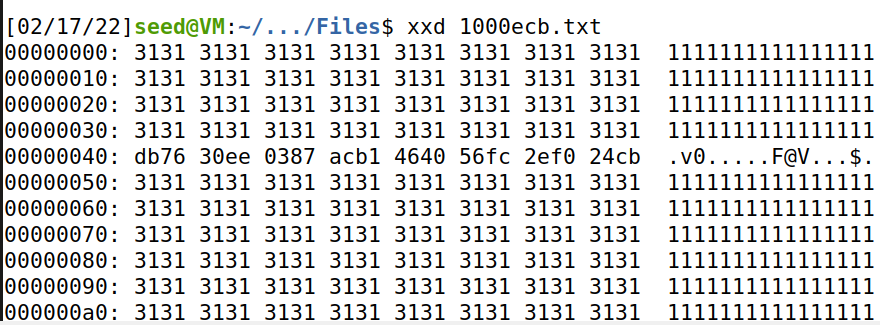
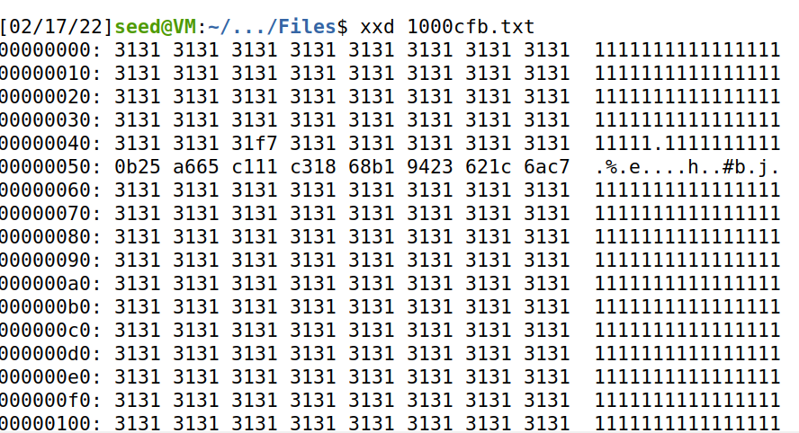
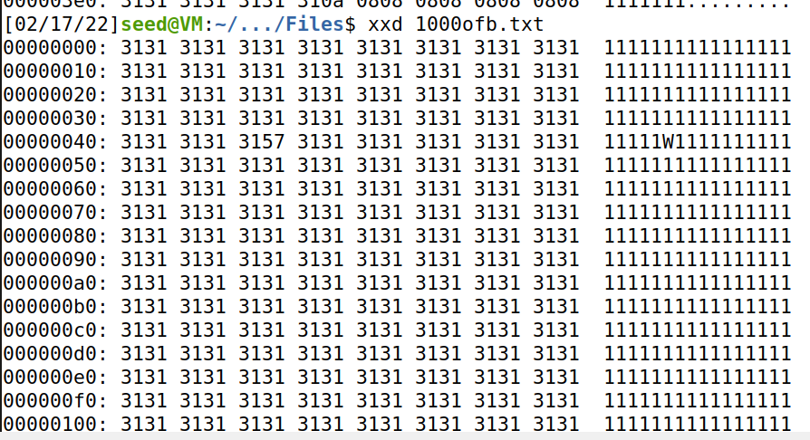
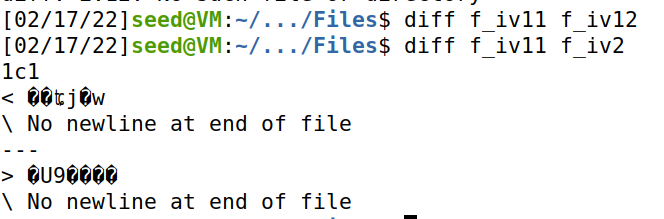
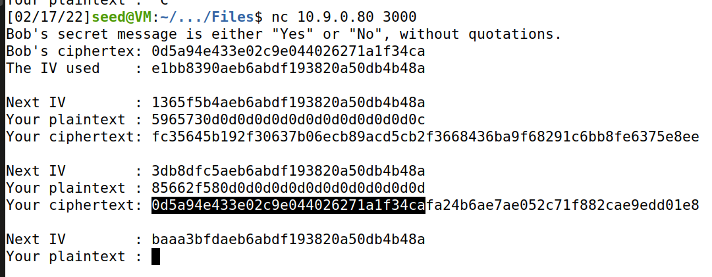

# Secret-Key Encryption

## Task 1: Frequency Analysis

```python
#!/bin/env python3
import random
s = "abcdefghijklmnopqrstuvwxyz"
list = random.sample(s, len(s))
key = ''.join(list)
print(key)
```

```shell
$ cat ciphertext.txt
ytn xqavhq yzhu  xu qzupvd ltmat qnncq vgxzy hmrty vbynh ytmq ixur qyhvurn
vlvhpq yhme ytn gvrrnh bnniq imsn v uxuvrnuvhmvu yxx

ytn vlvhpq hvan lvq gxxsnupnp gd ytn pncmqn xb tvhfnd lnmuqynmu vy myq xzyqny
vup ytn veevhnuy mceixqmxu xb tmq bmic axcevud vy ytn nup vup my lvq qtvenp gd
ytn ncnhrnuan xb cnyxx ymcnq ze givasrxlu eximymaq vhcavupd vaymfmqc vup
v uvymxuvi axufnhqvymxu vq ghmnb vup cvp vq v bnfnh phnvc vgxzy ltnytnh ytnhn
xzrty yx gn v ehnqmpnuy lmubhnd ytn qnvqxu pmpuy ozqy qnnc nkyhv ixur my lvq
nkyhv ixur gnavzqn ytn xqavhq lnhn cxfnp yx ytn bmhqy lnnsnup mu cvhat yx
vfxmp axubimaymur lmyt ytn aixqmur anhncxud xb ytn lmuynh xidcemaq ytvusq
ednxuratvur

xun gmr jznqymxu qzhhxzupmur ytmq dnvhq vavpncd vlvhpq mq txl xh mb ytn
anhncxud lmii vpphnqq cnyxx nqenamviid vbynh ytn rxipnu rixgnq ltmat gnavcn
v ozgmivuy axcmurxzy evhyd bxh ymcnq ze ytn cxfncnuy qenvhtnvpnp gd 
exlnhbzi txiidlxxp lxcnu ltx tnienp hvmqn cmiimxuq xb pxiivhq yx bmrty qnkzvi
tvhvqqcnuy vhxzup ytn axzuyhd

qmruvimur ytnmh qzeexhy rxipnu rixgnq vyynupnnq qlvytnp ytncqnifnq mu givas
qexhynp iveni emuq vup qxzupnp xbb vgxzy qnkmqy exlnh mcgvivuanq bhxc ytn hnp
avheny vup ytn qyvrn xu ytn vmh n lvq aviinp xzy vgxzy evd munjzmyd vbynh
myq bxhcnh vuatxh avyy qvpinh jzmy xuan qtn invhunp ytvy qtn lvq cvsmur bvh
inqq ytvu v cvin axtxqy vup pzhmur ytn anhncxud uvyvimn exhycvu yxxs v gizuy
vup qvymqbdmur pmr vy ytn viicvin hxqynh xb uxcmuvynp pmhnayxhq txl axzip
ytvy gn yxeenp

vq my yzhuq xzy vy invqy mu ynhcq xb ytn xqavhq my ehxgvgid lxuy gn

lxcnu mufxifnp mu ymcnq ze qvmp ytvy viytxzrt ytn rixgnq qmrumbmnp ytn
mumymvymfnq ivzuat ytnd unfnh muynupnp my yx gn ozqy vu vlvhpq qnvqxu
avcevmru xh xun ytvy gnavcn vqqxamvynp xuid lmyt hnpavheny vaymxuq muqynvp
v qexsnqlxcvu qvmp ytn rhxze mq lxhsmur gntmup aixqnp pxxhq vup tvq qmuan
vcvqqnp  cmiimxu bxh myq inrvi pnbnuqn bzup ltmat vbynh ytn rixgnq lvq
bixxpnp lmyt ytxzqvupq xb pxuvymxuq xb  xh inqq bhxc enxein mu qxcn 
axzuyhmnq


ux avii yx lnvh givas rxluq lnuy xzy mu vpfvuan xb ytn xqavhq ytxzrt ytn
cxfncnuy lmii vicxqy anhyvmuid gn hnbnhnuanp gnbxhn vup pzhmur ytn anhncxud 
nqenamviid qmuan fxavi cnyxx qzeexhynhq imsn vqtind ozpp ivzhv pnhu vup
umaxin smpcvu vhn qatnpzinp ehnqnuynhq

vuxytnh bnvyzhn xb ytmq qnvqxu ux xun hnviid suxlq ltx mq rxmur yx lmu gnqy
emayzhn vhrzvgid ytmq tveenuq v ixy xb ytn ymcn muvhrzvgid ytn uvmigmynh
uvhhvymfn xuid qnhfnq ytn vlvhpq tden cvatmun gzy xbynu ytn enxein bxhnavqymur
ytn hvan qxaviinp xqavhxixrmqyq avu cvsn xuid npzavynp rznqqnq

ytn lvd ytn vavpncd yvgzivynq ytn gmr lmuunh pxnquy tnie mu nfnhd xytnh
avynrxhd ytn uxcmunn lmyt ytn cxqy fxynq lmuq gzy mu ytn gnqy emayzhn
avynrxhd fxynhq vhn vqsnp yx imqy ytnmh yxe cxfmnq mu ehnbnhnuymvi xhpnh mb v
cxfmn rnyq cxhn ytvu  enhanuy xb ytn bmhqyeivan fxynq my lmuq ltnu ux
cxfmn cvuvrnq ytvy ytn xun lmyt ytn bnlnqy bmhqyeivan fxynq mq nimcmuvynp vup
myq fxynq vhn hnpmqyhmgzynp yx ytn cxfmnq ytvy rvhunhnp ytn nimcmuvynp gviixyq
qnaxupeivan fxynq vup ytmq axuymuznq zuymi v lmuunh ncnhrnq

my mq vii ynhhmgid axubzqmur gzy veevhnuyid ytn axuqnuqzq bvfxhmyn axcnq xzy
vtnvp mu ytn nup ytmq cnvuq ytvy nupxbqnvqxu vlvhpq atvyynh mufvhmvgid
mufxifnq yxhyzhnp qenazivymxu vgxzy ltmat bmic lxzip cxqy imsnid gn fxynhq
qnaxup xh ytmhp bvfxhmyn vup ytnu njzviid yxhyzhnp axuaizqmxuq vgxzy ltmat
bmic cmrty ehnfvmi

mu  my lvq v yxqqze gnylnnu gxdtxxp vup ytn nfnuyzvi lmuunh gmhpcvu
mu  lmyt ixyq xb nkenhyq gnyymur xu ytn hnfnuvuy xh ytn gmr qtxhy ytn
ehmwn lnuy yx qexyimrty ivqy dnvh unvhid vii ytn bxhnavqynhq pnaivhnp iv
iv ivup ytn ehnqzceymfn lmuunh vup bxh ylx vup v tvib cmuzynq ytnd lnhn
axhhnay gnbxhn vu nufnixen quvbz lvq hnfnvinp vup ytn hmrtybzi lmuunh
cxxuimrty lvq ahxlunp

ytmq dnvh vlvhpq lvyatnhq vhn zunjzviid pmfmpnp gnylnnu ythnn gmiigxvhpq
xzyqmpn nggmur cmqqxzhm ytn bvfxhmyn vup ytn qtven xb lvynh ltmat mq
ytn gvrrnhq ehnpmaymxu lmyt v bnl bxhnavqymur v tvmi cvhd lmu bxh rny xzy

gzy vii xb ytxqn bmicq tvfn tmqyxhmavi xqavhfxymur evyynhuq vrvmuqy ytnc ytn
qtven xb lvynh tvq  uxcmuvymxuq cxhn ytvu vud xytnh bmic vup lvq viqx
uvcnp ytn dnvhq gnqy gd ytn ehxpzanhq vup pmhnayxhq rzmipq dny my lvq uxy
uxcmuvynp bxh v qahnnu vayxhq rzmip vlvhp bxh gnqy nuqncgin vup ux bmic tvq
lxu gnqy emayzhn lmytxzy ehnfmxzqid ivupmur vy invqy ytn vayxhq uxcmuvymxu
qmuan ghvfntnvhy mu  ytmq dnvh ytn gnqy nuqncgin qvr nupnp ze rxmur yx
ythnn gmiigxvhpq ltmat mq qmrumbmavuy gnavzqn vayxhq cvsn ze ytn vavpncdq
ivhrnqy ghvuat ytvy bmic ltmin pmfmqmfn viqx lxu ytn gnqy phvcv rxipnu rixgn
vup ytn gvbyv gzy myq bmiccvsnh cvhymu capxuvrt lvq uxy uxcmuvynp bxh gnqy
pmhnayxh vup vevhy bhxc vhrx cxfmnq ytvy ivup gnqy emayzhn lmytxzy viqx
nvhumur gnqy pmhnayxh uxcmuvymxuq vhn bnl vup bvh gnylnnu

$ ./freq.py
-------------------------------------
1-gram (top 20):
n: 488
y: 373
v: 348
x: 291
u: 280
q: 276
m: 264
h: 235
t: 183
i: 166
p: 156
a: 116
c: 104
z: 95
l: 90
g: 83
b: 83
r: 82
e: 76
d: 59
-------------------------------------
2-gram (top 20):
yt: 115
tn: 89
mu: 74
nh: 58
vh: 57
hn: 57
vu: 56
nq: 53
xu: 52
up: 46
xh: 45
yn: 44
np: 44
vy: 44
nu: 42
qy: 39
vq: 33
vi: 32
gn: 32
av: 31
-------------------------------------
3-gram (top 20):
ytn: 78
vup: 30
mur: 20
ynh: 18
xzy: 16
mxu: 14
gnq: 14
ytv: 13
nqy: 13
vii: 13
bxh: 13
lvq: 12
nuy: 12
vyn: 12
uvy: 11
lmu: 11
nvh: 11
cmu: 11
tmq: 10
vhp: 10

```

```
Plaintext:
the oscars turn on sunday which seems about right after this long strange awards trip the bagger feels like a nonagenarian too the awards race was bookended by the demise of harvey weinstein at its outset and the apparent implosion of his film company at the end and it was shaped by the emergence of metoo times up blackgown politics armcandy activism and a national conversation as brief and mad as a fever dream about whether there ought to be a president winfrey the season didnt just seem extra long it was extra long because the oscars were moved to the first weekend in march to avoid conflicting with the closing ceremony of the winter olympics thanks pyeongchang one big question surrounding this years academy awards is how or if the ceremony will address metoo especially after the golden globes which became a jubilant comingout party for times up the movement spearheaded by powerful hollywood women who helped raise millions of dollars to fight sexual harassment around the country signaling their support golden globes attendees swathed themselves in black sported lapel pins and sounded off about sexist power imbalances from the red carpet and the stage on the air e was called out about pay inequity after its former anchor catt sadler quit once she learned that she was making far less than a male cohost and during the ceremony natalie portman took a blunt and satisfying dig at the allmale roster of nominated directors how could that be topped as it turns out at least in terms of the oscars it probably wont be women involved in times up said that although the globes signified the initiatives launch they never intended it to be just an awards season campaign or one that became associated only with redcarpet actions instead a spokeswoman said the group is working behind closed doors and has since amassed million for its legal defense fund which after the globes was flooded with thousands of donations of or less from people in some countries no call to wear black gowns went out in advance of the oscars though the movement will almost certainly be referenced before and during the ceremony especially since vocal metoo supporters like ashley judd laura dern and nicole kidman are scheduled presenters another feature of this season no one really knows who is going to win best picture arguably this happens a lot of the time inarguably the nailbiter narrative only serves the awards hype machine but often the people forecasting the race socalled oscarologists can make only educated guesses the way the academy tabulates the big winner doesnt help in every other category the nominee with the most votes wins but in the best picture category voters are asked to list their top movies in preferential order if a movie gets more than percent of the firstplace votes it wins when no movie manages that the one with the fewest firstplace votes is eliminated and its votes are redistributed to the movies that garnered the eliminated ballots secondplace votes and this continues until a winner emerges it is all terribly confusing but apparently the consensus favorite comes out ahead in the end this means that endofseason awards chatter invariably involves tortured speculation about which film would most likely be voters second or third favorite and then equally tortured conclusions about which film might prevail in it was a tossup between boyhood and the eventual winner birdman in with lots of experts betting on the revenant or the big short the prize went to spotlight last year nearly all the forecasters declared la la land the presumptive winner and for two and a half minutes they were correct before an envelope snafu was revealed and the rightful winner moonlight was crowned this year awards watchers are unequally divided between three billboards outside ebbing missouri the favorite and the shape of water which is the baggers prediction with a few forecasting a hail mary win for get out but all of those films have historical oscarvoting patterns against them the shape of water has nominations more than any other film and was also named the years best by the producers and directors guilds yet it was not nominated for a screen actors guild award for best ensemble and no film has won best picture without previously landing at least the actors nomination since braveheart in this year the best ensemble sag ended up going to three billboards which is significant because actors make up the academys largest branch that film while divisive also won the best drama golden globe and the bafta but its filmmaker martin mcdonagh was not nominated for best director and apart from argo movies that land best picture without also earning best director nominations are few and far between
```

## Task 2: Encryption using Different Ciphers and Modes

```shell
$ openssl enc -aes-128-cbc -e -in plaintext.txt -out cipher.bin \
-K 00112233445566778889aabbccddeeff \
-iv 0102030405060708
$ openssl enc -base64 -e -in plaintext.txt -out cipher.bin \
-K 00112233445566778889aabbccddeeff \
-iv 0102030405060708
$ openssl enc -rc4 -e -in plaintext.txt -out cipher.bin \
-K 00112233445566778889aabbccddeeff 
```

## Task 3: Encryption Mode – ECB vs. CBC

```shell
$ head -c 54 p1.bmp > header
$ openssl enc -aes-128-cbc -e -in p1.bmp -out p2.bmp \
-K 00112233445566778889aabbccddeeff \
-iv 0102030405060708
$ tail -c +55 p2.bmp > body
$ cat header body > new.bmp
$ eog new.bmp
```



```shell
$ head -c 54 p1.bmp > header
$ openssl enc -aes-128-ecb -e -in p1.bmp -out p3.bmp
$ tail -c +55 p3.bmp > body
$ cat header body > new.bmp
$ eog new.bmp
```




对比可见，ECB是不太安全的Block Cipher Mode，仍可以看出原始图形的大致形状。

## Task 4: Padding

```shell
$ echo -n "12345" > 5P
$ openssl enc -aes-128-cbc -e -in 5P -out 5C
$ openssl enc -aes-128-cbc -d -nopad -in 5C -out 5P_new
$ xxd 5P_new
00000000: 3132 3334 350b 0b0b 0b0b 0b0b 0b0b 0b0b  12345...........
$ echo -n "1234512345" > 10P
$ openssl enc -aes-128-cbc -e -in 10P -out 10C
$ openssl enc -aes-128-cbc -d -nopad -in 10C -out 10P_new
$ xxd 10P_new
00000000: 3132 3334 3531 3233 3435 0606 0606 0606  1234512345......
$ echo -n "1234512345123451" > 16P
$ openssl enc -aes-128-cbc -e -in 16P -out 16C
$ openssl enc -aes-128-cbc -d -nopad -in 16C -out 16P_new
$ xxd 16P_new
00000000: 3132 3334 3531 3233 3435 3132 3334 3531  1234512345123451
00000010: 1010 1010 1010 1010 1010 1010 1010 1010  ................
```

padding = 16 - 长度 % 16

## Task 5: Error Propagation – Corrupted Cipher Text

```shell
$ openssl enc -aes-128-cbc -e -in 1000b.txt -out 1000cbc.bin
$ bless 1000cbc.bin
$ openssl enc -aes-128-cbc -d -nopad -in 1000cbc.bin -out 1000cbc.txt
enter aes-128-cbc decryption password:
$ cat 1000cbc.txt

$ openssl enc -aes-128-ecb -e -in 1000b.txt -out 1000ecb.bin
$ bless 1000ecb.bin
$ openssl enc -aes-128-ecb -d -nopad -in 1000ecb.bin -out 1000ecb.txt
$ cat 1000ecb.txt

$ openssl enc -aes-128-cfb -e -in 1000b.txt -out 1000cfb.bin
$ bless 1000cfb.bin
$ openssl enc -aes-128-cfb -d -nopad -in 1000cfb.bin -out 1000cfb.txt
$ cat 1000cfb.txt

$ openssl enc -aes-128-ofb -e -in 1000b.txt -out 1000ofb.bin
$ bless 1000ofb.bin
$ openssl enc -aes-128-ofb -d -nopad -in 1000ofb.bin -out 1000ofb.txt
$ cat 1000ofb.txt
```

cbc: 当前一组解密错误，且下一组也有一字节的错误



ecb: 当前组解密错误



cfb: 当前组一字节错误，下一组也解密错误



ofb: 只有1字节损坏。OFB不存在扩散问题，且因为与流密码异或加密，所以一个字节错误不会影响整组的解密错误。



## Task 6: Initial Vector (IV) and Common Mistakes

### Task 6.1. IV Experiment

```shell
$ openssl enc -aes-128-ofb -in file -out f_iv11 -K 12345678 -iv 12345678
$ openssl enc -aes-128-ofb -in file -out f_iv12 -K 12345678 -iv 12345678
$ openssl enc -aes-128-ofb -in file -out f_iv2 -K 12345678 -iv 87654321
```



Key相同时，使用不同的iv，加密后的文件不同；iv相同，加密后的文件相同。

### Task 6.2. Common Mistake: Use the Same IV

已知明文攻击：$P_2=P_1\oplus C_1 \oplus C_2$

```shell
def xor(first, second):
    return bytearray(x^y for x, y in zip(first, second))


MSG = "This is a known message!"
HEX_1 = "a469b1c502c1cab966965e50425438e1bb1b5f9037a4c159"
HEX_2 = "bf73bcd3509299d566c35b5d450337e1bb175f903fafc159"
# Convert ascii/hex string to bytearray
D1 = bytes(MSG, 'utf-8')
D2 = bytearray.fromhex(HEX_1)
D3 = bytearray.fromhex(HEX_2)
r1 = xor(D1, D2)
r3 = xor(r1, D3)
print(r3.hex())
```

```
4f726465723a204c61756e63682061206d697373696c6521
(Order: Launch a missile!)
```

If we replace OFB in this experiment with CFB (Cipher Feedback), how much of P2 can be revealed? You only need to answer the question; there is no need to demonstrate that.

如果用CFB，则可解密长度等于iv长度。


### Task 6.3. Common Mistake: Use a Predictable IV

```shell
Bob's secret message is either "Yes" or "No", without quotations.
Bob's ciphertex: 0d5a94e433e02c9e044026271a1f34ca
The IV used    : e1bb8390aeb6abdf193820a50db4b48a

Next IV        : 3db8dfc5aeb6abdf193820a50db4b48a
Your plaintext : 85662f580d0d0d0d0d0d0d0d0d0d0d0d
Your ciphertext: 0d5a94e433e02c9e044026271a1f34cafa24b6ae7ae052c71f882cae9edd01e8

```

`Yes`对应的明文是`5965730d0d0d0d0d0d0d0d0d0d0d0d0d`

`No`对应的明文是`4e6f0e0e0e0e0e0e0e0e0e0e0e0e0e0e`

注意到IV变化的只有前四字节，将两次IV的前四字节异或，再异或`Yes`或`No`的明文的前四字节，拼接上剩余的部分，作为plaintext发送。

0xe1bb8390 xor 0x3db8dfc5 xor 0x5965730d = 0x85662f58

发现`Yes`在上述操作后，返回的加密后的第一块和Bob提供的ciphertext相同，所以Bob的消息是`Yes`。



## Task 7: Programming using the Crypto Library

```python
import binascii
from base64 import b64encode, b64decode
from binascii import unhexlify

from Crypto.Cipher import AES
from Crypto.Util.Padding import pad, unpad

cipher_text = "764aa26b55a4da654df6b19e4bce00f4ed05e09346fb0e762583cb7da2ac93a2"
iv = "aabbccddeeff00998877665544332211"
msg = "This is a top secret."
assert(len(msg) == 21)
iv = unhexlify(iv)
# Pad to AES Block Size
msg = pad(msg.encode(), AES.block_size)

with open('words.txt', 'r') as f:
    for word in f:
        word = word.strip("\n")
        if len(word) > 16:
            continue
        word += ('#' * (16 - len(word)))
        password = word.encode('latin-1')
        print(f"word: {word}, len: {len(word)}")
        print(f"key: {password}, len: {len(password)}")
        print(f"IV: {iv.hex()}")
        # print(f"MSG: {msg}")

        # Encipher Text
        cipher = AES.new(key=password, mode=AES.MODE_CBC, iv=iv)
        my_cipher_text = cipher.encrypt(msg)
        print(f"OUT: {my_cipher_text.hex()}")

        if my_cipher_text.hex() == cipher_text:
            print(f"Found! key: {word.strip('#')}")
            break

```


```shell
$ python task7.py
[...]
word: Syracuse########, len: 16
key: b'Syracuse########', len: 16
IV: aabbccddeeff00998877665544332211
OUT: 764aa26b55a4da654df6b19e4bce00f4ed05e09346fb0e762583cb7da2ac93a2
Found! key: Syracuse
[...]
```

