# TLS

## Task 1: TLS Client

### Task 1.a: TLS handshake

```shell
$ python3 handshake.py qq.com
After making TCP connection. Press any key to continue ...
=== Cipher used: ('ECDHE-RSA-AES128-GCM-SHA256', 'TLSv1.2', 128)
=== Server hostname: qq.com
=== Server certificate:
{'OCSP': ('http://ocsp.digicert.cn',),
 'caIssuers': ('http://cacerts.digicert.cn/DigiCertSecureSiteCNCAG3.crt',),
 'crlDistributionPoints': ('http://crl.digicert.cn/DigiCertSecureSiteCNCAG3.crl',),
 'issuer': ((('countryName', 'US'),),
            (('organizationName', 'DigiCert Inc'),),
            (('commonName', 'DigiCert Secure Site CN CA G3'),)),
 'notAfter': 'Jul 26 23:59:59 2022 GMT',
 'notBefore': 'Jul 26 00:00:00 2021 GMT',
 'serialNumber': '05624DF7EF6BF9D4DD21EFC169195E5D',
 'subject': ((('countryName', 'CN'),),
             (('stateOrProvinceName', '广东省'),),
             (('localityName', '深圳市'),),
             (('organizationName',
               'Shenzhen Tencent Computer Systems Company Limited'),),
             (('commonName', 'qq.com'),)),
 'subjectAltName': (('DNS', 'qq.com'),
                    ('DNS', 'qq.wang'),
                    ('DNS', 'www.qq.com')),
 'version': 3}
[{'issuer': ((('countryName', 'US'),),
             (('organizationName', 'DigiCert Inc'),),
             (('organizationalUnitName', 'www.digicert.com'),),
             (('commonName', 'DigiCert Global Root CA'),)),
  'notAfter': 'Nov 10 00:00:00 2031 GMT',
  'notBefore': 'Nov 10 00:00:00 2006 GMT',
  'serialNumber': '083BE056904246B1A1756AC95991C74A',
  'subject': ((('countryName', 'US'),),
              (('organizationName', 'DigiCert Inc'),),
              (('organizationalUnitName', 'www.digicert.com'),),
              (('commonName', 'DigiCert Global Root CA'),)),
  'version': 3}]
After TLS handshake. Press any key to continue ...

```


* What is the cipher used between the client and the server?

  ECDHE-RSA-AES128-GCM-SHA256

* Please print out the server certificate in the program.

  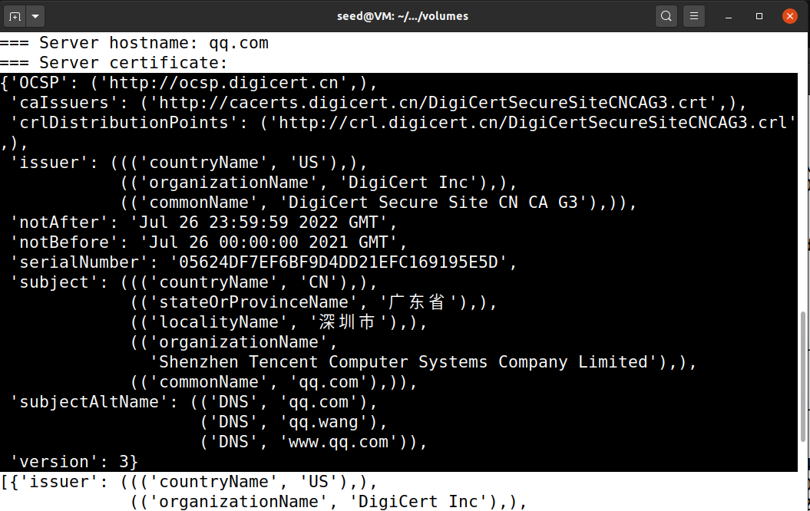

* Explain the purpose of /etc/ssl/certs.
	用于存储根CA文件。
	
* Use Wireshark to capture the network traffics during the execution of the program, and explain your observation. In particular, explain which step triggers the TCP handshake, and which step triggers the TLS handshake. Explain the relationship between the TLS handshake and the TCP handshake.

  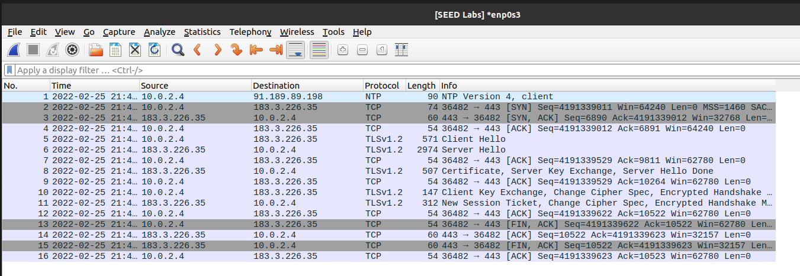

​		图中，2~4是TCP握手的过程，5~12为TLS握手。在TCP三次握手建立连接之后，才会进行TLS握手。

5为Client Hello，包含了客户端支持的密码套件、客户端随机数等。

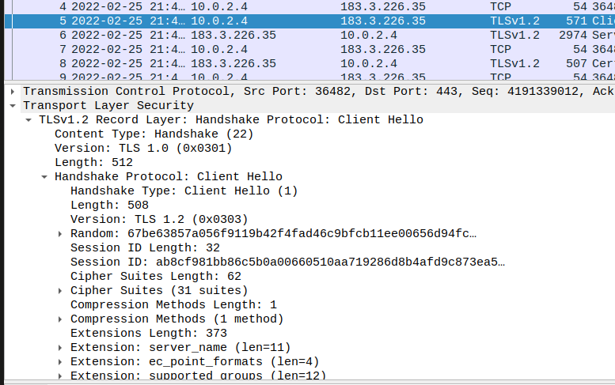

6为Server Hello，包含选择的密码套件、服务器随机数等。

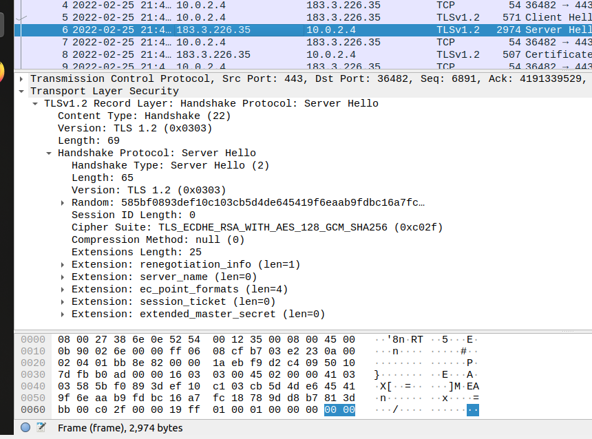

8为证书、Server Key Exchange，Server Hello Done。

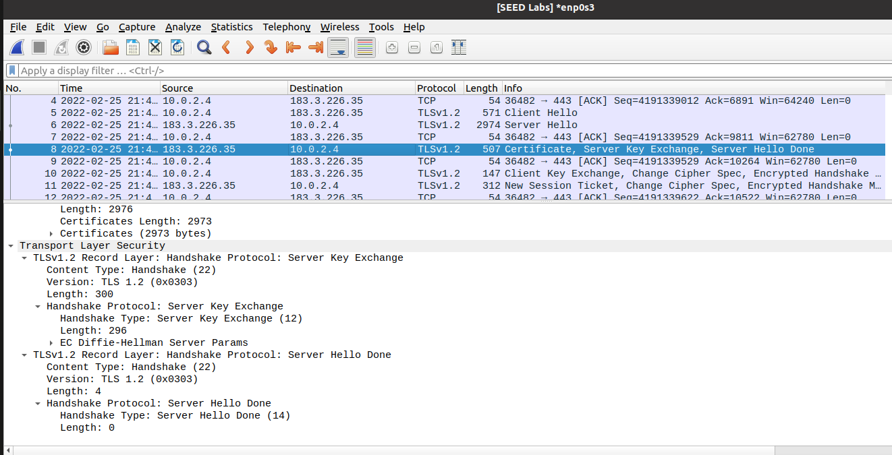

10为Client Key Exchange，Change Cipher Spec（更改密码规范消息），客户端握手结束。

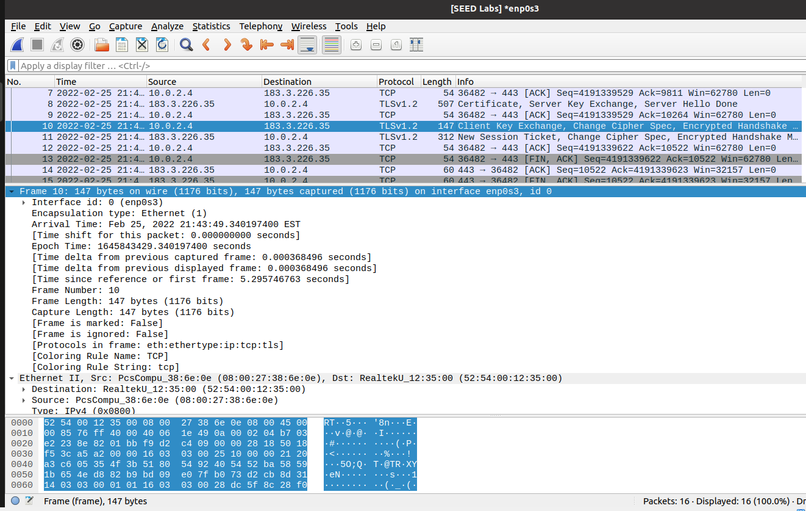

服务器回复Change Cipher Spec（更改密码规范消息）以及New Session，握手结束。

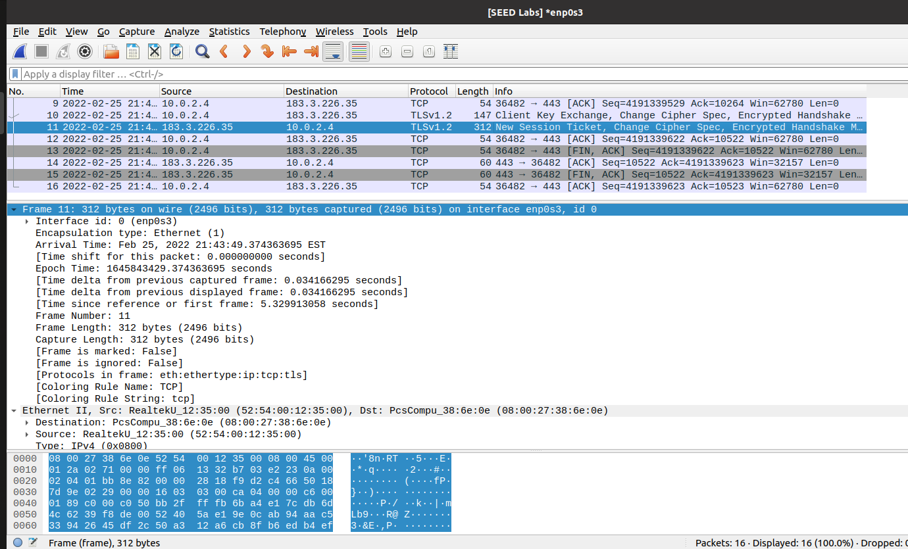

### Task 1.b: CA’s Certificate

修改程序：`cadir = './client-certs'`

```shell
$ python3 handshake.py qq.com
After making TCP connection. Press any key to continue ...
Traceback (most recent call last):
  File "handshake.py", line 29, in <module>
    ssock.do_handshake()   # Start the handshake
  File "/usr/lib/python3.8/ssl.py", line 1309, in do_handshake
    self._sslobj.do_handshake()
ssl.SSLCertVerificationError: [SSL: CERTIFICATE_VERIFY_FAILED] certificate verify failed: unable to get local issuer certificate (_ssl.c:1123)

```

```shell
$ cp /etc/ssl/certs/DigiCert_Global_Root_CA.pem ./client-certs
$ openssl x509 -in ./client-certs/DigiCert_Global_Root_CA.pem -noout -subject_hash
3513523f
$ cd ./client-certs
$ ln -s DigiCert_Global_Root_CA.pem 3513523f.0
```

再次实验，证书成功认证。

### Task 1.c: Experiment with the hostname check

```shell
$ dig qq.com

; <<>> DiG 9.16.1-Ubuntu <<>> qq.com
;; global options: +cmd
;; Got answer:
;; ->>HEADER<<- opcode: QUERY, status: NOERROR, id: 3602
;; flags: qr rd ra; QUERY: 1, ANSWER: 3, AUTHORITY: 0, ADDITIONAL: 1

;; OPT PSEUDOSECTION:
; EDNS: version: 0, flags:; udp: 65494
;; QUESTION SECTION:
;qq.com.				IN	A

;; ANSWER SECTION:
qq.com.			494	IN	A	123.151.137.18
qq.com.			494	IN	A	61.129.7.47
qq.com.			494	IN	A	183.3.226.35

;; Query time: 16 msec
;; SERVER: 127.0.0.53#53(127.0.0.53)
;; WHEN: Sat Feb 26 04:21:04 EST 2022
;; MSG SIZE  rcvd: 83


```

```shell
# echo "123.151.137.18 www.qq2020.com" > /etc/hosts

```

修改`handshake.py`：`context.check_hostname = False`

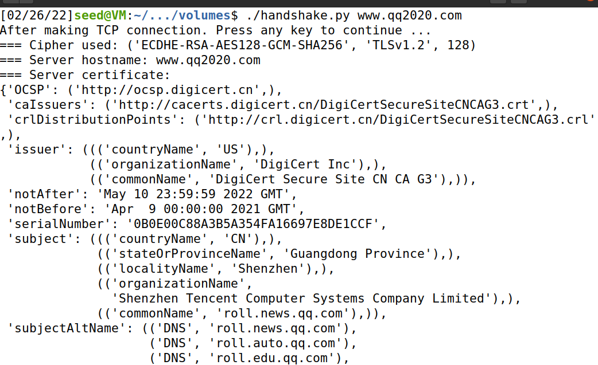

能成功显示证书内容。

### Task 1.d: Sending and getting Data

将提供的代码加入`handshake.py`，可以从www.baidu.com获得数据：

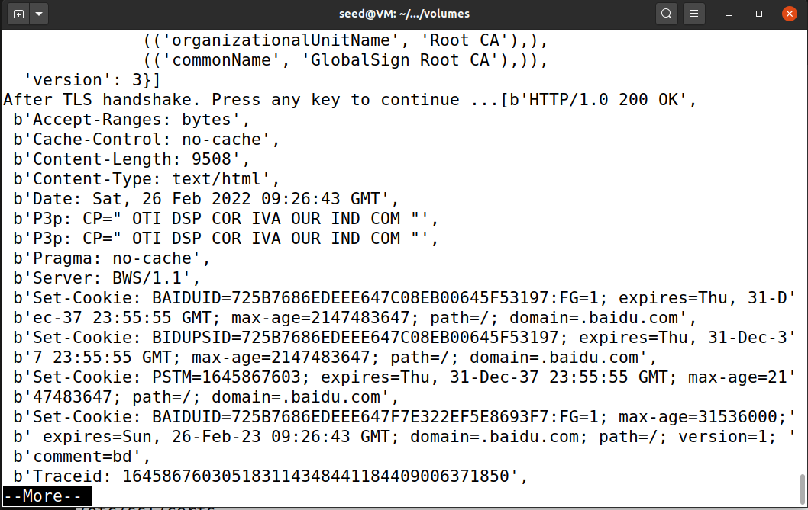

## Task 2: TLS Server

### Task 2.a. Implement a simple TLS server

```shell
$ openssl x509 -in mycert.crt -noout -subject_hash
ec1d63c3
$ ln -s mycert.crt ec1d63c3.0
$ openssl x509 -in ca.crt -noout -subject_hash
dbb9c584
$ ln -s ca.crt dbb9c584.0
$ nano handshake.py
将端口改为4433，修改certs目录cadir = './client-certs'
$ sudo nano /etc/hosts
添加127.0.0.1	www.bank32.com
$ python3 handshake.py www.bank32.com
```

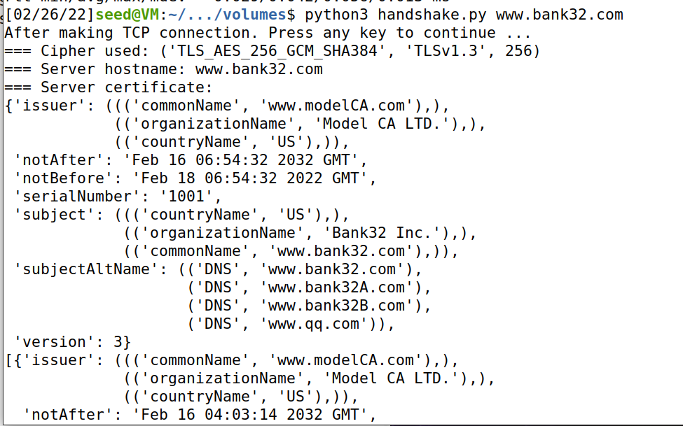

### Task 2.b. Testing the server program using browsers

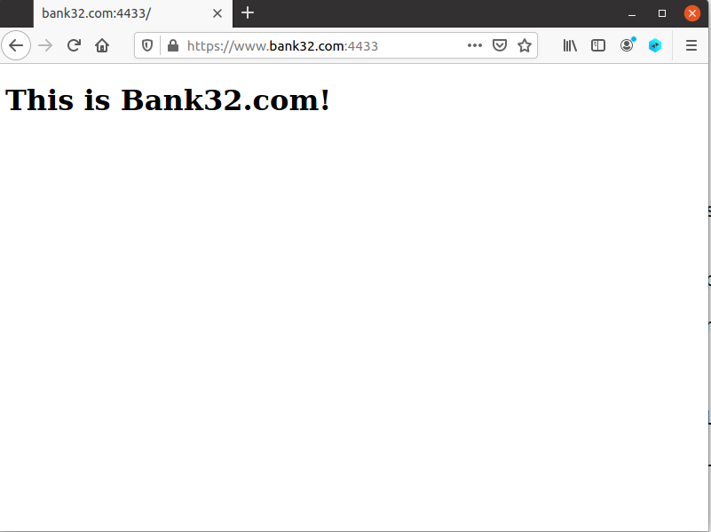

### Task 2.c. Certificate with multiple names

PKI实验中生成的证书的SAN包括`www.bank.com`, `www.bank32a.com`, `www.bank32b.com`，故修改`www.bank32a.com`的hosts记录，然后用浏览器访问，证书也有效。

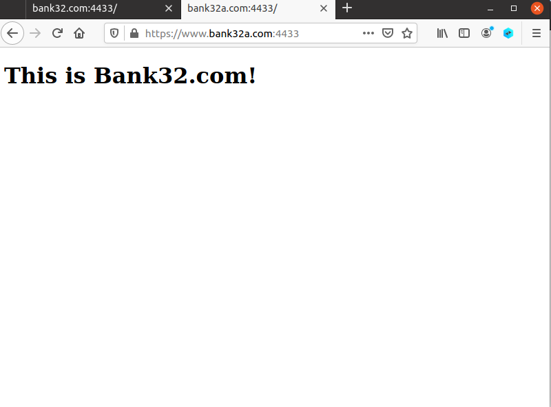

## Task 3: A Simple HTTPS Proxy

```python
#!/usr/bin/env python3

import socket
import ssl
import pprint
import threading


def process_request(ssock_for_browser):
	cadir = '/etc/ssl/certs'

	# Set up the TLS context
	context_cli = ssl.SSLContext(ssl.PROTOCOL_TLS_CLIENT)  # For Ubuntu 20.04 VM
	# context_cli = ssl.SSLContext(ssl.PROTOCOL_TLSv1_2)      # For Ubuntu 16.04 VM
	
	context_cli.load_verify_locations(capath=cadir)
	context_cli.verify_mode = ssl.CERT_REQUIRED
	context_cli.check_hostname = False

	hostname = 'www.qq.com'
	# Make a connection to the real server
	sock_for_server = socket.create_connection((hostname, 443))
	ssock_for_server = context_cli.wrap_socket(sock_for_server, server_side=False) # [Code omitted]: Wrap the socket using TLS
	request = ssock_for_browser.recv(2048)
	if request:
		# Forward request to server
		ssock_for_server.sendall(request)
		# Get response from server, and forward it to browser
		response = ssock_for_server.recv(2048)
		while response:
			ssock_for_browser.sendall(response) # Forward to browser
			response = ssock_for_server.recv(2048)
	ssock_for_browser.shutdown(socket.SHUT_RDWR)
	ssock_for_browser.close()


SERVER_CERT = './server-certs/mycert.crt'
SERVER_PRIVATE = './server-certs/mycert.key'


context_srv = ssl.SSLContext(ssl.PROTOCOL_TLS_SERVER)  # For Ubuntu 20.04 VM
# context = ssl.SSLContext(ssl.PROTOCOL_TLSv1_2)      # For Ubuntu 16.04 VM
context_srv.load_cert_chain(SERVER_CERT, SERVER_PRIVATE)

sock_listen = socket.socket(socket.AF_INET, socket.SOCK_STREAM, 0)
sock_listen.bind(('0.0.0.0', 4433))
sock_listen.listen(5)

while True:
	sock_for_browser, fromaddr = sock_listen.accept()
	ssock_for_browser = context_srv.wrap_socket(sock_for_browser, server_side=True)
	x = threading.Thread(target=process_request, args=(ssock_for_browser,))
	x.start()

```

可以看出，MITM代理将`www.qq.com:4433`的请求转发到真实的`www.qq.com:443`。Firefox浏览器显示，使用的证书是我们自签名的证书。

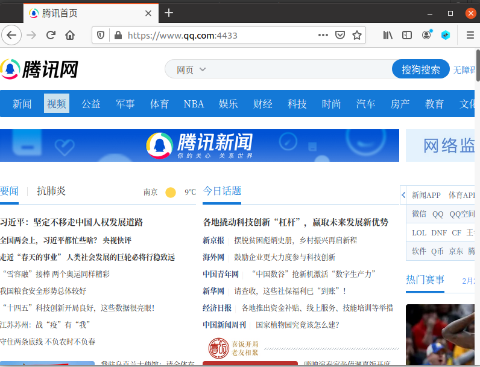

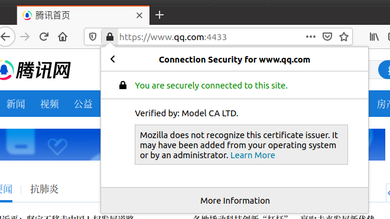
