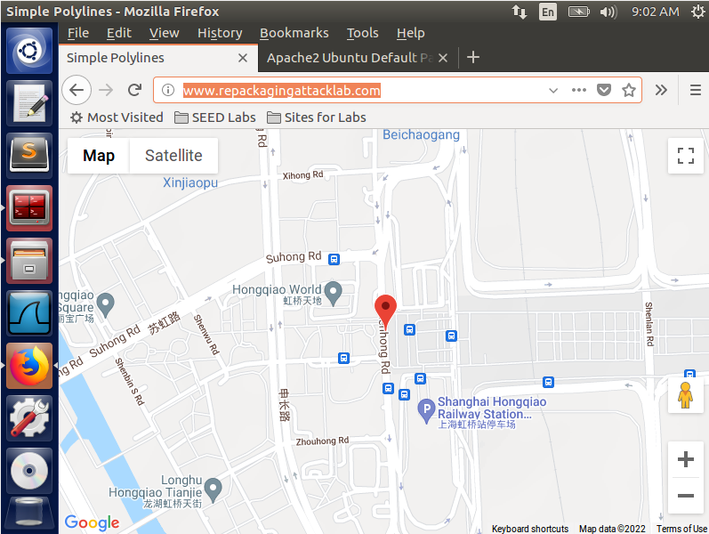

# Android Repackaging Attack Lab

## Task 1: Obtain An Android App (APK file) and Install It

## Task 2: Disassemble Android App

```shell
$ apktool d RepackagingLab.apk
I: Using Apktool 2.2.2 on RepackagingLab.apk
I: Loading resource table...
I: Decoding AndroidManifest.xml with resources...
I: Loading resource table from file: /home/seed/.local/share/apktool/framework/1.apk
I: Regular manifest package...
I: Decoding file-resources...
I: Decoding values */* XMLs...
I: Baksmaling classes.dex...
I: Copying assets and libs...
I: Copying unknown files...
I: Copying original files...

$ cd RepackagingLab/
$ ls
AndroidManifest.xml  apktool.yml  original  res  smali

```


## Task 3: Inject Malicious Code

将`Malicious.smali`复制到`smail/com`，并修改`AndroidManifest.xml`。

## Task 4: Repack Android App with Malicious Code

### Step 1: Rebuild APK

```shell
$ apktool b RepackagingLab
I: Using Apktool 2.2.2
I: Checking whether sources has changed...
I: Smaling smali folder into classes.dex...
I: Checking whether resources has changed...
I: Building resources...
I: Building apk file...
I: Copying unknown files/dir...

```

### Step 2: Sign the APK file

```shell
$ keytool -alias <alias_name> -genkey -v -keystore mykey.keystore
[...]
$ jarsigner -keystore mykey.keystore app_name.apk <alias_name>

Enter Passphrase for keystore: 
jar signed.

Warning: 
The signer certificate will expire within six months.
No -tsa or -tsacert is provided and this jar is not timestamped. Without a timestamp, users may not be able to validate this jar after the signer certificate's expiration date (2022-05-20) or after any future revocation date.

```

## Task 5: Install the Repackaged App and Trigger the Malicious Code

```shell
$ adb connect
$ adb install <apk>
```

先创建几个联系人：


设置中给予相关权限：


运行安装的含有恶意代码的App，打开然后按Home键

在设置中修改时间


联系人被清空：


## Task 6: Using Repackaging Attack to Track Victim’s Location

### Step 1. Setting up mock locations.

### Step 2: Configuring DNS.

Ubuntu Desktop的IP地址为10.0.2.15。

在Android中打开终端模拟器，

```shell
$ su
# vi /etc/hosts

```

添加`10.0.2.15 www.repackagingattacklab.com`

### Step 3: Repackaging and installing the victim app

### Step 4: Enabling the permission on the Android VM.

### Step 5: Triggering the attacking code

### Step 6: Tracking the victim.

成功追踪到了Android上模拟的位置。

