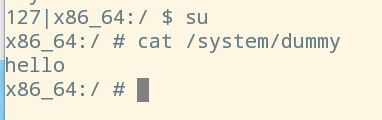
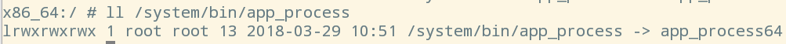
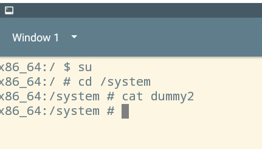

# Android Rooting

## Lab Task 1: Build a simple OTA package

### Step 1: Write the update script.

`update-binary`

```shell
#/bin/sh

sed -i "/return 0/i /system/xbin/dummy.sh" /android/system/etc/init.sh
cp ../../../../system/xbin/dummy.sh /android/system/xbin
chmod a+x /android/system/xbin/dummy.sh
```


```shell
$ echo "echo hello > /system/dummy" > dummy.sh
$ zip -r my_ota.zip ./my_ota
```

### Step 2: Build the OTA Package.


### Step 3: Run the OTA Package

```shell
cd my_ota/META-INF/com/google/android/
sudo ./update-binary
```

注意：由于一些函数也会return 0，`/android/system/etc/init.sh`其实有多处会被加入`/system/xbin/dummy.sh`，但因为脚本内容是幂等的，影响不大。




## Task 2: Inject code via app process
### Step 1. Compile the code.

`Android.mk`

```
LOCAL_PATH := $(call my-dir)
include $(CLEAR_VARS)
LOCAL_MODULE := my_app_process
LOCAL_SRC_FILES := my_app_process.c
include $(BUILD_EXECUTABLE)

```


---

`Application.mk`

```
APP_ABI :=x86
APP_PLATFORM := android-21
APP_STL := stlport_static
APP_BUILD_SCRIPT := Android.mk
```

---

`my_app_process.c`

```c
# include <stdio.h>
# include <stdlib.h>
# include <unistd.h>

extern char ** environ;

int main(int argc, char ** argv) {
 // Write the dummy file 
 FILE * f = fopen("/system/dummy2", "w");
 if (f == NULL) { 
    printf("Permission Denied.\n");
    exit(EXIT_FAILURE);
 }
 fclose(f);

 // Launch the original binary 
 char * cmd = "/system/bin/app_process_original";
 execve(cmd, argv, environ);

 // execve () returns only if it fails
 return EXIT_FAILURE;
}
```

---

编译为Android二进制文件：

```shell
$ export NDK_PROJECT_PATH=.
$ ndk-build NDK_APPLICATION_MK=./Application.mk

Compile x86    : my_app_process <= my_app_process.c
Executable     : my_app_process
Install        : my_app_process => libs/x86/my_app_process

```


---

### Step 2. Write the update script and build OTA package.



所以应该修改`/system/bin/app_process64`。

`update-binary`

```shell
#/bin/sh

mv /android/system/bin/app_process64 /android/system/bin/app_process_original
cp my_app_process /android/system/bin/app_process64
chmod a+x /android/system/bin/app_process64

```



## Task 3: Implement `SimpleSU` for Getting Root Shell

```shell
[02/19/22]seed@VM:~/SimpleSU$ sudo chmod +x compile_all.sh 
[02/19/22]seed@VM:~/SimpleSU$ ./compile_all.sh 
/////////Build Start//////////
Compile x86    : mydaemon <= mydaemonsu.c
Compile x86    : mydaemon <= socket_util.c
Executable     : mydaemon
Install        : mydaemon => libs/x86/mydaemon
Compile x86    : mysu <= mysu.c
Compile x86    : mysu <= socket_util.c
Executable     : mysu
Install        : mysu => libs/x86/mysu
/////////Build End////////////
```

在RecoveryOS中，将`mydaemon`复制到`/android/system/bin/app_process64`，`mysu`复制到`/android/system/bin`


---

```shell
$ mysu
# echo $$
3146
# ps | grep app_process64
root      1032  1013  5064   428            0 0000000000 S /system/bin/app_process64
# ll /proc/1032/fd
# ll /proc/3146/fd
```


---

Questions: 

* Server launches the original app process binary
`mydaemonsu.c`: L254
```c
	argv[0] = APP_PROCESS;
	execve(argv[0], argv, environ);
```

* Client sends its FDs
`mysu.c`: L112
```c
    send_fd(socket, STDIN_FILENO);      //STDIN_FILENO = 0
    send_fd(socket, STDOUT_FILENO);     //STDOUT_FILENO = 1
    send_fd(socket, STDERR_FILENO);     //STDERR_FILENO = 2
```

* Server forks to a child process
`mydaemonsu.c`: L247

* Child process receives client’s FDs
`mydaemonsu.c`: L147
```c
    int client_in = recv_fd(socket);
    int client_out = recv_fd(socket);
    int client_err = recv_fd(socket);
```

* Child process redirects its standard I/O FDs
`mydaemonsu.c`: L149
```c
    dup2(client_in, STDIN_FILENO);      //STDIN_FILENO = 0
    dup2(client_out, STDOUT_FILENO);    //STDOUT_FILENO = 1
    dup2(client_err, STDERR_FILENO);    //STDERR_FILENO = 2
```

* Child process launches a root shell
`mysu.c`: L153
```c
    char* shell[] = {"/system/bin/sh", NULL};
    execve(shell[0], shell, NULL);
```

